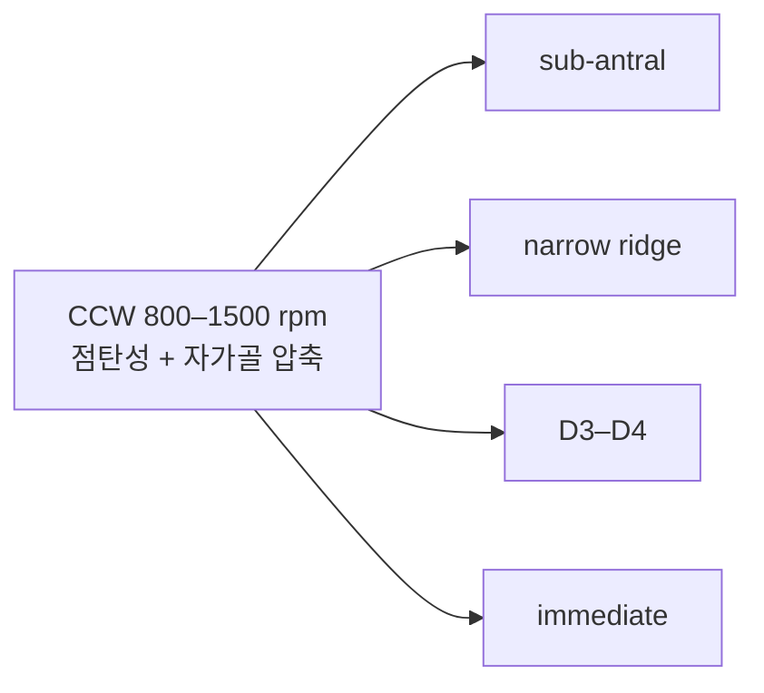

# Slide Deck Outline

**총 12 slide · 25–30분 · 동료 임상의 대상 (파인만 차등: 주전공, 비유·기초 생략)**

---

## Slide 1 — Title

- 골밀도화 (Osseodensification, OD) 전체 그림
- Spine: Fontes Pereira et al. 2023 SR (JCM 12(22):7046)
- 발표자·일자

---

## Slide 2 — 한 줄 결론

> OD = CCW + 점탄성 + 자가골 압축. 4 시나리오 (sub-antral / narrow ridge / D3–D4 / immediate)에서 IT 일관 상승, ISQ 가변 상승, survival 동등. **근거 수준 low–moderate, RCT 부족.**

[근거강함] · Fontes Pereira 2023, PRISMA, PROSPERO

---

## Slide 3 — Why OD now: conventional drilling의 한계

- Conventional CW drilling = **excavate** (골 제거)
- 저밀도골 (D3–D4)·좁은 ridge·sinus floor에서 IT 30 Ncm 확보 어려움
- 즉시부하 (Immediate Loading) 시대에 IT·ISQ 동시 확보 needs ↑
- → OD가 등장한 임상적 맥락

---

## Slide 4 — 메커니즘 (hub)

- Densahbur = 다날 (multi-flute), CCW로 burnishing/compacting
- 골의 점탄성 (viscoelasticity) → spring-back으로 osteotomy ↓ 직경 → 임플란트 fit ↑
- Autograft 효과: 절삭 대신 횡방향 압축 → walls/apex 자가골 미세이식

도해: hub 1개 + 4 spoke (Mermaid)

[근거강함] · Huwais & Meyer 2016 (in vitro 원위논문)

---

## Slide 5 — Outcome Matrix (spine SR 결론)

| Outcome | OD vs Conv | Conf |
|---------|-----------|------|
| Insertion Torque | ↑↑ | 근거강함 |
| ISQ | ↑ (D3/D4 뚜렷) | 합의수준 |
| BIC (in vitro) | ×3 | 근거강함 |
| BIC (in vivo) | ↑, 데이터 부족 | 합의수준 |
| Survival | = | 근거강함 |
| MBL (장기) | ? | 미검증 |

핵심: **OD의 차별점은 IT·BIC, ISQ는 부수효과** — Huwais 2016에서 이미 명시

---

## Slide 6 — 시나리오 1: Sub-antral Bone Augmentation

- 잔존골 (RBH) 4–8 mm, 경치조골 거상 (TSFE) 적응증
- Densahbur로 sinus floor까지 CCW → hydraulic + autograft로 막 거상
- [근거강함] Starch-Jensen 2025 SR+MA (6 RCTs, GRADE low): TSMEOD vs osteotome·측방창에서 ISQ ↑, survival =

**주의**: ESBG는 측방창 < OD. 수직 골증대 1차 목표면 측방창 우선.

---

## Slide 7 — 시나리오 2: Narrow Alveolar Ridge

- Ridge 4–6 mm, ridge split·GBR 회피 목적
- Lateral condensation으로 부피 손실 없이 직경 확보
- [합의수준] Fontes Pereira 2023 SR included only, narrow-ridge 단독 SR 부재

**주의**: D1/D2 cortical-dominant ridge에서 골절 위험. Thin buccal plate 손상 가능.

---

## Slide 8 — 시나리오 3: Low-density Bone (D3–D4)

- 상악 구치부·후방 무치악, IT 30 Ncm 확보 어려운 경우
- Fontes Pereira 2023이 "**greatest OD benefit**" 시나리오로 명시
- [근거강함] Althobaiti 2023 SR + Konuklu 2026 RCT
- D4 chairside 인터랙티브 → wiki/overviews/d4-bone-densah-protocol.html

**Caution**: IT 상승 ≠ ISQ 상승. 즉시부하는 IT + ISQ 동시 평가.

---

## Slide 9 — 시나리오 4: Immediate Implant Placement

- 발치와 즉시식립, socket-bone gap, apical engagement 확보
- Type 1 socket + thick buccal plate 한정
- [합의수준] Fontes Pereira 2023 SR included only, immediate OD 단독 SR 부재

**주의**: Buccal plate <1 mm에서 OD lateral compaction이 plate 발거·손상 가능. 심미 부위는 grafting + 차폐막 병행.

---

## Slide 10 — Parameter cheat sheet

| 항목 | 값 |
|------|---|
| 회전 방향 | CCW (반시계) |
| 회전속도 | 800–1500 rpm |
| 관수 | 소량 saline (sub-antral 일부 dry) |
| Bur 증가 단계 | implant 직경 −0.5 mm까지 |
| 각 단계 유지 | 5–10초 (스프링백) |
| Stop 임계 | torque feedback 50 Ncm 초과 시 |

---

## Slide 11 — Spine SR의 한계 = 우리가 update해야 할 지점

- Search cutoff 2023 → 2024–2026 추가 RCT·SR 반영 필요 ([[konuklu-2026]], [[starch-jensen-2025]] 이미 반영)
- Included studies 이질성 (protocol·bur 크기·rpm)
- Conventional drilling 정의 모호
- Versah Inc. 후원 연구 다수 포함 — independent RCT 필요
- 장기 follow-up (5년+) 부재
- → llm-wiki는 living document로 갱신 ([[feedback_wiki-living-document]])

---

## Slide 12 — Take-home & next steps

**Take-home 3줄**
1. OD = CCW + 점탄성 + autograft, 4 시나리오 모두 IT ↑, survival =
2. 가장 명확한 benefit: D3–D4 저밀도골 + sub-antral. Narrow ridge·immediate는 근거 약함
3. 근거 수준 low–moderate, IT 단독으로 즉시부하 결정 금지

**Next steps**
- Chairside: D4 protocol 인터랙티브 + ISQ loading threshold overview 우선 참조
- Spoke 보강: narrow-ridge·immediate OD 단독 SR/RCT 추가 ingest (P1)
- 5년 RCT 결과 발표 시 spine SR 갱신
- 본 deck 인터랙티브 버전: interactives/2026-05-25_osseodensification-navigator.html

---

## References (slide 사용 인용)

- Fontes Pereira et al. 2023, J Clin Med 12(22):7046, DOI:10.3390/jcm12227046
- Huwais & Meyer 2016, Int J Oral Maxillofac Implants, DOI:10.11607/jomi.4817
- Starch-Jensen et al. 2025, J Oral Maxillofac Res 16(1):e1, DOI:10.5037/jomr.2025.16101
- Althobaiti et al. 2023 (SR, ISQ)
- Konuklu et al. 2026 (RCT, 5 protocols)

## Speaker Notes 메모

- Slide 4의 Mermaid는 actual 시각화 시 SVG로 변환 권장 (PowerPoint 호환)
- Slide 5의 outcome table은 강의 30분 버전에서 핵심. 짧은 버전 (15분)이면 slide 7·9 압축
- 청중이 임플란트 입문자면 slide 3·4에 conventional drilling 비교 도식 1장 추가 권장
