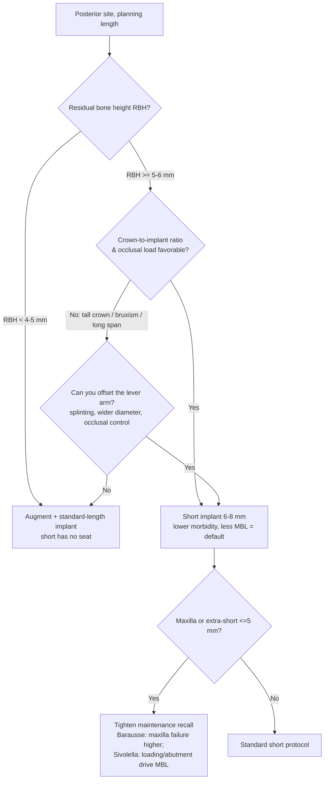

## One-line Summary
On survival the short implant (≤8 mm) equals the longer implant — so the real question is not "does short work?" but "when does short *stop* being the better choice?"; the answer is governed by residual bone height, crown-to-implant ratio / occlusal load, the thinner ≥5-year evidence base, and primary stability in poor bone — not by length per se.

## 한줄요약
생존율만 보면 숏 임플란트(≤8mm)는 더 긴 임플란트와 동등하다. 따라서 진짜 질문은 "숏이 되느냐"가 아니라 "언제 숏이 더 이상 최선이 아니게 되느냐"이며, 그 답은 길이 자체가 아니라 **잔존골고(RBH)·치관-임플란트 비(C/I)/교합부하·얇은 5년 근거·불량골 1차안정성** 네 가지가 결정한다.

## Thesis

The intuition behind the question — *"7 mm short implants succeed, so why bother with longer implants and augmentation?"* — is **largely correct on the survival axis and is the modern evidence consensus**. Across head-to-head meta-analyses, short and extra-short implants match longer implants (with or without bone augmentation) on survival at 1–3 years, and they consistently **lose less marginal bone** with **fewer biological complications** (Yu 2021: MBL WMD −0.22, biological-complication RR 0.321; Mester 2023: biological RR 0.46). So "always go long" is **not** supported.

But three things keep "always go short" from being correct either, and they are the reasons a clinician still reaches for a longer implant (often via augmentation):

1. **Length is downstream of bone, not a free choice.** You can only place a short implant if there is enough residual bone height (RBH) to seat it. Below ~4–5 mm RBH even a short implant has no home, and augmentation + a standard-length implant becomes the dependable route.
2. **The longer implant buys mechanical margin where the lever arm is hostile.** A short implant under a tall clinical crown (unfavorable crown-to-implant ratio), heavy bruxism, or a long edentulous span concentrates stress at the crest. Survival data do not yet penalize short implants here, but this is where the comfort zone narrows. [claude해석]
3. **The long-term curve bends slightly toward length.** At 5 years Yu 2021 found longer implants *statistically* favored (RR 0.970, p<0.05) — though parity returned in the augmentation subgroup — and Mester 2023's ≥5 y pool trended toward standard+SFE (RR 0.97, p=0.07, NS). The ≥5 y evidence is thinner and lower-certainty, so the published *track record* still favors the longer/grafted route even when point estimates are equivalent.

The synthesis: **choose length by the site, not by a blanket rule.** Where RBH and load permit, the short implant is the lower-morbidity default; where they don't, the longer implant + augmentation earns its place. [claude해석]

## Evidence Map

| Paper | Design | Key length finding | Where it lands the decision |
|---|---|---|---|
| Yu 2021 | SR+MA, 21 RCT | ≤6 vs ≥8 mm: survival equal 1 y (RR 1.002) & 3 y (RR 0.996); **longer favored 5 y (RR 0.970, p<0.05)** but parity in augmentation subgroup; MBL & biological complications favor short | Short = augmentation alternative, but watch the 5 y signal |
| Saenz-Ravello 2023 | Umbrella review | Atrophic posterior **mandible**: short <10 mm vs augmentation+standard → fewer failures, less MBL, fewer complications (low certainty) | Short preferred in atrophic mandible |
| Anitua 2022 | Retrospective cohort (88+88, 11–117 mo) | Single posterior crown: short ≤6.5 vs long ≥7.5 mm → no difference in survival/MBL/prosthetic complications | Short is rational for single posterior crowns |
| Barausse 2024 | Retrospective, 496 impl, ~8 y | **4 mm** short, posterior atrophic: survival 95.36%; maxilla failure ↑ (p=0.02); MBL 0.47→0.59 mm over 10 y; hygiene recalls protective | Even 4 mm viable long-term — but maxilla & maintenance matter |
| Sivolella 2025 | Prospective, 5 y | 5–6 mm extra-short: survival 89%; loading protocol & abutment choice drive MBL | Extra-short works; execution (load/abutment) is the variable |
| Zhang 2024 | Network MA, 17 / 1751 impl | Posterior maxilla: short 4–8 mm is the simpler protocol vs sinus grafting, survival equivalent | Short = fewer steps in posterior maxilla |
| Mester 2023 | SR+MA, ≥5 y, 5 RCT | Survival RR 0.97 (p=0.07, NS, trends to standard+SFE); MBL & biological complications favor short | The long-term caveat that keeps "always short" honest |

## Clinical Decision Points

Decision logic in prose:
1. **RBH is the first gate.** ≥5–6 mm → a 6–8 mm short implant is placeable and is the lower-morbidity default. <4–5 mm → augmentation + standard length is the dependable route. [합의수준]
2. **Crown-to-implant ratio / occlusal load is the second gate.** Favorable C/I and load → short. Unfavorable C/I, bruxism, long spans → either offset the lever arm (splint, wider diameter, occlusal management) or step up to a longer implant + augmentation. C/I thresholds are not quantified in the pooled evidence — this gate is inference. [claude해석]
3. **Site and execution modify the short choice.** Maxilla carries higher short-implant failure (Barausse), and for extra-short (≤5–6 mm) the loading protocol and abutment choice directly move MBL (Sivolella) — so tighten maintenance and execution rather than abandoning short. [합의수준]
4. **When equivalent, patient priorities and track record break the tie.** Short wins on morbidity, cost, time, MBL; the longer/grafted route wins on the longer published ≥5 y track record. [합의수준]

## Gaps & Future Research
- **The ≥5 y evidence still leans, non-significantly, toward longer/grafted** (Yu 5 y RR 0.970 p<0.05; Mester RR 0.97 p=0.07). Adequately powered long-term RCTs are the missing piece.
- **C/I ratio thresholds are not pooled** — the load gate is clinical inference, not quantified evidence.
- **Maxilla vs mandible asymmetry** (Barausse higher maxillary failure; Saenz-Ravello mandible-favorable) is under-synthesized.
- **MBL advantage of short (~0.1–0.3 mm)** is statistically robust but of uncertain long-term clinical consequence.

## Related Papers
- [[implants/yu-2021-extra-short-vs-longer-implants-ma]] — time-horizon-dependent equivalence; the 5 y signal.
- [[implants/saenz-ravello-2023-short-implants-compared-to-regular]] — atrophic mandible umbrella review.
- [[implants/anitua-2022-short-vs-longer-implants-single-crown]] — single posterior crown, short is rational.
- [[implants/barausse-2024-4mm-short-implants-posterior-atrophic-8year]] — 4 mm short, 8 y; maxilla & maintenance caveats.
- [[implants/sivolella-2025-extra-short-5-6mm-implants-5year]] — extra-short 5 y; loading/abutment drive MBL.
- [[implants/zhang-2024-short-vs-long-implants-sinus]] — short as the simpler posterior-maxilla protocol.
- [[sinus-lift/lateral/mester-2023-short-vs-standard-implants-sinus-floor-elevation-sr-ma]] — ≥5 y caveat.
- [[overviews/short-implant-vs-sinus-augmentation-decision]] — companion: the augmentation branch in detail.
- [[overviews/implants-clinical-decision-ladder]] — where length sits in the broader implant decision ladder.
