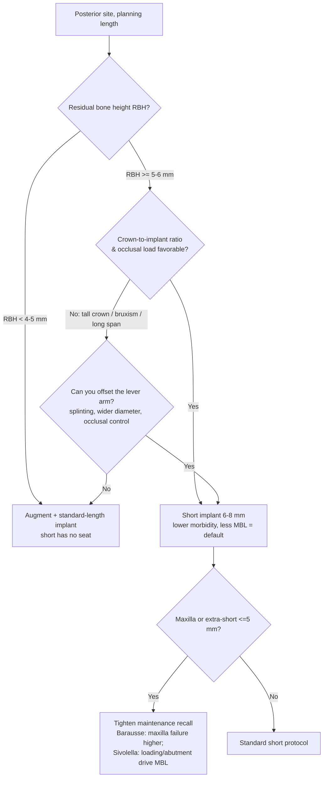

## 한국어 핵심요약

> [!summary] 한국어 핵심요약
> - 핵심 명제: 생존율만 보면 숏 임플란트(≤8 mm)는 더 긴 임플란트와 동등하다. 진짜 질문은 "숏이 되느냐"가 아니라 "언제 숏이 더 이상 최선이 아니게 되느냐"이며, 답은 **길이 자체가 아니라 4가지 인자**가 결정한다.
> - **생존율 동등 + 숏의 우위**: 1–3년 head-to-head MA에서 숏/초숏은 (거상 유무 무관) 장축과 생존 동등, 변연골소실(Marginal Bone Loss, MBL)은 일관되게 더 적고 생물학적 합병증 더 적음 (Yu 2021: MBL WMD −0.22, 생물학적 합병증 RR 0.321; Mester 2023: 생물학적 RR 0.46). → "무조건 장축"은 미지지.
> - **MBL 우위의 실제 기전(오해 주의)**: "숏이 MBL 적다"는 상당 부분 **비교 대상이 상악동거상술(SFE) 동반 롱**이라 롱 쪽에 수술 부담이 실린 comparator artifact (Alenezi 2025: 숏 vs 롱+SFE MD −0.26mm). 거상 없이 순수 길이 대 길이로 비교하면 MBL **동등**하고(Kim 2026: 0.05 vs 0.12mm NS), 높은 치관-임플란트비(C/I)도 MBL과 **무관**(r=0.079) — MBL의 진짜 동인은 길이가 아니라 **삽입깊이·생물학적 폭경 재형성**(Kim 2026: insertion depth r=0.372). 즉 숏이 골을 "지켜서"가 아님.
> - **"무조건 숏"도 틀린 3가지 이유**: ①길이는 골의 하류 변수 — 잔존골고(Residual Bone Height, RBH) 부족(~4–5 mm 미만)이면 숏을 앉힐 자리 자체가 없음; ②장축은 불리한 lever arm(높은 치관-임플란트 비, 이갈이, 긴 무치악 span)에서 기계적 여유를 줌; ③장기(5년+) 곡선은 약간 길이 쪽으로 휨.
> - **5년 신호**: Yu 2021은 5년에 장축이 통계적으로 유리(RR 0.970, p<0.05)했으나 거상 subgroup에선 동등 회귀; Mester 2023의 ≥5년 pool은 표준+상악동거상(SFE)으로 trend(RR 0.97, p=0.07, NS). ≥5년 근거는 얇고 확실성 낮음.
> - **부위·집행 변수**: 4 mm 숏도 8년 생존 95.36% 가능하나 상악에서 실패율 ↑(p=0.02), 위생 recall이 보호적 (Barausse 2024); 초숏(5–6 mm)은 생존 89%이며 부하 프로토콜·지대주 선택이 MBL을 좌우 (Sivolella 2025).
> - **결정 1번째 gate(RBH)**: ≥5–6 mm → 6–8 mm 숏이 저이환 default; <4–5 mm → 거상+표준 길이가 신뢰 경로.
> - **결정 2번째 gate(C/I·교합부하)**: 양호 → 숏; 불리한 C/I·이갈이·긴 span → lever arm 상쇄(splinting·넓은 직경·교합 관리) 또는 장축+거상. (C/I 임계값은 pooled 근거 없음 — 임상 추론).
> - **결정 3번째**: 상악·초숏(≤5 mm)이면 유지관리 recall 강화로 대응(숏 포기 대신 집행 조정).
> - **결정 4번째(동등 시)**: 숏은 이환·비용·시간·MBL에서 우위, 장축/이식 경로는 ≥5년 publish된 track record에서 우위 → 환자 우선순위로 tie-break.
> - **오판 패턴**: "7 mm 숏이 되니 거상은 불필요" — RBH·부하가 허용할 때만 참; 허용 안 되면 장축+거상이 자리를 번다.

## Three-line Summary
Synthesis of 9 papers (6 SR+MAs/umbrella, 2 retrospective, 1 prospective) on short vs standard implants: across head-to-head meta-analyses, short implants (≤8 mm) match longer implants on survival at 1–3 years while consistently losing less marginal bone and carrying fewer biological complications (Yu 2021: MBL WMD −0.22; Mester 2023: biological-complication RR 0.46).

Short implants are not always optimal: residual bone height (RBH) below ~4–5 mm removes the option entirely, unfavorable crown-to-implant ratio / bruxism / long spans concentrate lever-arm stress, and the ≥5-year evidence base bends slightly toward longer implants (Yu 2021 5y RR 0.970 p<0.05; Mester 2023 RR 0.97 p=0.07).

Clinical rule: where RBH and occlusal load permit, the short implant is the lower-morbidity default; where RBH < 4–5 mm or load is hostile and unmitigable, augmentation + standard-length implant earns its place — the 4-mm short implant can survive 8 years at 95% but requires tighter maintenance in the maxilla.

## 세줄요약
9편 종합(SR+MA/umbrella 6, 후향 2, 전향 1): 숏 임플란트(≤8mm)는 1–3년 head-to-head 메타분석에서 긴 임플란트와 생존율이 동등하면서 변연골소실(MBL)이 더 적고 생물학적 합병증도 더 적다(Yu 2021: MBL WMD −0.22; Mester 2023: 생물학적 합병증 RR 0.46).

숏 임플란트가 최선이 아닌 세 가지 상황 — ①잔존골고(RBH) <4–5 mm이면 자리 자체가 없음, ②불리한 치관-임플란트 비(C/I)/이갈이/긴 span은 lever arm 집중, ③5년 이상 장기 곡선은 장축 쪽으로 경향(Yu 5y p<0.05; Mester RR 0.97 p=0.07).

임상 원칙: RBH·교합부하가 허용하면 숏이 저이환 기본값; 허용하지 않으면 거상+표준 길이가 자리를 번다 — 4mm 숏도 8년 95% 생존 가능하나 상악·초단에서는 유지관리 강화 필수.

## Thesis

The intuition behind the question — *"7 mm short implants succeed, so why bother with longer implants and augmentation?"* — is **largely correct on the survival axis and is the modern evidence consensus**. Across head-to-head meta-analyses, short and extra-short implants match longer implants (with or without bone augmentation) on survival at 1–3 years, and they consistently **lose less marginal bone** with **fewer biological complications** (Yu 2021: MBL WMD −0.22, biological-complication RR 0.321; Mester 2023: biological RR 0.46). So "always go long" is **not** supported.

But three things keep "always go short" from being correct either, and they are the reasons a clinician still reaches for a longer implant (often via augmentation):

1. **Length is downstream of bone, not a free choice.** You can only place a short implant if there is enough residual bone height (RBH) to seat it. Below ~4–5 mm RBH even a short implant has no home, and augmentation + a standard-length implant becomes the dependable route.
2. **The longer implant buys mechanical margin where the lever arm is hostile.** A short implant under a tall clinical crown (unfavorable crown-to-implant ratio), heavy bruxism, or a long edentulous span concentrates stress at the crest. Survival data do not yet penalize short implants here, but this is where the comfort zone narrows. [미검증]
3. **The long-term curve bends slightly toward length.** At 5 years Yu 2021 found longer implants *statistically* favored (RR 0.970, p<0.05) — though parity returned in the augmentation subgroup — and Mester 2023's ≥5 y pool trended toward standard+SFE (RR 0.97, p=0.07, NS). The ≥5 y evidence is thinner and lower-certainty, so the published *track record* still favors the longer/grafted route even when point estimates are equivalent.

The synthesis: **choose length by the site, not by a blanket rule.** Where RBH and load permit, the short implant is the lower-morbidity default; where they don't, the longer implant + augmentation earns its place. [미검증]

## Why Short Shows Less MBL — the mechanism behind the number

The MBL advantage is real in the pooled data but it is **easy to misread as a length effect**. Two things, not implant length itself, drive most of the observed difference:

1. **The comparator is usually a *grafted* long implant, not a bare one.** In the meta-analyses where short wins on MBL, the "long" arm is a long implant placed **with sinus floor elevation (SFE)** — so the difference partly reflects the surgical trauma and graft remodeling loaded onto the long arm, not the length. Alenezi 2025 (RCT-only SR+MA): short <8 mm vs long+SFE, MBL MD −0.26 mm (p<0.001). Zhang 2024 network MA: short beats **both** long+immediate-SFE and long+delayed-SFE on MBL. Strip the augmentation out and the gap narrows.
2. **Head-to-head without grafting, MBL is equal — and length is not the determinant.** Kim 2026 (6 mm vs 8.5 mm, mean 6.5 y, no augmentation confound in the short arm) found MBL statistically **no different** (0.05 vs 0.12 mm, NS). Crucially, the higher crown-to-implant ratio of short implants (1.96 vs 1.41) was **not** associated with MBL (r=0.079, p=0.477) — refuting the "short = worse lever arm = more bone loss" intuition. The only parameter correlated with MBL was **insertion depth** (r=0.372, p<0.001), interpreted as physiological biologic-width remodeling after subcrestal placement, not pathological loss. Xu 2020 similarly found MBL MD 0.00 despite short's higher C/I.

Biomechanical rationale for *why* length barely moves MBL: occlusal stress concentrates at the crestal cortical bone around the implant neck — the region where MBL actually occurs — and the apical length below contributes little to bearing that crestal load. So adding length does not meaningfully unload the crest, and MBL and length are only weakly linked to begin with. [미검증 — no length-specific FEA in the wiki; the only crestal-stress FEA here is tapered-vs-cylindrical body geometry in [[overviews/implant-macrogeometry-clinical-outcomes-overview]], not length]

**Takeaway:** short implants do not "protect" bone by being short. The pooled MBL edge is largely a **comparator artifact** (long arm carries augmentation) plus the fact that MBL's true drivers are insertion depth / biologic-width remodeling / surgical burden — not length or crown-to-implant ratio. Length-vs-length without grafting → MBL is equivalent.

## Evidence Map

| Paper | Design | Key length finding | Where it lands the decision |
|---|---|---|---|
| Yu 2021 | SR+MA, 21 RCT | ≤6 vs ≥8 mm: survival equal 1 y (RR 1.002) & 3 y (RR 0.996); **longer favored 5 y (RR 0.970, p<0.05)** but parity in augmentation subgroup; MBL & biological complications favor short | Short = augmentation alternative, but watch the 5 y signal |
| Saenz-Ravello 2023 | Umbrella review | Atrophic posterior **mandible**: short <10 mm vs augmentation+standard → fewer failures, less MBL, fewer complications (low certainty) | Short preferred in atrophic mandible |
| Anitua 2022 | Retrospective cohort (88+88, 11–117 mo) | Single posterior crown: short ≤6.5 vs long ≥7.5 mm → no difference in survival/MBL/prosthetic complications | Short is rational for single posterior crowns |
| Barausse 2024 | Retrospective, 496 impl, ~8 y | **4 mm** short, posterior atrophic: survival 95.36%; maxilla failure ↑ (p=0.02); MBL 0.47→0.59 mm over 10 y; hygiene recalls protective | Even 4 mm viable long-term — but maxilla & maintenance matter |
| Sivolella 2025 | Prospective, 5 y | 5–6 mm extra-short: survival 89%; loading protocol & abutment choice drive MBL | Extra-short works; execution (load/abutment) is the variable |
| Zhang 2024 | Network MA, 17 / 1751 impl | Posterior maxilla: short 4–8 mm is the simpler protocol vs sinus grafting, survival equivalent | Short = fewer steps in posterior maxilla |
| Mester 2023 | SR+MA, ≥5 y, 5 RCT | Survival RR 0.97 (p=0.07, NS, trends to standard+SFE); MBL & biological complications favor short | The long-term caveat that keeps "always short" honest |
| Alenezi 2025 | SR+MA, 7 RCT | Short <8 mm vs long+**SFE**: MBL MD −0.26 mm (p<0.001), biological complications OR 0.39; survival equal | Shows the MBL "advantage" is measured against a *grafted* long arm |
| Kim 2026 | Retrospective, 84 impl, ~6.5 y | 6 vs 8.5 mm, no augmentation confound: MBL equal (0.05 vs 0.12 mm, NS); C/I ratio **not** linked to MBL (r=0.079); **insertion depth** is the MBL correlate (r=0.372) | Length-vs-length MBL is equal; the driver is depth/biologic width, not length |

## Clinical Decision Points

```mermaid
flowchart TD
    A[Posterior site, planning length] --> B{Residual bone height RBH?}
    B -->|RBH < 4-5 mm| F[Augment + standard-length implant<br/>short has no seat]
    B -->|RBH >= 5-6 mm| C{Crown-to-implant ratio<br/>& occlusal load favorable?}
    C -->|Yes| D[Short implant 6-8 mm<br/>lower morbidity, less MBL = default]
    C -->|No: tall crown / bruxism / long span| E{Can you offset the lever arm?<br/>splinting, wider diameter, occlusal control}
    E -->|Yes| D
    E -->|No| F
    D --> G{Maxilla or extra-short <=5 mm?}
    G -->|Yes| H[Tighten maintenance recall<br/>Barausse: maxilla failure higher;<br/>Sivolella: loading/abutment drive MBL]
    G -->|No| I[Standard short protocol]
```

Decision logic in prose:
1. **RBH is the first gate.** ≥5–6 mm → a 6–8 mm short implant is placeable and is the lower-morbidity default. <4–5 mm → augmentation + standard length is the dependable route. [확인]
2. **Crown-to-implant ratio / occlusal load is the second gate.** Favorable C/I and load → short. Unfavorable C/I, bruxism, long spans → either offset the lever arm (splint, wider diameter, occlusal management) or step up to a longer implant + augmentation. C/I thresholds are not quantified in the pooled evidence — this gate is inference. [미검증]
3. **Site and execution modify the short choice.** Maxilla carries higher short-implant failure (Barausse), and for extra-short (≤5–6 mm) the loading protocol and abutment choice directly move MBL (Sivolella) — so tighten maintenance and execution rather than abandoning short. [확인]
4. **When equivalent, patient priorities and track record break the tie.** Short wins on morbidity, cost, time, MBL; the longer/grafted route wins on the longer published ≥5 y track record. [확인]

## Gaps & Future Research
- **The ≥5 y evidence still leans, non-significantly, toward longer/grafted** (Yu 5 y RR 0.970 p<0.05; Mester RR 0.97 p=0.07). Adequately powered long-term RCTs are the missing piece.
- **C/I ratio thresholds are not pooled** — the load gate is clinical inference, not quantified evidence.
- **Maxilla vs mandible asymmetry** (Barausse higher maxillary failure; Saenz-Ravello mandible-favorable) is under-synthesized.
- **MBL advantage of short (~0.1–0.3 mm)** is statistically robust but of uncertain long-term clinical consequence.

## Related Papers
- [[implants/yu-2021-extra-short-vs-longer-implants-ma]] — time-horizon-dependent equivalence; the 5 y signal.
- [[implants/saenz-ravello-2023-short-implants-compared-to-regular]] — atrophic mandible umbrella review.
- [[implants/anitua-2022-short-vs-longer-implants-single-crown]] — single posterior crown, short is rational.
- [[implants/barausse-2024-4mm-short-implants-posterior-atrophic-8year]] — 4 mm short, 8 y; maxilla & maintenance caveats.
- [[implants/sivolella-2025-extra-short-5-6mm-implants-5year]] — extra-short 5 y; loading/abutment drive MBL.
- [[implants/zhang-2024-short-vs-long-implants-sinus]] — short as the simpler posterior-maxilla protocol.
- [[sinus-lift/lateral/mester-2023-short-vs-standard-implants-sinus-floor-elevation-sr-ma]] — ≥5 y caveat.
- [[implants/alenezi-2025-short-long-implants-sinus-floor-elevation]] — the MBL edge is measured against a grafted long arm.
- [[implants/kim-2026-long-term-outcomes-short-standard-implants]] — length-vs-length MBL equal; insertion depth, not length/C-I, is the driver.
- [[overviews/short-implant-vs-sinus-augmentation-decision]] — companion: the augmentation branch in detail.
- [[overviews/implants-clinical-decision-ladder]] — where length sits in the broader implant decision ladder.
