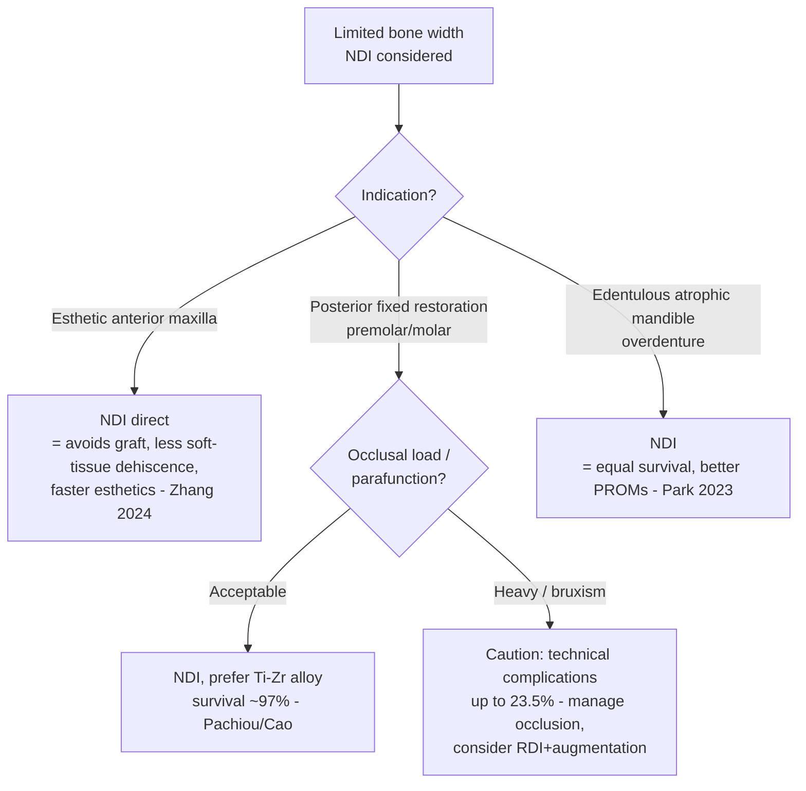

## One-line Summary
Across four SR/MAs spanning the esthetic anterior maxilla, load-bearing posterior fixed prostheses, mandibular overdentures, and titanium-zirconium single crowns, narrow-diameter implants (<3.75 mm) match regular-diameter implants on survival and marginal bone loss — and sometimes beat them on patient-reported outcomes and esthetic complications — so the choice is driven by avoiding bone augmentation, not by a survival penalty.

## 한줄요약
SR/MA 4편(전치부 상악·구치부 고정성 보철·하악 피개의치·TiZr 단일크라운) 종합 — 좁은 직경 임플란트(NDI, <3.75 mm)는 정규 직경(RDI)과 생존율·변연골소실(MBL)이 동등하고 환자보고결과(PROM)·심미 합병증에서는 오히려 우위. 선택 기준은 생존율 손해가 아니라 "골증대 회피"다.

## Thesis
The historical objection to narrow-diameter implants (NDIs) was mechanical: a reduced diameter means less bone contact and lower fracture/fatigue resistance, so NDIs were confined to the anterior region and to retaining overdentures. Four recent SR/MAs collectively dismantle that restriction. Survival is high and statistically indistinguishable from regular-diameter implants (RDIs) in every indication tested — the esthetic anterior maxilla (Zhang 2024, 36-mo ISR 93.8–100% vs 100%), load-bearing posterior fixed prostheses (Pachiou 2025, pooled survival 97.0% maxilla / 96.5% mandible across 2741 NDIs), and titanium-zirconium single crowns (Cao 2023, 97.5% survival, no difference vs commercially pure titanium). Marginal bone loss is equivalent throughout.

Two findings push past mere non-inferiority. First, in the esthetic zone the augmentation comparator carried *more* soft-tissue dehiscence than the NDI arm (Zhang 2024) — the NDI is not just survivable, it may be esthetically safer by avoiding the graft. Second, for mandibular overdentures NDIs significantly outperformed RDIs on patient satisfaction (VAS) and oral health-related quality of life (Park 2023). The unifying clinical logic is therefore graft-avoidance: NDIs deliver RDI-equivalent hard-tissue outcomes while removing the morbidity, cost, time, and (in the esthetic zone) the complications of bone augmentation. The titanium-zirconium alloy is the enabling material — it neutralizes the fracture-resistance concern that justified the old anterior-only restriction (Cao 2023; Pachiou 2025 reports material-independent survival). [claude해석]

The honest caveats: follow-up is short across all four (mostly ≤36 months except parts of Pachiou's range to 12 years), the dominant complications in posterior load-bearing use are *technical* (screw loosening, fracture, detachment, up to 23.5%) rather than survival events, and biological complication data are too sparse to pool (Pachiou 2025) — so peri-implantitis risk of NDIs remains under-characterized. [근거강함 for survival equivalence; 미검증 for long-term and biological complications]

## Evidence Map

| Paper | Design | n | Indication | Key Finding | Confidence |
|---|---|---|---|---|---|
| Zhang 2024 | SR+MA | 5 studies / 282 NDI, 100 RDI | Anterior maxilla (vs RDI+augmentation) | ISR equal at 36 mo (RR 0.989, p=0.896); MBL/PPD equal; soft-tissue dehiscence mostly in RDIs | sr+ma |
| Pachiou 2025 | SR+MA | 36 trials / 2741 NDI | Posterior fixed restorations | Pooled survival maxilla 97.0% / mandible 96.5% (p=0.688); technical compl. 0–23.5%; biological data unpoolable | sr+ma |
| Park 2023 | SR+MA | 12 pub / 8 studies | Mandibular overdentures (vs RDI) | Survival & MBL equal; NDI significantly better VAS satisfaction & OHRQoL | sr+ma |
| Cao 2023 | SR+MA | 7 quant / 256 Ti-Zr NDI | Single crowns (Ti-Zr vs cpTi) | Survival 97.5% / success 97.2% at ≤36 mo, no difference vs cpTi; 1-y MBL 0.44 mm | sr+ma |

## Clinical Decision Points

Decision logic in prose:
1. **Indication sets the default.** In the esthetic anterior maxilla and in atrophic edentulous mandibles for overdentures, NDIs are a strong first choice — equal hard-tissue outcomes plus an esthetic-complication or PROM advantage over the augmentation/RDI alternative. [근거강함 survival; 합의수준 PROM]
2. **Material matters in load-bearing sites.** For posterior fixed prostheses, prefer titanium-zirconium (Roxolid) NDIs — the alloy is what makes posterior survival match RDIs (Cao 2023; Pachiou 2025 material-independent). [합의수준]
3. **The residual risk is technical, not survival.** In posterior load-bearing use plan for screw loosening / fracture / detachment (up to 23.5%): control occlusion, manage parafunction, and verify component fit rather than fearing implant loss. [근거강함]
4. **Biological-complication uncertainty is the live gap.** Because peri-implantitis data for NDIs are unpooled, maintain standard peri-implant surveillance and avoid over-extending NDIs in high biological-risk patients. [미검증]

## Gaps & Future Research
- **Long-term data.** Most pooled follow-up is ≤36 months; decade-horizon NDI survival and MBL (especially for posterior load-bearing) are largely unproven.
- **Biological complications.** Pachiou 2025 could not pool biological complication / peri-implantitis data — the single biggest evidence gap for NDIs.
- **NDI vs mini-implant boundary.** Overdenture syntheses blur the <3.0 mm mini-implant vs 3.0–3.5 mm NDI distinction; outcomes may not transfer across that line.
- **Direct NDI-vs-(RDI+graft) head-to-head in the posterior region.** Anterior data exist (Zhang 2024); the posterior graft-avoidance comparison is still indirect.

## Related Papers
- [[implants/zhang-2024-narrow-regular-diameter-anterior-maxilla]] — esthetic anterior maxilla; NDI ≈ RDI+graft, fewer soft-tissue dehiscences.
- [[implants/pachiou-2025-narrow-diameter-implants-fixed-posterior]] — largest posterior fixed-restoration dataset; survival ~97%, technical complications dominate.
- [[implants/park-2023-narrow-regular-diameter-mandibular-overdentures]] — mandibular overdentures; equal survival, superior PROMs.
- [[implants/cao-2023-titanium-zirconium-narrow-diameter-single-crown]] — Ti-Zr single crowns; equal to cpTi, the enabling alloy.
- [[overviews/short-implant-vs-sinus-augmentation-decision]] — companion graft-avoidance overview (short-implant axis).
- [[overviews/implant-length-selection-why-not-always-short]] — parallel dimension-selection reasoning for length.
