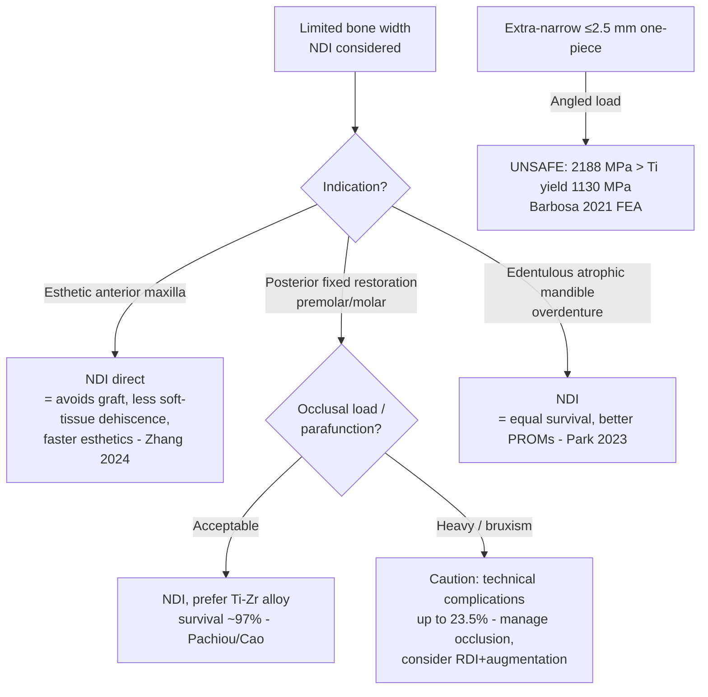

## 한국어 핵심요약

> [!summary] 한국어 핵심요약
> - 좁은 직경 임플란트(Narrow-Diameter Implant, NDI, <3.75mm)의 임상결과를 4개 적응증(전치부 상악·구치부 고정성 보철·하악 피개의치·티타늄-지르코늄 단일크라운)에 걸쳐 본 SR/MA 4편 통합.
> - 핵심 bottom-line: NDI는 정규직경 임플란트(Regular-Diameter Implant, RDI)와 생존율·변연골소실(MBL)이 **동등**하며, 환자보고결과(PROM)·심미 합병증에선 오히려 우위 → 선택 기준은 생존율 손해가 아니라 **골증대(augmentation) 회피**.
> - 과거 NDI 제한(기계적: 골접촉 적음·파절저항 낮음 → 전치부·피개의치 한정)을 4편이 해체.
> - 심미존 전치부(Zhang 2024): 36개월 임플란트생존율(ISR) 93.8–100% vs RDI 100%로 동등하고, 오히려 골증대 RDI군에서 연조직 열개가 더 많음 → NDI가 graft 회피로 심미적으로 더 안전할 수 있음.
> - 구치부 고정성 보철(Pachiou 2025, 2741 NDI): 통합 생존율 상악 97.0%/하악 96.5%(p=0.688) — 단 dominant 합병증은 생존이 아니라 **기술적**(나사풀림·파절·탈락 최대 23.5%).
> - 하악 피개의치(Park 2023): 생존·MBL 동등하면서 NDI가 환자만족도(VAS)·구강건강관련삶의질(OHRQoL)에서 유의하게 우월.
> - 티타늄-지르코늄(Ti-Zr, Roxolid) 합금이 enabling material — 구치부 부하 부위 생존을 RDI에 맞추는 핵심(Cao 2023: 단일크라운 생존 97.5%, 상용순수티타늄 cpTi와 차이 없음).
> - 의사결정: ① 적응증이 default 설정 — 심미 전치부·위축 하악 피개의치는 NDI 강력 1차 선택; ② 부하 부위는 Ti-Zr 합금 선호; ③ 잔여 위험은 생존이 아닌 기술적(교합관리·parafunction 통제); ④ 생물학적 합병증 불확실성이 live gap.
> - FEA 생역학 경계(Barbosa 2021): 2.5 mm 초소경(Extra-Narrow) one-piece 임플란트는 30° 경사하중 시 응력이 2188 MPa → 티타늄 항복강도(1130 MPa) 93.6% 초과. 3.0 mm one-piece 및 3.5 mm Morse taper two-piece는 축·경사 하중 모두 안전. **"3.0 mm가 임상적 안전 하한"** — Pachiou 2025의 생존율 데이터에 생역학적 근거를 제공.
> - 정직한 한계: 추적기간 대부분 ≤36개월로 짧고, 후방 부하의 10년 horizon 미입증, 임플란트주위염(peri-implantitis) 등 생물학적 합병증 데이터가 pool 불가(Pachiou 2025) — NDI의 가장 큰 근거 공백.

## One-line Summary
Across four SR/MAs spanning the esthetic anterior maxilla, load-bearing posterior fixed prostheses, mandibular overdentures, and titanium-zirconium single crowns, narrow-diameter implants (<3.75 mm) match regular-diameter implants on survival and marginal bone loss — and sometimes beat them on patient-reported outcomes and esthetic complications — so the choice is driven by avoiding bone augmentation, not by a survival penalty.

## 한줄요약
SR/MA 4편(전치부 상악·구치부 고정성 보철·하악 피개의치·TiZr 단일크라운) 종합 — 좁은 직경 임플란트(NDI, <3.75 mm)는 정규 직경(RDI)과 생존율·변연골소실(MBL)이 동등하고 환자보고결과(PROM)·심미 합병증에서는 오히려 우위. 선택 기준은 생존율 손해가 아니라 "골증대 회피"다.

## Thesis
The historical objection to narrow-diameter implants (NDIs) was mechanical: a reduced diameter means less bone contact and lower fracture/fatigue resistance, so NDIs were confined to the anterior region and to retaining overdentures. Four recent SR/MAs collectively dismantle that restriction. Survival is high and statistically indistinguishable from regular-diameter implants (RDIs) in every indication tested — the esthetic anterior maxilla (Zhang 2024, 36-mo ISR 93.8–100% vs 100%), load-bearing posterior fixed prostheses (Pachiou 2025, pooled survival 97.0% maxilla / 96.5% mandible across 2741 NDIs), and titanium-zirconium single crowns (Cao 2023, 97.5% survival, no difference vs commercially pure titanium). Marginal bone loss is equivalent throughout.

Two findings push past mere non-inferiority. First, in the esthetic zone the augmentation comparator carried *more* soft-tissue dehiscence than the NDI arm (Zhang 2024) — the NDI is not just survivable, it may be esthetically safer by avoiding the graft. Second, for mandibular overdentures NDIs significantly outperformed RDIs on patient satisfaction (VAS) and oral health-related quality of life (Park 2023). The unifying clinical logic is therefore graft-avoidance: NDIs deliver RDI-equivalent hard-tissue outcomes while removing the morbidity, cost, time, and (in the esthetic zone) the complications of bone augmentation. The titanium-zirconium alloy is the enabling material — it neutralizes the fracture-resistance concern that justified the old anterior-only restriction (Cao 2023; Pachiou 2025 reports material-independent survival). [claude해석]

The honest caveats: follow-up is short across all four (mostly ≤36 months except parts of Pachiou's range to 12 years), the dominant complications in posterior load-bearing use are *technical* (screw loosening, fracture, detachment, up to 23.5%) rather than survival events, and biological complication data are too sparse to pool (Pachiou 2025) — so peri-implantitis risk of NDIs remains under-characterized. [근거강함 for survival equivalence; 미검증 for long-term and biological complications]

## Evidence Map

| Paper | Design | n | Indication | Key Finding | Confidence |
|---|---|---|---|---|---|
| Zhang 2024 | SR+MA | 5 studies / 282 NDI, 100 RDI | Anterior maxilla (vs RDI+augmentation) | ISR equal at 36 mo (RR 0.989, p=0.896); MBL/PPD equal; soft-tissue dehiscence mostly in RDIs | sr+ma |
| Pachiou 2025 | SR+MA | 36 trials / 2741 NDI | Posterior fixed restorations | Pooled survival maxilla 97.0% / mandible 96.5% (p=0.688); technical compl. 0–23.5%; biological data unpoolable | sr+ma |
| Park 2023 | SR+MA | 12 pub / 8 studies | Mandibular overdentures (vs RDI) | Survival & MBL equal; NDI significantly better VAS satisfaction & OHRQoL | sr+ma |
| Cao 2023 | SR+MA | 7 quant / 256 Ti-Zr NDI | Single crowns (Ti-Zr vs cpTi) | Survival 97.5% / success 97.2% at ≤36 mo, no difference vs cpTi; 1-y MBL 0.44 mm | sr+ma |
| Barbosa 2021 | FEA | 3 implant models | Biomechanical limits by diameter and connection type | 2.5 mm one-piece: 2188 MPa under 30° load (93.6% over Ti yield limit); 3.0 mm one-piece and 3.5 mm Morse taper: safe under all loads | in-vitro |

## Clinical Decision Points

Decision logic in prose:
1. **Indication sets the default.** In the esthetic anterior maxilla and in atrophic edentulous mandibles for overdentures, NDIs are a strong first choice — equal hard-tissue outcomes plus an esthetic-complication or PROM advantage over the augmentation/RDI alternative. [근거강함 survival; 합의수준 PROM]
2. **Material matters in load-bearing sites.** For posterior fixed prostheses, prefer titanium-zirconium (Roxolid) NDIs — the alloy is what makes posterior survival match RDIs (Cao 2023; Pachiou 2025 material-independent). [합의수준]
3. **The residual risk is technical, not survival.** In posterior load-bearing use plan for screw loosening / fracture / detachment (up to 23.5%): control occlusion, manage parafunction, and verify component fit rather than fearing implant loss. [근거강함]
5. **The 3.0 mm diameter is the biomechanical floor for one-piece designs.** FEA (Barbosa 2021) shows that 2.5 mm extra-narrow one-piece implants exceed titanium yield strength by 93.6% under 30° angled loading (2188 MPa vs 1130 MPa limit) — a clinically relevant failure mode in any site with off-axis forces. A 3.0 mm one-piece and a 3.5 mm Morse taper two-piece both remain within structural limits; the Morse taper connection additionally reduces cortical bone stress by 321% compared to the one-piece design, suggesting that where diameter must be minimized to 3.5 mm, a two-piece Morse taper is preferable to a one-piece design. [근거강함 FEA; 임상 RCT 보강 필요] This lower boundary converges with what clinical SR/MA evidence (Pachiou 2025; Cao 2023) already implies by the lower bound of the pooled survival evidence being ~3.0 mm NDIs. [claude해석]

4. **Biological-complication uncertainty is the live gap.** Because peri-implantitis data for NDIs are unpooled, maintain standard peri-implant surveillance and avoid over-extending NDIs in high biological-risk patients. [미검증] A notable exception on systemic risk: [[implants/isq/diehl-2022-narrow-diameter-implant-stability-hyperglycemic]] (prospective case–control, n=32 patients / 48 NDIs, 3 months) found that 3.3 mm SLActive TiZr NDIs achieved equivalent ISQ at Month 3 in uncontrolled T2DM (HbA1c mean 7.34%) vs. normoglycemic controls (63.84 ± 6.05 vs. 63.84 ± 6.18; no between-group difference at any time point, no HbA1c–ISQ correlation), suggesting that hyperglycemia per se — at least up to ~HbA1c 8.1% — does not preclude NDI use when a hydrophilic SLActive surface is employed. [합리적 근거; HbA1c >8.1% 미검증]

## Gaps & Future Research
- **Long-term data.** Most pooled follow-up is ≤36 months; decade-horizon NDI survival and MBL (especially for posterior load-bearing) are largely unproven.
- **Biological complications.** Pachiou 2025 could not pool biological complication / peri-implantitis data — the single biggest evidence gap for NDIs.
- **NDI vs mini-implant boundary.** Overdenture syntheses blur the <3.0 mm mini-implant vs 3.0–3.5 mm NDI distinction; outcomes may not transfer across that line.
- **Clinical validation of the 2.5 mm FEA fracture signal.** Barbosa 2021 (FEA) predicts 2.5 mm one-piece implants will fracture under angled loading — but FEA does not account for bone remodeling, fatigue cycling, or real-world loading variation. Clinical registry data on 2.5 mm one-piece fracture rates are needed.
- **Direct NDI-vs-(RDI+graft) head-to-head in the posterior region.** Anterior data exist (Zhang 2024); the posterior graft-avoidance comparison is still indirect.
- **Drilling protocol optimisation for narrow implants.** [[implants/witek-2021-surgical-instrumentation-narrow-wide-short-implants]] (in-vivo sheep, 144 plateau-root-form implants, 3.5 mm narrow vs. 6.0 mm wide, 3 × 2 factorial RPM × irrigation design) shows that irrigation is most critical for narrow implants at low speed (50 RPM BIC: 30.6 ± 6.1% with irrigation vs. 19.7 ± 6.1% without; significant), whereas wide implants benefit more at higher speeds (500–1,000 RPM); BAFO was driven only by healing duration (3 vs. 6 weeks), not by any instrumentation variable. The SR/MA evidence base reviewed here does not address osteotomy protocol — pending clinical RCT translation of these diameter-specific drilling sensitivities.

## Related Papers
- [[implants/zhang-2024-narrow-regular-diameter-anterior-maxilla]] — esthetic anterior maxilla; NDI ≈ RDI+graft, fewer soft-tissue dehiscences.
- [[implants/pachiou-2025-narrow-diameter-implants-fixed-posterior]] — largest posterior fixed-restoration dataset; survival ~97%, technical complications dominate.
- [[implants/park-2023-narrow-regular-diameter-mandibular-overdentures]] — mandibular overdentures; equal survival, superior PROMs.
- [[implants/cao-2023-titanium-zirconium-narrow-diameter-single-crown]] — Ti-Zr single crowns; equal to cpTi, the enabling alloy.
- [[implants/witek-2021-surgical-instrumentation-narrow-wide-short-implants]] — in-vivo sheep study; diameter-specific RPM × irrigation interactions on BIC; extends to surgical technique dimension absent in SR/MA evidence above.
- [[implants/isq/diehl-2022-narrow-diameter-implant-stability-hyperglycemic]] — prospective case–control; 3.3 mm SLActive TiZr NDI ISQ in uncontrolled T2DM; refines biological-risk decision point.
- [[implants/barbosa-2021-narrow-implants-one-two-piece-fea]] — FEA; 2.5 mm one-piece exceeds Ti yield under 30° load (2188 MPa); 3.0 mm one-piece and 3.5 mm Morse taper safe; biomechanical floor for NDI selection.
- [[overviews/short-implant-vs-sinus-augmentation-decision]] — companion graft-avoidance overview (short-implant axis).
- [[overviews/implant-length-selection-why-not-always-short]] — parallel dimension-selection reasoning for length.
