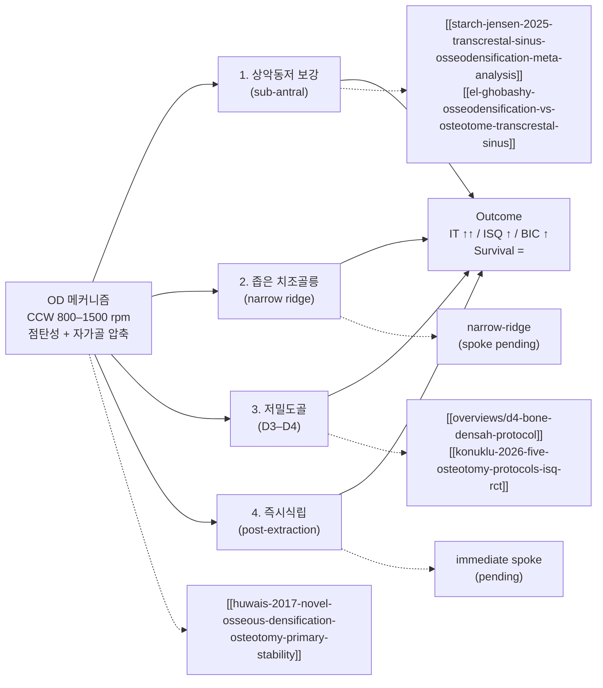

## 한국어 핵심요약

> [!summary] 한국어 핵심요약
> - 핵심 명제: 골밀도화(Osseodensification, OD)는 반시계회전(Counterclockwise, CCW) 800–1500 rpm으로 Densahbur가 자가골을 압축·자가이식하는 술식으로, Fontes Pereira 2023 SR을 spine으로 4개 시나리오(상악동저 보강·좁은 ridge·저밀도골 D3–D4·즉시식립)에 적용된다.
> - 메커니즘: 다날 bur가 CW에서 절삭·CCW에서 압축, 골 점탄성 spring-back으로 osteotomy가 bur보다 작게 회복되어 강한 접촉, 횡방향 압축으로 자가골이 미세이식.
> - Outcome matrix: 삽입토크(Insertion Torque, IT)는 일관되게 상승 [근거강함], 골-임플란트 접촉률(Bone-to-Implant Contact, BIC)은 in vitro 약 3배 상승, 생존율은 conventional과 동등, 전반적 근거 수준은 낮음–중등.
> - 핵심 논쟁 — 저밀도골 임플란트 안정성 지수(Implant Stability Quotient, ISQ): Mohammadi 2025 SR+MA(7편)에서 1차 MD=4.13(p=0.13)·2차 MD=1.78(p=0.11) 모두 유의차 없음(NS), Al-Ahmari 2022 split-mouth도 골밀도만 OD↑·안정성 NS → confidence 하향.
> - 재정식화: 이득은 IT(기계적 1차 고정)에 확실, RFA로 측정되는 ISQ 이득은 인체에서 불확실하며 있다면 2차 안정성(동물 RCT Arpudaswamy 2025의 3개월 ISQ↑)에 가까움 → 환자 설명 시 분리 권장.
> - 발열 안전(Soldatos 2024): 3.0/4.0 버를 23회 이상 재사용+800/1200 RPM 시 ΔT가 골괴사 임계 47°C 초과, 1000 RPM이 최저 발열 → 버 ~23회 교체·무작정 고RPM 금지·관수 보조.
> - 상악동저 보강: TSFE 적응(잔존골 높이(Residual Bone Height, RBH) 4–8mm), Starch-Jensen 2025 SR+MA(6 RCT, low GRADE)에서 OD가 ISQ 우위·생존 동등, 천공률 7.31%(Mazor 2024)이나 RBH ≤3mm가 천공 독립 위험인자.
> - CBCT가 RBH를 약 1.86mm 과소평가(Ragher 2026) → borderline 케이스에서 CBCT 단독 의존 경고, 이중 모달리티 권장.
> - 저밀도골(D3–D4)·상악동저 보강이 가장 active한 두 시나리오, 좁은 ridge·즉시식립은 단독 SR 부재로 spoke pending(추가 ingest 우선순위 P1).
> - 한계: search cutoff 2023, RCT 부족·follow-up 짧음, Versah Inc. 후원 연구 다수 → 환자 동의서에 "근거 수준 낮음–중등" 언급 권장.

## 한줄요약
골밀도화 (Osseodensification, OD)는 반시계회전 (Counterclockwise, CCW) 800–1500 rpm으로 Densahbur가 자가골을 압축·자가이식하여 4개 임상 시나리오 (상악동저 보강·좁은 ridge·저밀도골 D3–D4·즉시식립)에 적용된다 — 삽입토크 (Insertion Torque, IT) 일관되게 상승 [근거강함], 임플란트 안정성 지수 (Implant Stability Quotient, ISQ)는 **저밀도골 인체 SR+MA(mohammadi 2025)에서 유의차 없음 — 논쟁적** [합의수준, 하향], 골-임플란트 접촉률 (Bone-to-Implant Contact, BIC) in vitro 3배 상승 [근거강함]; 전반적 임상 근거 수준은 낮음–중등 (Fontes Pereira 2023 결론). 발열 안전: 버 재사용 ≥23회 + 고RPM 시 골괴사 임계(47°C) 초과 (soldatos 2024).

---

## Summary

이 overview는 [[wiki/implants/fontes-pereira-2023-osseodensification-osteotomy-alternative-sr|Fontes Pereira et al. 2023 (JCM, SR, search 2016–2023)]]를 spine으로 OD의 전체 그림을 잡는다. 그 SR이 명시적으로 분류한 4개 적용 시나리오를 축으로, llm-wiki에 들어와 있는 OD 관련 페이지들을 spoke로 묶는다.

핵심 질문 5개:

1. **OD 메커니즘은 무엇이고 conventional drilling과 어떻게 다른가** — CCW + 점탄성 + 자가골 압축
2. **삽입토크·ISQ·BIC·생존율 outcome은 어떻게 다른가** — Fontes Pereira 2023 evidence matrix
3. **4개 적용 시나리오는 각각 어떤 임상 상황에 쓰이는가** — 의사결정 흐름
4. **각 시나리오의 최강 근거는 무엇이고 어떤 paper로 들어가야 하는가** — spoke 진입점
5. **이 spine SR의 한계는 무엇인가** — living document 갱신 포인트

---

## 1. 메커니즘 — CCW + 점탄성 + 자가골 압축

[[wiki/implants/huwais-2017-novel-osseous-densification-osteotomy-primary-stability|Huwais & Meyer 2017 (in vitro, 돼지경골 n=72)]]가 OD를 정의한 원위논문이다. 핵심 4가지:

- **회전 방향**: Densahbur는 다날 (multi-flute) bur로 시계방향 (Clockwise, CW)에서는 cutting, 반시계방향 (CCW)에서는 burnishing/compacting [근거강함, Huwais 2016].
- **속도**: 800–1500 rpm, 무관수 또는 소량 관수 [합의수준, Fontes Pereira 2023].
- **bone behavior**: 골의 점탄성 (viscoelasticity) → spring-back으로 osteotomy 직경이 bur보다 작게 회복되어 임플란트와 bone wall이 강하게 접촉 [근거강함].
- **autograft 효과**: 절삭 대신 횡방향 압축 → 자가골이 walls/apex에 미세이식되어 BIC ↑ [근거강함, in vitro × 3], [합의수준, in vivo].

이 메커니즘이 4개 적용 시나리오의 공통 분모다. ISQ가 항상 오르는 건 아니라는 점은 Huwais 2016에서도 이미 명시 — OD의 차별점은 IT와 BIC, ISQ는 부수효과 [근거강함].

**발열·버 재사용 안전** [[wiki/implants/soldatos-2024-temperature-changes-osseodensification-cadaver-tibiae-cw-ccw|Soldatos et al. 2024 (cadaver tibiae, 360 osteotomy)]] [합의수준]: CCW(densification) 모드에서 **3.0/4.0 버를 23회 이상 재사용 + 800/1200 RPM 조합 시 ΔT가 골괴사 임계 47°C 초과**. **1000 RPM이 두 모드 모두 최저 발열**. → 임상 규칙: ① 버는 ~23회에서 교체, ② 저밀도골이라도 RPM을 무작정 높이지 말 것(1000 rpm 부근 권장), ③ 관수 보조. 무관수 고RPM + 마모 버 조합이 가장 위험.

---

## 2. Outcome Matrix — Fontes Pereira 2023 spine

[[wiki/implants/fontes-pereira-2023-osseodensification-osteotomy-alternative-sr|SR (JCM 2023, search 2016–2023)]] 결론을 기준점으로:

| Outcome | OD vs Conventional | Consistency | Confidence | 비고 |
|---------|--------------------|-------------|------------|------|
| Insertion Torque (IT) | OD ↑ 유의 | High | [근거강함] | 모든 included studies에서 일관; bergamo 2021 multicenter CCT도 재확인 |
| ISQ (식립 시점, 1차) | OD ↑ 대부분 / **저밀도골 SR+MA에서는 NS** | **Low–Moderate ↓ (하향)** | [합의수준, 논쟁적] | althobaiti 2023 SR·bergamo 2021은 ↑; **mohammadi 2025 SR+MA (7편) 1차 MD=4.13 p=0.13 NS**, al-ahmari 2022 split-mouth도 NS |
| ISQ (2차/치유 후) | OD ↑ (동물 RCT·CCT) | Moderate | [합의수준] | arpudaswamy 2025 (rabbit, 3mo ISQ↑), bergamo 2021 (전 기간 ISQ≥68) — **이득은 1차보다 2차 안정성에 있을 가능성** |
| BIC | OD ↑ (인비트로 ×3, 인비보 제한적) | Low–Moderate | [근거강함, in-vitro] / [합의수준, in vivo] | 인비보 휴먼 데이터 부족; 척추 모델 lopez 2017·torroni 2021이 OD BIC·pullout 우위 보강(외삽 주의) |
| Survival rate | OD = Conventional | High | [근거강함] | 단기 follow-up |
| 술기 시간 | OD ↓ (특히 sub-antral) | Moderate | [합의수준] | Starch-Jensen 2025 |
| MBL (marginal bone loss) | 차이 없음 / 데이터 부족 | Low | [미검증] | 장기 RCT 필요 |

Fontes Pereira 2023의 명시적 limitation: "evidence quality low–moderate, RCT 부족, follow-up 짧음" — 본 overview는 living document로 갱신 ([[feedback_wiki-living-document]]).

---

## 3. 4개 적용 시나리오 — hub-and-spoke

### 3-1. 상악동저 보강 (sub-antral bone augmentation)

**언제**: 잔존골 높이 (Residual Bone Height, RBH) 4–8 mm, 경치조골 거상 (Transcrestal Sinus Floor Elevation, TSFE) 적응증.

**원리**: Densahbur로 sinus floor까지 CCW로 진행 → 골을 floor 쪽으로 압축하며 hydraulic + 자가골 이식 효과로 막 거상.

**최강 근거**:
- [[wiki/sinus-lift/transcrestal/starch-jensen-2025-transcrestal-sinus-osseodensification-meta-analysis|Starch-Jensen et al. 2025 SR+MA (6 RCTs, low GRADE)]] [근거강함, 그러나 GRADE low] — TSMEOD가 osteotome·측방창 대비 식립시·지대주 연결시 ISQ 유의하게 높음. 생존율 동등.
- [[wiki/sinus-lift/transcrestal/el-ghobashy-osseodensification-vs-osteotome-transcrestal-sinus]] [합의수준, RCT] — RCT, OD가 osteotome 대비 ISQ ↑.
- [[wiki/sinus-lift/transcrestal/mazor-2024-maxillary-sinus-membrane-perforation-osseodensification|Mazor et al. 2024 multicenter cross-sectional (6센터·670 sites)]] [합의수준] — OD 기반 TSFE **슈나이더막 천공률 7.31%** (기존 7–58% 하단). **RBH ≤3 mm가 천공 독립 위험인자**; 부위·socket 상태(healed/fresh)는 무관.
- [[wiki/sinus-lift/transcrestal/samir-2024-osseodensification-piezoelectric-internal-sinus-elevation|Samir 2024 RCT (OD vs 피에조)]] [합의수준, RCT] — OD가 골량·골밀도·수술시간·만족도 우위, 피에조는 당일 1차 안정성 우위 — 둘 다 유효, 강점이 다름.

**대안 OD 버 시스템 — HaeNaem CW-OD (시계방향 회전)**:
[[wiki/sinus-lift/transcrestal/changrani-2024-haenaem-zero-bone-loss-indirect-sinus-lift|Changrani et al. 2024 (Cureus, 전향적 단일군, n=12)]]은 경치조골 간접 상악동 거상에 시계방향 (Clockwise, CW) 회전 OD 버인 HaeNaem Zero Bone Loss Kit을 적용한 유일한 전향적 임상 데이터다. RCBH 6–8 mm, 무이식, 동시식립 조건에서 4개월 CBCT 4방향(근심·원심·협측·구개측) 모두 유의한 골고 증가(p<0.01). **Densah(Versah)가 반시계방향(CCW) 회전으로 bone을 burnish하는 것과 달리 HaeNaem은 CW 전진 회전으로 압축력을 전달** — 근거 수준: n=12, 대조군 없음, 단기(4개월), ISQ 수치 미보고, 낮음. 제조사 주장("Densah 대비 risk-to-benefit 우위")은 내부 비교 데이터 없는 assertion임. Densah CCW 패러다임의 유일한 현존 CW 대안 임상 시리즈로서 의의 있으나, 실용적 권고 도출에는 추가 연구 필수. [합의수준 미달, 낮은 근거]

**주의**:
- ESBG (Endo-Sinus Bone Gain)는 측방창 대비 OD에서 적음. 수직 골증대가 1차 목표면 측방창 우선 [근거강함, Starch-Jensen 2025].
- **RBH ≤3 mm에서는 OD-TSFE 천공 위험 ↑** (Mazor 2024) → 이 영역은 측방창 고려.
- **CBCT가 RBH를 ~1.86 mm 과소평가** ([[wiki/sinus-lift/transcrestal/ragher-2026-infrasinus-residual-ridge-height-cbct-indirect-sinus|Ragher 2026]], n=50) → borderline RBH 케이스에서 CBCT 단독 의존 경고, 이중 모달리티 권장.

**진입점**: [[wiki/overviews/sinus-lift-technique-selection|sinus-lift-technique-selection overview]].

### 3-2. 좁은 치조골릉 (narrow alveolar ridge)

**언제**: ridge 폭 4–6 mm로 conventional drilling은 천공 위험, 골절단 (ridge split)이나 GBR은 부담스러운 경우.

**원리**: CCW Densahbur가 cortical wall을 횡방향으로 압축·확장 (lateral condensation) → 골 부피 손실 없이 osteotomy 직경 확보.

**최강 근거**: [claude해석] Fontes Pereira 2023이 included studies로 인용하나 본 llm-wiki에는 narrow-ridge 단독 SR이 아직 없음. 향후 추가 필요 (spoke pending).

**주의**: D1/D2 cortical-dominant ridge에서는 골절·미세균열 위험 — torque feedback과 CBCT 사전평가 필수 [합의수준].

### 3-3. 저밀도골 (low-density bone, D3–D4)

**언제**: 상악 구치부, 후방 무치악, IT 30 Ncm 확보 어려운 경우.

**원리**: trabecular bone 압축으로 walls에 미세 cortical layer 형성 → IT·ISQ 즉시 상승.

**최강 근거 (지지)**:
- [[wiki/implants/isq/althobaiti-2023-osseodensification-conventional-drilling-isq-sr|Althobaiti et al. 2023 SR (ISQ-focused)]] [근거강함] — D3/D4에서 OD ISQ ↑ 효과 가장 큼.
- [[wiki/implants/isq/konuklu-2026-five-osteotomy-protocols-isq-rct|Konuklu et al. 2026 RCT (5 protocols)]] [근거강함, RCT] — 5개 osteotomy protocol 직접 비교.
- [[wiki/implants/bergamo-2021-osseodensification-effect-implants-primary-secondary|Bergamo et al. 2021 multicenter CCT (56명·150 임플란트)]] [합의수준] — OD가 IT·ISQ 모두 유의 우위, ISQ 3주 dip 후 6주 회복하나 OD는 전 기간 ISQ≥68 유지. **단 short 임플란트는 예외(차이 없음)**.
- [[wiki/implants/isq/arpudaswamy-2025-osseodensification-conventional-implant-stability-rabbit|Arpudaswamy 2025 (토끼 D4 split-body RCT)]] [animal] — 식립 시점 ISQ는 차이 없으나 **3개월 ISQ·IT 유의 ↑ → 이득은 2차 안정성**.
- [[wiki/implants/neiva-2018-effects-osseodensification-astra-tx-ev|Neiva 2018 (sheep e-poster)]] [animal] — IT/RFA OD 압도적 우위, EV 시스템에서 BIC/BAFO도 ↑.
- [[wiki/overviews/d4-bone-densah-protocol|d4-bone-densah-protocol]] — **D4 전용 chairside 인터랙티브**.

**반례 (논쟁) — living-document 갱신 핵심**:
- [[wiki/implants/mohammadi-2025-osseodensification-conventional-low-density-bone-sr-ma|Mohammadi et al. 2025 SR+MA (7편)]] [근거강함, 반례] — 저밀도골 OD vs CD에서 **1차 ISQ MD=4.13 (p=0.13)·2차 MD=1.78 (p=0.11) 모두 NS**, MBL·PI도 NS. 12개월 PD·구개측 CBL만 OD 유리. 결론: "장기 우월성 입증 부족".
- [[wiki/implants/isq/al-ahmari-2022-osseodensification-conventional-low-density-jaw|Al-Ahmari 2022 split-mouth (20명·40 임플란트)]] [합의수준, 반례] — **골밀도만 OD↑, 1차·2차 안정성·PI·BOP·PD·MBL은 NS**.

**임상 종합**: Fontes Pereira 2023은 D3–D4를 "greatest OD benefit" 시나리오로 명시했으나, **2025 인체 SR+MA(mohammadi)는 ISQ 이득을 재현하지 못함**. 현재 합의: IT(1차 기계적 고정)는 일관되게 ↑, 그러나 **RFA로 측정되는 ISQ 이득은 인체에서 불확실**하고 이득이 있다면 2차 안정성(동물 RCT)에 가까움. 환자 설명 시 "삽입 토크는 확실히 개선, 안정성 수치(ISQ) 이득은 근거 혼재"로 분리 권장.

### 3-4. 즉시식립 (post-extraction immediate placement)

**언제**: 발치와 (extraction socket) 즉시식립에서 socket-bone gap, 잔존 buccal plate 얇음, primary stability 확보 어려움.

**원리**: socket walls를 OD로 압축·확장 → engagement 증가, gap 감소, autograft 효과.

**최강 근거**: [미검증] Fontes Pereira 2023이 included studies로 언급하나 본 llm-wiki에 즉시식립 OD 단독 SR이 아직 없음. spoke pending.

**주의**: thin buccal plate (<1 mm)에서 OD의 lateral compaction이 plate 손상·발거 가능 — Type 1 socket·thick buccal plate에 한정 [claude해석].

---

## 4. 시나리오 → spoke 진입점 표

| 시나리오 | 최강 근거 | spoke 페이지 |
|---------|-----------|---------------|
| 상악동저 보강 | SR+MA (low GRADE) + 천공 데이터 | [[sinus-lift/transcrestal/starch-jensen-2025-transcrestal-sinus-osseodensification-meta-analysis]] + [[sinus-lift/transcrestal/mazor-2024-maxillary-sinus-membrane-perforation-osseodensification]] + [[overviews/sinus-lift-technique-selection]] |
| 좁은 치조골릉 | SR included only | (spoke pending — narrow-ridge 단독 SR 추가 필요) |
| 저밀도골 D3–D4 | SR + RCT (**SR+MA 반례 존재**) | 지지: [[implants/isq/althobaiti-2023-osseodensification-conventional-drilling-isq-sr]] + [[implants/bergamo-2021-osseodensification-effect-implants-primary-secondary]] ↔ 반례: [[implants/mohammadi-2025-osseodensification-conventional-low-density-bone-sr-ma]] + [[implants/isq/al-ahmari-2022-osseodensification-conventional-low-density-jaw]] + [[overviews/d4-bone-densah-protocol]] |
| 즉시식립 | SR included only | (spoke pending) |
| 메커니즘 원위 | in-vitro 원위논문 | [[implants/huwais-2017-novel-osseous-densification-osteotomy-primary-stability]] |
| ISQ 부하 결정 | overview | [[overviews/isq-loading-threshold]] |

---

## 5. Spine SR의 한계 — living document 갱신 포인트

[[feedback_wiki-living-document]] 원칙으로 명시:

- **Search cutoff 2023**: 2024–2026 추가 RCT·SR (예: [[konuklu-2026-five-osteotomy-protocols-isq-rct]], [[starch-jensen-2025-transcrestal-sinus-osseodensification-meta-analysis]]) 반영 필요 — 본 overview는 이미 반영, Fontes Pereira 2023 페이지 자체는 그대로.
- **저밀도골 ISQ 명제 하향 (2026-06-01 갱신)**: [[mohammadi-2025-osseodensification-conventional-low-density-bone-sr-ma]] SR+MA가 저밀도골 1차·2차 ISQ 모두 NS로 보고 — Fontes Pereira 2023의 "greatest benefit" 프레이밍과 충돌. Outcome matrix ISQ 행을 1차/2차로 분리하고 confidence를 하향. [[al-ahmari-2022-osseodensification-conventional-low-density-jaw]] split-mouth도 반례. **이득은 IT(기계적)에 확실, ISQ(RFA)는 인체 근거 혼재**로 재정식화.
- **발열 안전 변수 추가**: [[soldatos-2024-temperature-changes-osseodensification-cadaver-tibiae-cw-ccw]] — 버 재사용 횟수·RPM이 골괴사 위험의 결정 변수. 향후 인체 thermal RCT 들어오면 갱신.
- **Included studies 이질성**: protocol·bur 사이즈·rpm·골질 정의가 일관되지 않음 — RCT가 들어올 때마다 outcome matrix의 confidence 재평가.
- **Conventional drilling 정의 모호**: 일부 included studies가 "standard"를 명확히 정의하지 않음 — 본 overview는 OD vs. CW + irrigation으로 가정 [추정].
- **저자 conflict of interest**: Versah Inc. 후원 연구 다수 included — independent RCT 추가 시 갱신.
- **장기 follow-up 부재**: 5년 이상 MBL·survival 데이터 없음 — Stuhr 2025 류의 long-term이 들어오면 갱신.

---

## 6. 원장 메모 체크리스트

- 4 시나리오 중 본인 임상에 자주 등장 = (1) 상악동저 보강 (2) D3–D4 저밀도골 — 두 spoke가 가장 active
- D4 chairside 시 [[overviews/d4-bone-densah-protocol]] 인터랙티브 우선 참조
- sinus 술식 선택 시 [[overviews/sinus-lift-technique-selection]] 매트릭스에서 OD vs lateral 결정
- 좁은 ridge·즉시식립 시나리오는 spoke 부족 — 추가 paper ingest 우선순위 P1로 표시 (특히 narrow ridge OD RCT, immediate implant OD SR)
- 본 overview는 spine SR (Fontes Pereira 2023)의 evidence quality low–moderate를 항상 전제 — 환자 설명·동의서에 "근거 수준 낮음–중등" 언급 권장

---

## Related Papers
- [[implants/fontes-pereira-2023-osseodensification-osteotomy-alternative-sr]] — spine SR
- [[implants/huwais-2017-novel-osseous-densification-osteotomy-primary-stability]] — 메커니즘 원위논문
- [[implants/isq/althobaiti-2023-osseodensification-conventional-drilling-isq-sr]] — ISQ outcome SR
- [[implants/isq/konuklu-2026-five-osteotomy-protocols-isq-rct]] — 최근 RCT
- [[sinus-lift/transcrestal/starch-jensen-2025-transcrestal-sinus-osseodensification-meta-analysis]] — sub-antral SR+MA
- [[sinus-lift/transcrestal/el-ghobashy-osseodensification-vs-osteotome-transcrestal-sinus]] — sub-antral RCT
- [[implants/mohammadi-2025-osseodensification-conventional-low-density-bone-sr-ma]] — 저밀도골 SR+MA (ISQ NS 반례)
- [[implants/bergamo-2021-osseodensification-effect-implants-primary-secondary]] — multicenter CCT (IT·ISQ 우위, ISQ≥68 유지)
- [[implants/isq/al-ahmari-2022-osseodensification-conventional-low-density-jaw]] — split-mouth 반례 (안정성 NS)
- [[implants/isq/arpudaswamy-2025-osseodensification-conventional-implant-stability-rabbit]] — 토끼 D4 RCT (2차 안정성↑)
- [[implants/neiva-2018-effects-osseodensification-astra-tx-ev]] — sheep (IT/RFA·BIC 우위)
- [[implants/soldatos-2024-temperature-changes-osseodensification-cadaver-tibiae-cw-ccw]] — 발열·버 재사용 안전 (47°C 임계)
- [[implants/torroni-2021-osseodensification-lumbar-fixation-ovine-pedicle-screw]] — 척추 pedicle screw pullout (외삽 주의)
- [[implants/lopez-2017-osseodensification-spinal-surgical-hardware-fixation]] — 척추 hardware pullout·BIC (외삽 주의)
- [[sinus-lift/transcrestal/mazor-2024-maxillary-sinus-membrane-perforation-osseodensification]] — TSFE 천공률 7.31%, RBH≤3mm 위험
- [[sinus-lift/transcrestal/samir-2024-osseodensification-piezoelectric-internal-sinus-elevation]] — OD vs 피에조 RCT
- [[sinus-lift/transcrestal/ragher-2026-infrasinus-residual-ridge-height-cbct-indirect-sinus]] — CBCT가 RBH 1.86mm 과소평가
- [[implants/el-kholey-2019-drilling-technique-low-density-bone-sr]] — SR (15편): undersized·osteotome·Piezo·OD 모두 일차안정성↑이나 장기 생존 우월 근거 약함 (OD claim 한정)
- [[implants/tabassum-2021-undersized-axial-compression-primary-stability]] — animal: 측방(undersized)+축방향 압축 결합 IT·%BIC↑ (OD 대안 압축술식)
- [[implants/gehrke-2021-healing-chambers-macrogeometry-low-density-drilling]] — in-vitro: undersized는 PCF-20에서만 효과, 최저밀도 한계 + macrogeometry 보완
- [[sinus-lift/transcrestal/yousry-2025-ozone-gel-osseodensification-transcrestal-sinus-rct]] — RCT: 경치조 OD+ozone gel 보조제 골치수 null
- [[sinus-lift/transcrestal/sulyhan-2024-transcrestal-osseodensification-graft-radiographic-pilot]] — pilot: 경치조 OD+이식재 +6.65mm 골고, 12mo 수축 0.90mm, 성공률 100%
- [[sinus-lift/transcrestal/changrani-2024-haenaem-zero-bone-loss-indirect-sinus-lift]] — CW-OD 버(HaeNaem) 경치조 간접 거상 전향적 단일군 (n=12, RCBH 6–8mm, 무이식, 4mo CBCT 4방향 골고↑): Densah CCW 패러다임과 대비되는 유일한 CW OD 임상 데이터 [낮은 근거]
- [[overviews/d4-bone-densah-protocol]] — D4 chairside 인터랙티브
- [[overviews/sinus-lift-technique-selection]] — sinus 술식 선택
- [[overviews/isq-loading-threshold]] — ISQ 부하 결정
