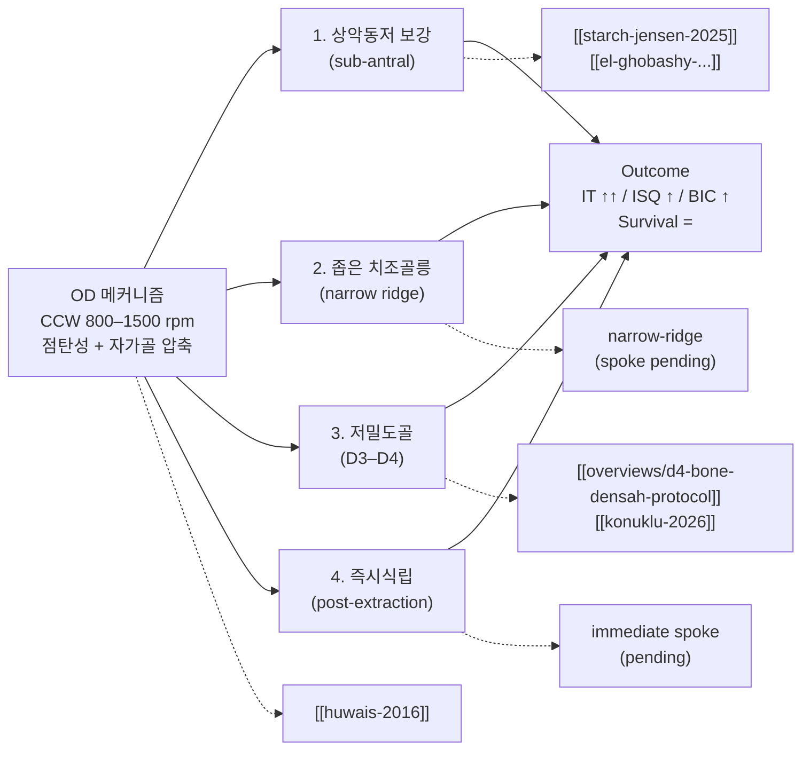

## 한줄요약
골밀도화 (Osseodensification, OD)는 반시계회전 (Counterclockwise, CCW) 800–1500 rpm으로 Densahbur가 자가골을 압축·자가이식하여 4개 임상 시나리오 (상악동저 보강·좁은 ridge·저밀도골 D3–D4·즉시식립)에 적용된다 — 삽입토크 (Insertion Torque, IT) 일관되게 상승 [근거강함], 임플란트 안정성 지수 (Implant Stability Quotient, ISQ) 가변적 상승 [합의수준], 골-임플란트 접촉률 (Bone-to-Implant Contact, BIC) in vitro 3배 상승 [근거강함]; 전반적 임상 근거 수준은 낮음–중등 (Fontes Pereira 2023 결론).

---

## Summary

이 overview는 [[wiki/implants/fontes-pereira-2023-osseodensification-osteotomy-alternative-sr|Fontes Pereira et al. 2023 (JCM, SR, search 2016–2023)]]를 spine으로 OD의 전체 그림을 잡는다. 그 SR이 명시적으로 분류한 4개 적용 시나리오를 축으로, llm-wiki에 들어와 있는 OD 관련 페이지들을 spoke로 묶는다.

핵심 질문 5개:

1. **OD 메커니즘은 무엇이고 conventional drilling과 어떻게 다른가** — CCW + 점탄성 + 자가골 압축
2. **삽입토크·ISQ·BIC·생존율 outcome은 어떻게 다른가** — Fontes Pereira 2023 evidence matrix
3. **4개 적용 시나리오는 각각 어떤 임상 상황에 쓰이는가** — 의사결정 흐름
4. **각 시나리오의 최강 근거는 무엇이고 어떤 paper로 들어가야 하는가** — spoke 진입점
5. **이 spine SR의 한계는 무엇인가** — living document 갱신 포인트

---

## 1. 메커니즘 — CCW + 점탄성 + 자가골 압축

[[wiki/implants/huwais-2017-novel-osseous-densification-osteotomy-primary-stability|Huwais & Meyer 2017 (in vitro, 돼지경골 n=72)]]가 OD를 정의한 원위논문이다. 핵심 4가지:

- **회전 방향**: Densahbur는 다날 (multi-flute) bur로 시계방향 (Clockwise, CW)에서는 cutting, 반시계방향 (CCW)에서는 burnishing/compacting [근거강함, Huwais 2016].
- **속도**: 800–1500 rpm, 무관수 또는 소량 관수 [합의수준, Fontes Pereira 2023].
- **bone behavior**: 골의 점탄성 (viscoelasticity) → spring-back으로 osteotomy 직경이 bur보다 작게 회복되어 임플란트와 bone wall이 강하게 접촉 [근거강함].
- **autograft 효과**: 절삭 대신 횡방향 압축 → 자가골이 walls/apex에 미세이식되어 BIC ↑ [근거강함, in vitro × 3], [합의수준, in vivo].

이 메커니즘이 4개 적용 시나리오의 공통 분모다. ISQ가 항상 오르는 건 아니라는 점은 Huwais 2016에서도 이미 명시 — OD의 차별점은 IT와 BIC, ISQ는 부수효과 [근거강함].

---

## 2. Outcome Matrix — Fontes Pereira 2023 spine

[[wiki/implants/fontes-pereira-2023-osseodensification-osteotomy-alternative-sr|SR (JCM 2023, search 2016–2023)]] 결론을 기준점으로:

| Outcome | OD vs Conventional | Consistency | Confidence | 비고 |
|---------|--------------------|-------------|------------|------|
| Insertion Torque (IT) | OD ↑ 유의 | High | [근거강함] | 모든 included studies에서 일관 |
| ISQ | OD ↑ 대부분 / 일부 동등 | Moderate | [합의수준] | D3/D4에서 ↑ 뚜렷, D1/D2에서 차이 ↓ |
| BIC | OD ↑ (인비트로 ×3, 인비보 제한적) | Low–Moderate | [근거강함, in-vitro] / [합의수준, in vivo] | 인비보 휴먼 데이터 부족 |
| Survival rate | OD = Conventional | High | [근거강함] | 단기 follow-up |
| 술기 시간 | OD ↓ (특히 sub-antral) | Moderate | [합의수준] | Starch-Jensen 2025 |
| MBL (marginal bone loss) | 차이 없음 / 데이터 부족 | Low | [미검증] | 장기 RCT 필요 |

Fontes Pereira 2023의 명시적 limitation: "evidence quality low–moderate, RCT 부족, follow-up 짧음" — 본 overview는 living document로 갱신 ([[feedback_wiki-living-document]]).

---

## 3. 4개 적용 시나리오 — hub-and-spoke

### 3-1. 상악동저 보강 (sub-antral bone augmentation)

**언제**: 잔존골 높이 (Residual Bone Height, RBH) 4–8 mm, 경치조골 거상 (Transcrestal Sinus Floor Elevation, TSFE) 적응증.

**원리**: Densahbur로 sinus floor까지 CCW로 진행 → 골을 floor 쪽으로 압축하며 hydraulic + 자가골 이식 효과로 막 거상.

**최강 근거**:
- [[wiki/sinus-lift/transcrestal/starch-jensen-2025-transcrestal-sinus-osseodensification-meta-analysis|Starch-Jensen et al. 2025 SR+MA (6 RCTs, low GRADE)]] [근거강함, 그러나 GRADE low] — TSMEOD가 osteotome·측방창 대비 식립시·지대주 연결시 ISQ 유의하게 높음. 생존율 동등.
- [[wiki/sinus-lift/transcrestal/el-ghobashy-osseodensification-vs-osteotome-transcrestal-sinus]] [합의수준, RCT] — RCT, OD가 osteotome 대비 ISQ ↑.

**주의**: ESBG (Endo-Sinus Bone Gain)는 측방창 대비 OD에서 적음. 수직 골증대가 1차 목표면 측방창 우선 [근거강함, Starch-Jensen 2025].

**진입점**: [[wiki/overviews/sinus-lift-technique-selection|sinus-lift-technique-selection overview]].

### 3-2. 좁은 치조골릉 (narrow alveolar ridge)

**언제**: ridge 폭 4–6 mm로 conventional drilling은 천공 위험, 골절단 (ridge split)이나 GBR은 부담스러운 경우.

**원리**: CCW Densahbur가 cortical wall을 횡방향으로 압축·확장 (lateral condensation) → 골 부피 손실 없이 osteotomy 직경 확보.

**최강 근거**: [claude해석] Fontes Pereira 2023이 included studies로 인용하나 본 llm-wiki에는 narrow-ridge 단독 SR이 아직 없음. 향후 추가 필요 (spoke pending).

**주의**: D1/D2 cortical-dominant ridge에서는 골절·미세균열 위험 — torque feedback과 CBCT 사전평가 필수 [합의수준].

### 3-3. 저밀도골 (low-density bone, D3–D4)

**언제**: 상악 구치부, 후방 무치악, IT 30 Ncm 확보 어려운 경우.

**원리**: trabecular bone 압축으로 walls에 미세 cortical layer 형성 → IT·ISQ 즉시 상승.

**최강 근거**:
- [[wiki/implants/isq/althobaiti-2023-osseodensification-conventional-drilling-isq-sr|Althobaiti et al. 2023 SR (ISQ-focused)]] [근거강함] — D3/D4에서 OD ISQ ↑ 효과 가장 큼.
- [[wiki/implants/isq/konuklu-2026-five-osteotomy-protocols-isq-rct|Konuklu et al. 2026 RCT (5 protocols)]] [근거강함, RCT] — 5개 osteotomy protocol 직접 비교.
- [[wiki/overviews/d4-bone-densah-protocol|d4-bone-densah-protocol]] — **D4 전용 chairside 인터랙티브**.

**임상**: Fontes Pereira 2023이 "greatest OD benefit" 시나리오로 명시 [근거강함].

### 3-4. 즉시식립 (post-extraction immediate placement)

**언제**: 발치와 (extraction socket) 즉시식립에서 socket-bone gap, 잔존 buccal plate 얇음, primary stability 확보 어려움.

**원리**: socket walls를 OD로 압축·확장 → engagement 증가, gap 감소, autograft 효과.

**최강 근거**: [미검증] Fontes Pereira 2023이 included studies로 언급하나 본 llm-wiki에 즉시식립 OD 단독 SR이 아직 없음. spoke pending.

**주의**: thin buccal plate (<1 mm)에서 OD의 lateral compaction이 plate 손상·발거 가능 — Type 1 socket·thick buccal plate에 한정 [claude해석].

---

## 4. 시나리오 → spoke 진입점 표

| 시나리오 | 최강 근거 | spoke 페이지 |
|---------|-----------|---------------|
| 상악동저 보강 | SR+MA (low GRADE) | [[sinus-lift/transcrestal/starch-jensen-2025-transcrestal-sinus-osseodensification-meta-analysis]] + [[overviews/sinus-lift-technique-selection]] |
| 좁은 치조골릉 | SR included only | (spoke pending — narrow-ridge 단독 SR 추가 필요) |
| 저밀도골 D3–D4 | SR + RCT | [[implants/isq/althobaiti-2023-osseodensification-conventional-drilling-isq-sr]] + [[implants/isq/konuklu-2026-five-osteotomy-protocols-isq-rct]] + [[overviews/d4-bone-densah-protocol]] |
| 즉시식립 | SR included only | (spoke pending) |
| 메커니즘 원위 | in-vitro 원위논문 | [[implants/huwais-2017-novel-osseous-densification-osteotomy-primary-stability]] |
| ISQ 부하 결정 | overview | [[overviews/isq-loading-threshold]] |

---

## 5. Spine SR의 한계 — living document 갱신 포인트

[[feedback_wiki-living-document]] 원칙으로 명시:

- **Search cutoff 2023**: 2024–2026 추가 RCT·SR (예: [[konuklu-2026]], [[starch-jensen-2025]]) 반영 필요 — 본 overview는 이미 반영, Fontes Pereira 2023 페이지 자체는 그대로.
- **Included studies 이질성**: protocol·bur 사이즈·rpm·골질 정의가 일관되지 않음 — RCT가 들어올 때마다 outcome matrix의 confidence 재평가.
- **Conventional drilling 정의 모호**: 일부 included studies가 "standard"를 명확히 정의하지 않음 — 본 overview는 OD vs. CW + irrigation으로 가정 [추정].
- **저자 conflict of interest**: Versah Inc. 후원 연구 다수 included — independent RCT 추가 시 갱신.
- **장기 follow-up 부재**: 5년 이상 MBL·survival 데이터 없음 — Stuhr 2025 류의 long-term이 들어오면 갱신.

---

## 6. 원장 메모 체크리스트

- 4 시나리오 중 본인 임상에 자주 등장 = (1) 상악동저 보강 (2) D3–D4 저밀도골 — 두 spoke가 가장 active
- D4 chairside 시 [[overviews/d4-bone-densah-protocol]] 인터랙티브 우선 참조
- sinus 술식 선택 시 [[overviews/sinus-lift-technique-selection]] 매트릭스에서 OD vs lateral 결정
- 좁은 ridge·즉시식립 시나리오는 spoke 부족 — 추가 paper ingest 우선순위 P1로 표시 (특히 narrow ridge OD RCT, immediate implant OD SR)
- 본 overview는 spine SR (Fontes Pereira 2023)의 evidence quality low–moderate를 항상 전제 — 환자 설명·동의서에 "근거 수준 낮음–중등" 언급 권장

---

## Related Papers
- [[implants/fontes-pereira-2023-osseodensification-osteotomy-alternative-sr]] — spine SR
- [[implants/huwais-2017-novel-osseous-densification-osteotomy-primary-stability]] — 메커니즘 원위논문
- [[implants/isq/althobaiti-2023-osseodensification-conventional-drilling-isq-sr]] — ISQ outcome SR
- [[implants/isq/konuklu-2026-five-osteotomy-protocols-isq-rct]] — 최근 RCT
- [[sinus-lift/transcrestal/starch-jensen-2025-transcrestal-sinus-osseodensification-meta-analysis]] — sub-antral SR+MA
- [[sinus-lift/transcrestal/el-ghobashy-osseodensification-vs-osteotome-transcrestal-sinus]] — sub-antral RCT
- [[overviews/d4-bone-densah-protocol]] — D4 chairside 인터랙티브
- [[overviews/sinus-lift-technique-selection]] — sinus 술식 선택
- [[overviews/isq-loading-threshold]] — ISQ 부하 결정
