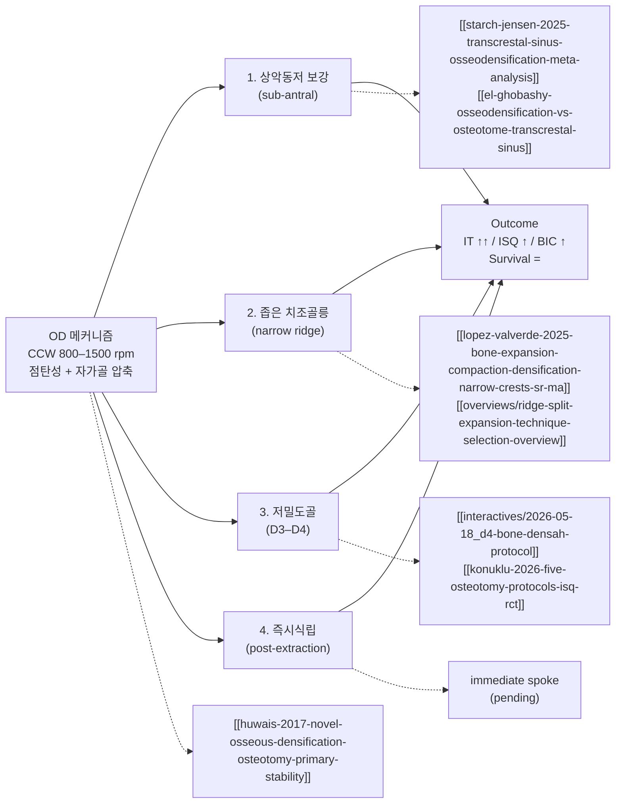

## 한국어 핵심요약

> [!summary] 한국어 핵심요약
> - 핵심 명제: 골밀도화(Osseodensification, OD)는 반시계회전(Counterclockwise, CCW) 800–1500 rpm으로 Densahbur가 자가골을 압축·자가이식하는 술식으로, Fontes Pereira 2023 SR을 spine으로 4개 시나리오(상악동저 보강·좁은 ridge·저밀도골 D3–D4·즉시식립)에 적용된다.
> - 메커니즘: 다날 bur가 CW에서 절삭·CCW에서 압축, 골 점탄성 spring-back으로 osteotomy가 bur보다 작게 회복되어 강한 접촉, 횡방향 압축으로 자가골이 미세이식. 단 Rittipakorn 2025 사체연구는 densah bur를 **시계방향(Clockwise, CW)·800 rpm**으로 돌리는 단순화 변형(CW-OD)을 처음 검증 — 음의 rake angle 덕에 CW에서도 측방 압축이 일어나며 SD 대비 ISQ·IT 더 높은 경향(NS)·더 일관됨 → CCW가 OD의 절대조건은 아닐 수 있음(in-vivo 검증 필요).
> - Outcome matrix: 삽입토크(Insertion Torque, IT)는 일관되게 상승 [확인], 골-임플란트 접촉률(Bone-to-Implant Contact, BIC)은 in vitro 약 3배 상승, 생존율은 conventional과 동등, 전반적 근거 수준은 낮음–중등.
> - 핵심 논쟁 — 저밀도골 임플란트 안정성 지수(Implant Stability Quotient, ISQ): Mohammadi 2025 SR+MA(7편)에서 1차 MD=4.13(p=0.13)·2차 MD=1.78(p=0.11) 모두 유의차 없음(NS), Al-Ahmari 2022 split-mouth도 골밀도만 OD↑·안정성 NS → confidence 하향. **Shilpi 2025 SR+MA(인체 RCT/NRCT 6편)가 독립적으로 재확인** — ISQ 즉시 SMD=2.13(p=0.06)·추적 SMD=1.81(p=0.11) 모두 NS, 단 식립 직후 골밀도는 SMD=2.14(p=0.004)로 유의 우위(3–7개월엔 NS) → "ISQ는 trend, 골밀도 이득은 초기에 국한" 패턴을 2025년 두 번째 SR+MA로 보강.
> - 재정식화: 이득은 IT(기계적 1차 고정)에 확실, RFA로 측정되는 ISQ 이득은 인체에서 불확실하며 있다면 2차 안정성(동물 RCT Arpudaswamy 2025의 3개월 ISQ↑)에 가까움 → 환자 설명 시 분리 권장. 이 IT–ISQ 해리는 인체 임상시험에서도 재현 — Moghaddas 2025 전향연구(상악 구치부 39 임플란트)에서 OD가 IT를 ~37%↑(50.3 vs 36.1 Ncm, p<0.001)했으나 ISQ는 식립·3개월 모두 NS(양 군 ISQ 68↑ 유지).
> - 직경 의존성(Koutouzis 2025, 돼지경골 6mm short 90개): OD의 IT 이득은 **광폭(5.4mm) 임플란트에서만 유의**(50.0 vs 28.0 Ncm, p=0.005), 세폭(4.2mm)은 이득 없음 → Bergamo 2021의 "short 임플란트 예외"를 직경 조절변수로 정밀화. 조직계측 차이는 없어 초기 효과는 기계적 압축.
> - 사체 1차 안정성 근거 축적: Mercier 2022(하악 사체 58 osteotomy)는 OD가 IT 34.9 vs 23.6 Ncm(p=0.036)·CBCT 골밀도(p=0.026) 유의 우위 — Rittipakorn 2025 CW-OD의 IT(34.0 Ncm)와 거의 일치해 술식·골원(하악 vs 경골)·OD 변형(CCW vs CW) 무관하게 OD IT가 일관됨.
> - 발열 안전(Soldatos 2024): 3.0/4.0 버를 23회 이상 재사용+800/1200 RPM 시 ΔT가 골괴사 임계 47°C 초과, 1000 RPM이 최저 발열 → 버 ~23회 교체·무작정 고RPM 금지·관수 보조.
> - 상악동저 보강: TSFE 적응(잔존골 높이(Residual Bone Height, RBH) 4–8mm), Starch-Jensen 2025 SR+MA(6 RCT, low GRADE)에서 OD가 ISQ 우위·생존 동등, 천공률 7.31%(Mazor 2024)이나 RBH ≤3mm가 천공 독립 위험인자.
> - CBCT가 RBH를 약 1.86mm 과소평가(Ragher 2026) → borderline 케이스에서 CBCT 단독 의존 경고, 이중 모달리티 권장.
> - Bench 보강(2026-06-24): Tao 2025(CNC, Type IV foam)는 OD가 토크는 크게 올리되 임플란트 안정성 지수(Implant Stability Quotient, ISQ)는 동등(47.1 vs 46.7, p=0.86)임을 통제 환경에서 재현하며 드릴링 파라미터 권고(1500 rpm·0.04 mm·z⁻¹·관수)를 신설; Barberá-Millán 2021은 OD가 기존 언더드릴링(Under-Drilling, UD) 대조군조차 삽입토크(21.72 vs 8.87 Ncm)·ISQ(69.75 vs 65.16) 모두 능가 — 저밀도골 1차 안정성 이득 보강.
> - **좁은 ridge spoke 개통 (2026-07-17)**: López-Valverde 2025 SR+MA(10편/241명, PROSPERO)가 골확장(BE)·골압축(BC)·골밀도화(OD)를 **하나의 실험군으로 묶어** 대조와 비교 — 골밀도(BD) SMD −0.71(I²=0%, 견고)·치조정 확장(CE) −1.12(I²≥75%, **민감도 분석 전엔 NS**)·ISQ −8.88(I²=96%). **이건 OD vs BE head-to-head가 아니다**; CE·ISQ는 출판편향 고위험 → "BD는 단단하게, CE·ISQ는 시사적으로". 저자들은 GBR·블록·crestal split이 가능하면 그 뒤에 이 기법들을 놓는다 — spoke는 열렸지만 결론은 "OD 우선"이 아니다.
> - **과잉의 천장 (신설 축)**: Coyac 2019(쥐 상악, 고미스핏 배정)이 골밀도화 → 미세골절 → 골세포 사멸 → 흡수 우세 → 조기 실패 경로를 제시 — 저자 정식화 "excessive osseo-densification → osseo-destruction". 보유 OD 근거가 대부분 *치유 없는* 벤치 계측이라 비어 있던 칸. **단 초록 전용이라 미스핏 크기·토크·p값이 없다 = 천장이 있다고만 말하고 어디인지는 말하지 않는다.** 독립 신호: Rizk 2024 RCT 과잉 밀도화 실패 3건(혈류 감소·발열).
> - **형상 vs 방향 (기전 보강)**: Bätz 2019(정형외과 브로치 벤치)가 작업 방향을 고정한 채 예리함만 바꿔 **무딘 추출형 +117%·압착형 +121% 밀도화(P=.005)** — 방향이 아니라 **형상**이 밀도화를 정한다 → Rittipakorn 2025 CW-OD를 "회전은 어느 face를 물지 고를 뿐"으로 읽는 쪽 지지. 치과 기구 미시험·준정적·소뼈 = 전이 불가.
> - **저밀도의 바닥**: de Agostinho Neto 2026(소 늑골 극저밀도, SIN/VERSAH/MAXIMUS 3군)이 미세구조·토크 **전부 NS**(35 / 43.2 / 59.6 Ncm). 경부·체부·근단부를 나눈 첫 micro-CT 계측이며 부위 차 없음 → HaeNaem 특허 전제(측벽↑·바닥↓, d2 ≪ d1) 미지지. 단 **n=5–8로 검정력 부족이 유력** → "차이 없음"이 아니라 "못 찾음"; 특허 전제는 미검증인 채로 남음.
> - 저밀도골(D3–D4)·상악동저 보강이 가장 active한 두 시나리오, **즉시식립만 spoke pending으로 남음**(추가 ingest 우선순위 P1).
> - ex vivo 보강 — IT/RT↑ 그러나 ISQ NS 재현 (de Lima 2026): 소 늑골 Type IV 모델(n=16) 쌍대 연구에서 Versah와 브라질산 WF 키트 모두 기존 드릴링 대비 삽입토크(IT)·제거토크(RT) 유의↑(p=0.007/0.008)이나 ISQ(~79–82, p=0.157)·최고 온도(~28–31°C, p=0.087)는 세 군 간 유의차 없음 → "OD 이득은 기계적 맞물림(torque-detectable), ISQ로 측정되는 강성 변화는 아님" 해석 지지. 특기사항: WF 키트가 토크에서 Versah를 초과(IT 95.25 vs 77.62 Ncm) — 동일 원리의 저비용 대안 가능성.
> - 한계: search cutoff 2023, RCT 부족·follow-up 짧음, Versah Inc. 후원 연구 다수 → 환자 동의서에 "근거 수준 낮음–중등" 언급 권장.

## Three-line Summary

Hub-and-spoke synthesis of 37 papers using Fontes Pereira 2023 SR as spine, mapping osseodensification (OD) — counterclockwise (CCW) 800–1500 rpm Densah-bur bone compaction/autografting — across 4 clinical scenarios: sub-antral augmentation, narrow ridge, low-density D3–D4 bone, and immediate placement.

The consistent OD benefit is raised insertion torque (IT), confirmed across bench/cadaver/animal/human in every study that measured it; in-vitro BIC is ~3× higher; but ISQ (RFA) benefit is not reproduced in two independent 2025 human SR+MAs (Mohammadi 2025 7 studies: primary MD=4.13 NS, Shilpi 2025 6 studies: immediate SMD=2.13 NS) — the torque/ISQ dissociation is a structural finding across bench, cadaver, animal, and clinical data; survival equals conventional; thermal safety caps bur reuse at ~23 uses and recommends ~1000 rpm (47 °C osteonecrosis threshold, Soldatos 2024); overall evidence quality is low–moderate, many Versah-sponsored studies.

Frame OD gains as "mechanical fixation (IT) certain / ISQ uncertain" when counseling patients; the sub-antral TSFE and low-density bone D3–D4 scenarios remain the two clinically active spokes, the narrow-ridge spoke is now filled by a dedicated SR+MA (López-Valverde 2025, 10 studies/241 subjects — but it pools BE+BC+OD against comparators rather than testing OD against BE, and only its bone-density estimate is trustworthy: BD SMD −0.71 at I²=0% versus CE −1.12 at I²≥75% and ISQ −8.88 at I²=96%, both with marked publication bias, leading its authors to place these techniques behind GBR/blocks/crestal split), and only the immediate-placement spoke still lacks a dedicated SR.

Two axes are new and both cut against the benefit-heavy reading: Coyac 2019 supplies the first ceiling — assigned high misfit osseo-densified bone and then destroyed it (micro-fractures, extensive osteocyte death, TRAP/cathepsin-K resorption, absent ALP/collagen I, early failure), formalized as "excessive osseo-densification → osseo-destruction", though abstract-only reporting means it establishes that a ceiling exists without locating it; and Bätz 2019 separates geometry from working direction (blunt extraction densified +117%, P=.005, statistically alongside compaction at +121%), supporting the reading that rotation selects which face engages rather than direction being causal — while de Agostinho Neto 2026 finds every outcome null in extremely porous bone (a likely-underpowered "threshold of utility" at n=5–8) and, in the first regional cervical/body/apical micro-CT the wiki holds, fails to support the HaeNaem patent's premise of side-wall-dominant densification.

## 세줄요약

Fontes Pereira 2023 SR을 spine으로 37편을 4개 임상 시나리오(상악동저 보강·좁은 ridge·저밀도골 D3–D4·즉시식립)에 허브-스포크로 통합.

일관된 이득은 삽입토크(Insertion Torque, IT) 상승 — 벤치·사체·동물·임상 전 계층에서 재현; in vitro 골-임플란트 접촉률(BIC) ~3배; 그러나 임플란트 안정성 지수(Implant Stability Quotient, ISQ)는 2025년 두 독립 인체 SR+MA(Mohammadi 2025 7편 NS·Shilpi 2025 6편 NS)로 근거 혼재 — 토크/ISQ 해리는 구조적 현상; 생존율 conventional과 동등; 발열 안전: 버 ~23회 교체·~1000 rpm 권장(47°C 임계, Soldatos 2024); 전반 근거 낮음–중등, Versah 후원 연구 다수.

환자 설명 시 "삽입 토크는 확실·ISQ는 혼재"로 분리; 상악동저 보강·저밀도골이 가장 활성화된 두 스포크; **좁은 ridge spoke는 López-Valverde 2025 SR+MA(10편/241명)로 개통** — 단 BE·BC·OD 합산 vs 대조이지 OD vs BE 비교가 아니며, 골밀도(SMD −0.71, I²=0%)만 견고하고 확장·ISQ는 출판편향 고위험이라 저자들도 GBR·crestal split 뒤에 배치; **즉시식립만 단독 SR 부재로 대기**.

신규 두 축은 모두 이득 편중을 깎는 방향이다: Coyac 2019이 **과잉 밀도화의 천장**(고미스핏 배정 → 골밀도화 → 미세골절·골세포 사멸 → 흡수 우세 → 조기 실패; "excessive osseo-densification → osseo-destruction")을 처음 제시하나 초록 전용이라 **천장의 존재만 말하고 위치는 말하지 않는다**; Bätz 2019은 방향을 고정한 채 형상만 바꿔 무딘 추출형 +117%(P=.005)로 **형상이 밀도화를 정함**을 계측해 Rittipakorn CW-OD를 지지; de Agostinho Neto 2026은 극저밀도에서 전 지표 NS(검정력 부족 유력)이자 부위별 micro-CT 첫 계측으로 **HaeNaem 특허의 측벽 편중 밀도화 전제를 지지하지 않음**.

---

## Summary

이 overview는 [[implants/osseodensification/fontes-pereira-2023-osseodensification-osteotomy-alternative-sr|Fontes Pereira et al. 2023 (JCM, SR, search 2016–2023)]]를 spine으로 OD의 전체 그림을 잡는다. 그 SR이 명시적으로 분류한 4개 적용 시나리오를 축으로, llm-wiki에 들어와 있는 OD 관련 페이지들을 spoke로 묶는다.

핵심 질문 5개:

1. **OD 메커니즘은 무엇이고 conventional drilling과 어떻게 다른가** — CCW + 점탄성 + 자가골 압축
2. **삽입토크·ISQ·BIC·생존율 outcome은 어떻게 다른가** — Fontes Pereira 2023 evidence matrix
3. **4개 적용 시나리오는 각각 어떤 임상 상황에 쓰이는가** — 의사결정 흐름
4. **각 시나리오의 최강 근거는 무엇이고 어떤 paper로 들어가야 하는가** — spoke 진입점
5. **이 spine SR의 한계는 무엇인가** — living document 갱신 포인트

---

## 1. 메커니즘 — CCW + 점탄성 + 자가골 압축

[[implants/osseodensification/huwais-2017-novel-osseous-densification-osteotomy-primary-stability|Huwais & Meyer 2017 (in vitro, 돼지경골 n=72)]]가 OD를 정의한 원위논문이다. 핵심 4가지:

- **회전 방향**: Densahbur는 다날 (multi-flute) bur로 시계방향 (Clockwise, CW)에서는 cutting, 반시계방향 (CCW)에서는 burnishing/compacting [확인, Huwais 2016]. **단 CCW가 OD의 절대조건은 아닐 수 있다** — [[implants/osseodensification/rittipakorn-2025-clockwise-osseodensification-primary-stability-cadaveric|Rittipakorn et al. 2025 (사람 경골 사체, D3/D4, n=20/group)]] [in-vitro]은 densifying bur를 *절삭방향인 CW·더 낮은 800 rpm*으로 돌리는 단순화 프로토콜(**CW-OD**)을 처음 검증했다. 가설: bur의 음의 rake angle과 비예리 flute가 CW에서도 측방 압축을 만든다. 결과는 SD 대비 ISQ(67.5 vs 62.9, p=0.077)·IT(34.0 vs 29.5 Ncm, p=0.052) 모두 수치상 높으나 NS였고, 대신 OD가 **IQR이 더 좁고 저토크 outlier가 없어 일관**됐으며 IT–ISQ 상관이 OD에서만 유의(ρ=0.577, p=0.0077). 즉 표준 CCW가 reverse-cutting flute로 실제 골을 깎아 술기민감도가 높다는 한계의 대안으로 CW-OD가 제시되나, 작은 표본·사체·정성영상·CCW arm 부재로 in-vivo 검증 필요 [미검증: CCW 컨벤션을 흔드는 첫 직접 데이터].
- **속도**: 800–1500 rpm, 무관수 또는 소량 관수 [확인, Fontes Pereira 2023].
- **bone behavior**: 골의 점탄성 (viscoelasticity) → spring-back으로 osteotomy 직경이 bur보다 작게 회복되어 임플란트와 bone wall이 강하게 접촉 [확인].
- **autograft 효과**: 절삭 대신 횡방향 압축 → 자가골이 walls/apex에 미세이식되어 BIC ↑ [확인, in vitro × 3], [확인, in vivo].

이 메커니즘이 4개 적용 시나리오의 공통 분모다. ISQ가 항상 오르는 건 아니라는 점은 Huwais 2016에서도 이미 명시 — OD의 차별점은 IT와 BIC, ISQ는 부수효과 [확인].

**기구 공학적 기반 (patent layer):** OD 버의 핵심 설계는 특허 문헌에 정의돼 있다. [[implants/osseodensification/huwais-2017-autografting-tool-enhanced-flute-profile]] (PCT WO 2017/124079, Versah/Densah)는 *연속적 음의 레이크각 (negative rake angle)* 과 날마다 절삭면+압밀면을 둔 구조로, 한 방향(CW)은 절삭·반대 방향(CCW)은 골 압축/유압식 자가이식을 구현 — 위 CW/CCW 메커니즘의 공학적 근거다. [[implants/osteotomy-thermal/kim-2019-double-spiral-condensing-screw-implant]] (KR 특허, HaeNaem)은 이중나선(압축 thread + 골분 유도 grooves + 하부 압축 dome)으로 측방·치근단 압밀을 한 번에 달성해 경치조골 상악동거상까지 노린 대체 OD 기구의 설계 기반이다. 즉 Versah(미국)·HaeNaem(한국) 두 계열 모두 "절삭 대신 압밀+자가이식"이라는 동일 원리를 서로 다른 기하로 구현한다.

**형상 vs 방향 — 특허 산문 아래 처음 깔린 계측 (2026-07-17 추가):** 위 patent layer의 핵심 주장("날의 face 기하가 절삭이냐 압밀이냐를 정한다")은 지금까지 **발명자 주장일 뿐 데이터가 없었다**. [[implants/osteotomy-thermal/batz-2019-influence-broach-design-bone-friction|Bätz et al. 2019 (Clin Biomech, 소 해면골 육면체, 준정적 벤치)]] [확인, 단 정형외과·초록 전용]가 그 아래 처음으로 계측을 깔았다: 인공 고관절 치환술 (Total Hip Arthroplasty, THA) 브로치 3종을 비교하되 **작업 방향을 추출(extraction)로 고정한 채 예리함만 바꾸자, 무딘 추출형이 예리한 추출형 대비 골밀도화 +117% (P=.005)** — 압착형(+121%)과 통계적으로 나란히 — 를 만들었다. 즉 *"절삭해야 할" 방향으로 움직이는 기구도 형상이 무디면 밀도화한다.* 이는 [[implants/osseodensification/rittipakorn-2025-clockwise-osseodensification-primary-stability-cadaveric|Rittipakorn 2025]]의 CW-OD 결과(시계방향으로 돌려도 압축됨)를 "방향이 인과"가 아니라 **"회전은 어느 face가 골을 물지를 고를 뿐"**으로 읽는 쪽을 지지한다 — §1 첫머리의 CW/CCW 컨벤션을 흔드는 두 번째 축. 또한 밀도화를 **깊이**(압착형이 더 깊음, P=.001)와 **최대 밀도화 크기**(무딘 추출형이 더 높음, P=.008)로 분리한 유일한 보유 논문으로, [[implants/osteotomy-thermal/kim-2019-double-spiral-condensing-screw-implant|HaeNaem 특허]]가 제기한 측방-vs-치근단 분포 질문의 가장 가까운 대용이다. **전이 한계가 심각하다**: 브로치는 축방향 타격이지 800–1500 rpm 회전이 아니고, 하중이 준정적이며, 소 해면골은 턱뼈가 아니다 — 치과 기구를 하나도 시험하지 않았다. 기전은 시사적일 뿐 **임상 수치로 전이 불가** [미검증: 전이 자체가 미검증].

**과잉의 천장 — densification이 destruction으로 넘어가는 지점 (2026-07-17 추가):** 위 메커니즘은 전부 *"얼마나 이득인가"*를 말하고 **"어디부터 해악인가"를 말하지 않는다** — 보유 OD 논문 대다수가 **치유가 없는** 벤치·ex vivo 계측이기 때문이다. [[implants/coyac-2019-preclinical-model-links-osseo-densification-misfit|Coyac et al. 2019 (Clin Oral Implants Res, 쥐 상악 발치와, 전임상 in vivo)]] [확인, 단 초록 전용]가 그 천장을 처음 제시한다: 임플란트–골삭제 간 **고미스핏(high misfit)을 실험적으로 배정**하자 주위골이 골밀도화된 뒤 미세골절 → **광범위한 골세포 (Osteocyte) 사멸 구역** → 흡수 우세 환경 (주석산 저항성 산성 인산분해효소 (Tartrate-Resistant Acid Phosphatase, TRAP) 활성·카텝신 K (Cathepsin K)) → **신생골 형성 부재** (알칼리성 인산분해효소 (Alkaline Phosphatase, ALP)·제1형 교원질 (Collagen I) 음성) → 섬유성 염증성 육아조직으로 채워진 분화구 모양 조기 실패로 이어졌다. 저자들의 정식화가 곧 명제다 — **"excessive osseo-densification → osseo-destruction"**.

**읽는 법을 반드시 제한한다** (이 문단이 "OD는 해롭다"로 오독되면 이 위키는 후퇴한다): ① 쥐 상악 ≠ 사람 턱, ② 발치와 ≠ 치유된 치조제, ③ **미스핏(언더사이즈 골삭제) ≠ 버 매개 OD** — 저자들이 densification을 misfit의 *결과*로 취급한다는 점에서만 기계론적으로 연결된다. 이 논문의 주장은 **과잉**에 관한 것이지 OD 일반에 관한 것이 아니다. 결정적으로 **초록에 표본수·토크값·미스핏 크기·BIC·p값이 일절 없어 어떤 수치도 인용할 수 없다** — 즉 이 논문은 천장이 **있다**고 말할 뿐 **어디인지 말하지 않는다** [미검증: 크기 미상]. 그럼에도 방향이 독립적으로 재현된다: §3-2의 Rizk 2024 RCT가 좁은 치조정 **과잉 밀도화로 임플란트 실패 3건**(혈류 감소·발열)을 보고했다. 토크 축에서의 상세 — 특히 Coyac이 Trisi 2011의 "골압박괴사 없음"을 어떻게 부위·크기 한정으로 되돌리는지 — 는 [[overviews/high-insertion-torque-primary-stability-crestal-bone-overview]].

**발열·버 재사용 안전** [[implants/osseodensification/soldatos-2024-temperature-changes-osseodensification-cadaver-tibiae-cw-ccw|Soldatos et al. 2024 (cadaver tibiae, 360 osteotomy)]] [확인]: CCW(densification) 모드에서 **3.0/4.0 버를 23회 이상 재사용 + 800/1200 RPM 조합 시 ΔT가 골괴사 임계 47°C 초과**. **1000 RPM이 두 모드 모두 최저 발열**. → 임상 규칙: ① 버는 ~23회에서 교체, ② 저밀도골이라도 RPM을 무작정 높이지 말 것(1000 rpm 부근 권장), ③ 관수 보조. 무관수 고RPM + 마모 버 조합이 가장 위험.

---

## 2. Outcome Matrix — Fontes Pereira 2023 spine

[[implants/osseodensification/fontes-pereira-2023-osseodensification-osteotomy-alternative-sr|SR (JCM 2023, search 2016–2023)]] 결론을 기준점으로:

| Outcome | OD vs Conventional | Consistency | Confidence | 비고 |
|---------|--------------------|-------------|------------|------|
| Insertion Torque (IT) | OD ↑ 유의 (단 직경 의존) | High | [확인] | 모든 included studies에서 일관; bergamo 2021 multicenter CCT도 재확인; **사체에서도 재현 — Mercier 2022 (하악 사체) 34.9 vs 23.6 Ncm p=0.036; Rittipakorn 2025 CW-OD (경골 사체) 34.0 vs 29.5 Ncm p=0.052 trend**; **인체 임상에서도 — Moghaddas 2025 (상악 구치부) 50.3 vs 36.1 Ncm p<0.001 (~37%↑)**; **bench — Tao 2025 (CNC Type IV) IT 11.73 vs 7.77 N·m·RT 9.28 vs 6.65 N·m p<0.001; Barberá-Millán 2021 (돼지경골 D4) OD 21.72 vs under-drilling 8.87 Ncm p=0.000으로 under-drilling 대조군조차 능가**; **de Lima 2026 (소 늑골 ex vivo Type IV, n=16) Versah IT 77.62, WF IT 95.25 Ncm — 두 OD 키트 모두 conventional(61.25 Ncm) 대비 유의↑(p=0.007), RT도 동일 패턴(p=0.008)**. **단 short 임플란트는 직경 의존 — Koutouzis 2025 (돼지경골 6mm) OD IT 이득이 광폭(5.4mm)에서만 유의(50.0 vs 28.0 Ncm p=0.005), 세폭(4.2mm) NS**. **또 하나의 바닥 단서 — de Agostinho Neto 2026 (소 늑골, 극저밀도) 3군 전부 NS (SIN 35±21.5 · VERSAH 43.2±27.1 · MAXIMUS 59.6±28.5 Ncm), 단 n=5–8로 검정력 부족 유력 → "차이 없음"이 아니라 "못 찾음"** |
| ISQ (식립 시점, 1차) | OD ↑ 일부 / **인체 SR+MA·임상에서는 NS** | **Low–Moderate ↓ (하향)** | [확인, 논쟁적] | althobaiti 2023 SR·bergamo 2021은 ↑; **mohammadi 2025 SR+MA (7편) 1차 MD=4.13 p=0.13 NS + shilpi 2025 SR+MA (인체 6편) ISQ 즉시 SMD=2.13 p=0.06·추적 SMD=1.81 p=0.11 둘 다 NS — 2025년 두 독립 SR+MA가 같은 결론**; al-ahmari 2022 split-mouth NS; **Moghaddas 2025 인체 전향연구도 ISQ 식립·3개월 NS (양 군 ISQ 68↑) — IT↑/ISQ NS 해리를 임상에서 재현**; **Tao 2025 bench도 ISQ NS (47.1 vs 46.7, p=0.86)**; Rittipakorn 2025 CW-OD도 ISQ 67.5 vs 62.9 p=0.077 NS trend; **de Lima 2026 ex vivo Type IV — ISQ 79–82 across all groups (Versah 82.40·WF 80.68·conventional 79.42), p=0.157 NS — torque↑/ISQ NS 해리를 두 번째 ex vivo 키트 비교에서 재현**. 단 Barberá-Millán 2021은 OD ISQ 69.75 vs UD 65.16 p=0.001로 ↑ (대조군이 under-drilling) |
| ISQ (2차/치유 후) | OD ↑ (동물 RCT·CCT) | Moderate | [확인] | arpudaswamy 2025 (rabbit, 3mo ISQ↑), bergamo 2021 (전 기간 ISQ≥68) — **이득은 1차보다 2차 안정성에 있을 가능성** |
| BIC / peri-implant 골밀도 | OD ↑ (인비트로 ×3, 인비보 초기에 국한) | Low–Moderate | [확인, in-vitro] / [확인, in vivo] | 인비보 휴먼 데이터 부족; 척추 모델 lopez 2017·torroni 2021이 OD BIC·pullout 우위 보강(외삽 주의); **Mercier 2022 CBCT 사체 골밀도 유의↑(p=0.026); shilpi 2025 SR+MA 식립 직후 골밀도 SMD=2.14 p=0.004 유의↑이나 3–7개월엔 NS — 압축 효과는 초기에 국한, remodeling으로 정상화**; Koutouzis 2025 조직계측은 NS(초기 효과는 기계적 압축, 조직학적 구별 불가) |
| Survival rate | OD = Conventional | High | [확인] | 단기 follow-up |
| 술기 시간 | OD ↓ (특히 sub-antral) | Moderate | [확인] | Starch-Jensen 2025 |
| MBL (marginal bone loss) | 차이 없음 / 데이터 부족 | Low | [미검증] | 장기 RCT 필요 |
| **좁은 치조정 — BD / CE / ISQ** | **BE·BC·OD 실험군 ↑ (대조 대비)** | **BD 견고 / CE·ISQ 취약** | **[확인, 단 출판편향 고위험]** | López-Valverde 2025 SR+MA (10편/241명): BD SMD −0.71 (I²=0%, 견고) · CE −1.12 (I²≥75%, **민감도 분석 전엔 NS**) · ISQ −8.88 (I²=96%). **세 기법 합산 vs 대조이지 OD vs BE head-to-head가 아님** — §3-2 |
| **과잉 압축 (harm ceiling)** | **densification → destruction 전환점이 존재** | **Low (전임상 1편)** | **[확인, 단 쥐·초록 전용]** | Coyac 2019: 고미스핏 → 골밀도화 → 미세골절 → 골세포 사멸 → 흡수 우세 → 조기 실패. **크기 미상** (초록에 미스핏 크기·토크·p값 없음) — 천장이 *있다*고만 말하고 *어디인지* 말하지 않음. 독립 임상 신호: Rizk 2024 RCT 과잉 밀도화 실패 3건 — §1 |

Fontes Pereira 2023의 명시적 limitation: "evidence quality low–moderate, RCT 부족, follow-up 짧음" — 본 overview는 living document로 갱신.

---

## 3. 4개 적용 시나리오 — hub-and-spoke

```mermaid
graph LR
    M["OD 메커니즘<br/>CCW 800–1500 rpm<br/>점탄성 + 자가골 압축"]
    M --> S1["1. 상악동저 보강<br/>(sub-antral)"]
    M --> S2["2. 좁은 치조골릉<br/>(narrow ridge)"]
    M --> S3["3. 저밀도골<br/>(D3–D4)"]
    M --> S4["4. 즉시식립<br/>(post-extraction)"]
    S1 --> O["Outcome<br/>IT ↑↑ / ISQ ↑ / BIC ↑<br/>Survival ="]
    S2 --> O
    S3 --> O
    S4 --> O
    M -.-> Mech["[[huwais-2017-novel-osseous-densification-osteotomy-primary-stability]]"]
    S1 -.-> P1["[[starch-jensen-2025-transcrestal-sinus-osseodensification-meta-analysis]]<br/>[[el-ghobashy-osseodensification-vs-osteotome-transcrestal-sinus]]"]
    S2 -.-> P2["[[lopez-valverde-2025-bone-expansion-compaction-densification-narrow-crests-sr-ma]]<br/>[[overviews/ridge-split-expansion-technique-selection-overview]]"]
    S3 -.-> P3["[[interactives/2026-05-18_d4-bone-densah-protocol]]<br/>[[konuklu-2026-five-osteotomy-protocols-isq-rct]]"]
    S4 -.-> P4["immediate spoke<br/>(pending)"]
```

### 3-1. 상악동저 보강 (sub-antral bone augmentation)

**언제**: 잔존골 높이 (Residual Bone Height, RBH) 4–8 mm, 경치조골 거상 (Transcrestal Sinus Floor Elevation, TSFE) 적응증.

**원리**: Densahbur로 sinus floor까지 CCW로 진행 → 골을 floor 쪽으로 압축하며 hydraulic + 자가골 이식 효과로 막 거상.

**최강 근거**:
- [[sinus-lift/transcrestal/starch-jensen-2025-transcrestal-sinus-osseodensification-meta-analysis|Starch-Jensen et al. 2025 SR+MA (6 RCTs, low GRADE)]] [확인, 그러나 GRADE low] — TSMEOD가 osteotome·측방창 대비 식립시·지대주 연결시 ISQ 유의하게 높음. 생존율 동등.
- [[sinus-lift/transcrestal/el-ghobashy-osseodensification-vs-osteotome-transcrestal-sinus]] [확인, RCT] — RCT, OD가 osteotome 대비 ISQ ↑.
- [[sinus-lift/transcrestal/mazor-2024-maxillary-sinus-membrane-perforation-osseodensification|Mazor et al. 2024 multicenter cross-sectional (6센터·670 sites)]] [확인] — OD 기반 TSFE **슈나이더막 천공률 7.31%** (기존 7–58% 하단). **RBH ≤3 mm가 천공 독립 위험인자**; 부위·socket 상태(healed/fresh)는 무관.
- [[sinus-lift/transcrestal/samir-2024-osseodensification-piezoelectric-internal-sinus-elevation|Samir 2024 RCT (OD vs 피에조)]] [확인, RCT] — OD가 골량·골밀도·수술시간·만족도 우위, 피에조는 당일 1차 안정성 우위 — 둘 다 유효, 강점이 다름.

**대안 OD 버 시스템 — HaeNaem CW-OD (시계방향 회전)** ⚠️ **(아래 Changrani 2024는 이후 RETRACTED/철회됨 — 임상근거로 인용 금지)**:
[[sinus-lift/transcrestal/changrani-2024-haenaem-zero-bone-loss-indirect-sinus-lift|Changrani et al. 2024 (Cureus, 전향적 단일군, n=12) — RETRACTED]]은 경치조골 간접 상악동 거상에 시계방향 (Clockwise, CW) 회전 OD 버인 HaeNaem Zero Bone Loss Kit을 적용한 (현존) 유일한 전향적 임상 데이터였다. RCBH 6–8 mm, 무이식, 동시식립 조건에서 4개월 CBCT 4방향(근심·원심·협측·구개측) 모두 유의한 골고 증가(p<0.01)로 보고됐으나, **이 논문은 이후 철회(retracted)되었으므로 위 수치를 근거로 사용해서는 안 된다.** 제조사 주장("Densah 대비 risk-to-benefit 우위")은 내부 비교 데이터 없는 assertion이며, 단일군(대조군 없음)이라 Densah와의 head-to-head 비교도 아니었다. 따라서 HaeNaem CW-OD에 대한 유효한 전향적 임상근거는 **현재 부재**하다. [철회됨 — 근거 무효]

**주의**:
- ESBG (Endo-Sinus Bone Gain)는 측방창 대비 OD에서 적음. 수직 골증대가 1차 목표면 측방창 우선 [확인, Starch-Jensen 2025].
- **RBH ≤3 mm에서는 OD-TSFE 천공 위험 ↑** (Mazor 2024) → 이 영역은 측방창 고려.
- **CBCT가 RBH를 ~1.86 mm 과소평가** ([[sinus-lift/transcrestal/ragher-2026-infrasinus-residual-ridge-height-cbct-indirect-sinus|Ragher 2026]], n=50) → borderline RBH 케이스에서 CBCT 단독 의존 경고, 이중 모달리티 권장.

**진입점**: [[overviews/sinus-lift-technique-selection|sinus-lift-technique-selection overview]].

### 3-2. 좁은 치조골릉 (narrow alveolar ridge)

**언제**: ridge 폭 4–6 mm로 conventional drilling은 천공 위험, 골절단 (ridge split)이나 GBR은 부담스러운 경우.

**원리**: CCW Densahbur가 cortical wall을 횡방향으로 압축·확장 (lateral condensation) → 골 부피 손실 없이 osteotomy 직경 확보.

**최강 근거 (2026-07-17 — spoke 개통, 종전 "pending")**: [[bone-regeneration/lopez-valverde-2025-bone-expansion-compaction-densification-narrow-crests-sr-ma|López-Valverde et al. 2025 (Front Bioeng Biotechnol, SR+MA, 10편/241명, PROSPERO CRD42025646738)]] [확인, 단 근거 취약] — 수평위축 ≤2.5 mm 좁은 치조정에서 **골확장 (Bone Expansion, BE)·골압축 (Bone Compaction, BC)·골밀도화 (OD) 세 기법을 하나의 실험군으로 묶어** 대조 술식과 비교한 SR+MA. 이 overview가 오래 비워 둔 자리를 메우는 첫 전용 합성이다.

**결과 — outcome별로 신뢰도가 갈리는 것이 핵심이다**:

| Outcome | SMD (95% CI) | p | I² | 신뢰도 |
|---|---|---|---|---|
| 골밀도 (Bone Density, BD) | **−0.71** (−1.15 – −0.27) | 0.002 | **0%** | **견고** — 고정효과·깔때기 대칭·출판편향 없음 |
| 치조정 확장 (Crestal Expansion, CE) | −1.12 (−2.21 – −0.03) | 0.04 | **≥75%** | **취약** — 민감도 분석 **전에는 NS**(0.41, p=0.58); 3편 제거 후에야 유의 |
| ISQ | −8.88 (−13.85 – −3.91) | 0.0005 | **96%** | **취약** — 이질성 극단 + 깔때기 비대칭 |

음의 SMD = 실험군 우위. **읽는 법 두 가지를 못박는다**: ① 이 SMD들은 **세 기법을 합친 실험군 vs 대조군**이지 **OD vs BE의 head-to-head가 아니다** — 이 SR은 "OD가 BE보다 우월하다"를 보고하지 않았으므로 그렇게 인용하면 안 된다. ② 헤드라인 "셋 다 개선"은 **"BD는 단단하게, CE·ISQ는 시사적으로"**로 읽어야 한다 (CE·ISQ 모두 출판편향 고위험). 절대 폭 증가는 포함 연구 통틀어 대략 **1.1–2.4 mm**.

**같은 논문 안의 head-to-head 신호 (narrative — pooled 아님)**: Rizk 2024 RCT — OD 버 > 임플란트 확장기 (폭 증가; 즉시 p=0.018/0.022 · 6개월 p=0.025/0.040); Tofan 2024 — OD 버 vs 나사형 확장기 최종 폭 차이 없음(5.48±0.57 vs 5.53±0.71)이나 OD가 더 빠름; Ahmed 2022 — OD가 crestal split 대비 삽입토크↑·수술시간↓이나 **6개월 수평 골증가는 유의차 없음**(1.99±0.68 vs 2.63±0.74 mm).

**⚠️ 저자들의 결론은 OD 홍보가 아니다** — 이 spoke를 "개통"으로만 읽으면 논문을 거꾸로 읽는 것이다:
- **임상 ↔ 전임상 상충**: 임상 pooling은 densification에 유리하나, **전임상 모델(양·돼지·쥐)은 BIC·골통합 이득을 보이지 않는다.**
- **과잉 밀도화 실패**: Rizk 2024가 좁은 치조정 **과잉 밀도화로 인한 임플란트 실패 3건**(혈류 감소·발열)을 보고 — §1의 Coyac 천장과 **독립적으로 같은 방향**을 가리키며, 좁은 능선은 압축할 해면골과 여유 혈류가 애초에 적다는 점에서 천장이 더 낮을 수 있다 [미검증: 좁은 능선의 천장이 더 낮다는 것은 추론].
- **저자들의 서열**: 이 기법들을 **GBR·블록골이식·crestal split이 가능하다면 그 뒤에** 놓는다.

→ 따라서 이 spoke의 임상 명제는 *"OD가 좁은 능선의 1차 선택"*이 **아니라** *"단계적 골증대가 여의치 않을 때, 숙련자에 한해, BD 이득은 믿고 CE·ISQ 이득은 반쯤 깎아 듣고"*이다.

**술식 간 서열 (cross-overview)**: [[overviews/ridge-split-expansion-technique-selection-overview]]의 Vorovenci 2024 직접 비교 — 골증대량 GBR **4.04 mm** > ridge split **3.66 mm** > OD 확장 **2.15 mm** (ANOVA P=0.002), 단 생존율은 셋 다 ~98–99%로 동등. 결정적 해석: **OD는 셋 중 가장 넓은 능선(시작 4.37 mm)에 적용된 반면 RS는 가장 좁은 능선(3.43 mm)에 적용**됐다 — OD의 낮은 증대량은 "약해서"가 아니라 **애초에 덜 좁은 능선에 쓰이기 때문**일 수 있다. 좁은 능선의 술식 선택 자체는 이 overview가 아니라 그 overview에서 결정하라.

**주의**: D1/D2 cortical-dominant ridge에서는 골절·미세균열 위험 — torque feedback과 CBCT 사전평가 필수 [확인].

### 3-3. 저밀도골 (low-density bone, D3–D4)

**언제**: 상악 구치부, 후방 무치악, IT 30 Ncm 확보 어려운 경우.

**원리**: trabecular bone 압축으로 walls에 미세 cortical layer 형성 → IT·ISQ 즉시 상승.

**최강 근거 (지지)**:
- [[implants/isq/althobaiti-2023-osseodensification-conventional-drilling-isq-sr|Althobaiti et al. 2023 SR (ISQ-focused)]] [확인] — D3/D4에서 OD ISQ ↑ 효과 가장 큼.
- [[implants/isq/konuklu-2026-five-osteotomy-protocols-isq-rct|Konuklu et al. 2026 RCT (5 protocols)]] [확인, RCT] — 5개 osteotomy protocol 직접 비교.
- [[implants/osseodensification/bergamo-2021-osseodensification-effect-implants-primary-secondary|Bergamo et al. 2021 multicenter CCT (56명·150 임플란트)]] [확인] — OD가 IT·ISQ 모두 유의 우위, ISQ 3주 dip 후 6주 회복하나 OD는 전 기간 ISQ≥68 유지. **단 short 임플란트는 예외(차이 없음)** — 이 예외는 직경 조절변수로 정밀화된다(아래 Koutouzis 2025).
- [[implants/osseodensification/koutouzis-2025-osteotomy-preparation-short-implants-stability|Koutouzis et al. 2025 (돼지경골, 6mm short 임플란트 90개, 3직경×3술식)]] [animal] — **OD의 IT 이득이 직경 의존적**: 광폭(5.4mm)에서만 OD가 SD 대비 유의↑(50.0 vs 28.0 Ncm, p=0.005), 세폭(4.2mm)·표준폭(4.8mm)은 NS. OD 내에서도 W-OD(50.0) > N-OD(31.5, p=0.04)로 직경 효과가 가산적. 단 osteotome도 광폭에서 OD와 동등하게 IT를 올려(46.9 Ncm, p=0.026) **OD가 압축술식 중 유일하게 우월한 것은 아님**. 조직계측(골수강·결합조직 접촉)은 NS. → **임상: short 임플란트에 OD를 쓸 때는 직경 ≥5.4mm를 함께 선택해야 IT 이득 실현** (Bergamo의 short 예외를 "직경이 좁아서"로 설명).
- [[implants/osseodensification/moghaddas-2025-osseodensification-standard-drilling-isq-itv|Moghaddas & Banazadeh 2025 전향 임상 (21명·39 임플란트, 상악 구치부)]] [prospective] — 인체 임상에서 OD가 IT를 ~37%↑(50.3 vs 36.1 Ncm, p<0.001)했으나 **ISQ는 식립·3개월 모두 NS, 양 군 ISQ 68↑ 유지** — IT↑/ISQ NS 해리를 cadaver/animal이 아닌 실제 환자에서 재현. 단 ridge ≥9mm·≥6mm cohort라 SD도 이미 충분한 안정성 달성.
- [[implants/osseodensification/mercier-2022-osseodensification-primary-stability-cadavers|Mercier et al. 2022 (사람 하악 사체 21개·58 osteotomy)]] [in-vitro] — OD가 SD 대비 IT 유의↑(34.9 vs 23.6 Ncm, +48%, p=0.036)·CBCT 골밀도↑(p=0.026), IT–ISQ 상관 OD에서만(ρ=0.527). Rittipakorn 2025 CW-OD의 IT(34.0 Ncm)와 거의 일치 — 골원·OD 변형 무관하게 OD IT 일관됨.
- [[implants/isq/arpudaswamy-2025-osseodensification-conventional-implant-stability-rabbit|Arpudaswamy 2025 (토끼 D4 split-body RCT)]] [animal] — 식립 시점 ISQ는 차이 없으나 **3개월 ISQ·IT 유의 ↑ → 이득은 2차 안정성**.
- [[implants/osseodensification/neiva-2018-effects-osseodensification-astra-tx-ev|Neiva 2018 (sheep e-poster)]] [animal] — IT/RFA OD 압도적 우위, EV 시스템에서 BIC/BAFO도 ↑.
- [[implants/osseodensification/barbera-millan-2021-primary-stability-low-density-osseodensification|Barberá-Millán et al. 2021 (in vitro, 돼지경골 Type IV, n=55/group)]] [확인, in-vitro] — **대조군이 plain drilling이 아닌 conventional under-drilling(UD)**이라는 점에서 가장 엄격한 D4 비교: OD가 UD 대비 IT 21.72 vs 8.87 Ncm (≈2.4배, p=0.000)·ISQ 69.75 vs 65.16 (p=0.001) 모두 유의 우위. torque–ISQ는 sigmoid 관계로 ISQ가 ~75.6에서 plateau (그 이상의 torque는 추가 안정성 없음). 즉 **이미 under-sizing한 soft-bone 프로토콜조차 OD가 능가** — D4에서 OD의 1차 안정성 이득을 보강.
- [[implants/osseodensification/tao-2025-optimizing-osseodensification-drilling-implant|Tao et al. 2025 (in vitro CNC, Type IV foam 0.160 g/cm³)]] [확인, in-vitro] — **드릴링 파라미터 최적화** 관점을 추가: OD vs CD(BLT tapered)에서 IT 11.73 vs 7.77 N·m·RT 9.28 vs 6.65 N·m (모두 p<0.001)로 torque 우위·골벽 결함 적음·발열 낮음이나 **ISQ는 동등(47.1 vs 46.7, p=0.86)** — torque↑/ISQ NS divergence를 CNC 통제 환경에서 깔끔하게 재현. 권장 OD 셋팅 **1500 rpm·0.04 mm·z⁻¹·관수 동반**(Type IV).
- [[interactives/2026-05-18_d4-bone-densah-protocol|d4-bone-densah-protocol]] — **D4 전용 chairside 인터랙티브**.

**반례 (논쟁) — living-document 갱신 핵심**:
- [[implants/osseodensification/mohammadi-2025-osseodensification-conventional-low-density-bone-sr-ma|Mohammadi et al. 2025 SR+MA (7편)]] [확인, 반례] — 저밀도골 OD vs CD에서 **1차 ISQ MD=4.13 (p=0.13)·2차 MD=1.78 (p=0.11) 모두 NS**, MBL·PI도 NS. 12개월 PD·구개측 CBL만 OD 유리. 결론: "장기 우월성 입증 부족".
- [[implants/osseodensification/shilpi-2025-osseodensification-conventional-low-bone-sr-ma|Shilpi et al. 2025 SR+MA (인체 RCT/NRCT 6편)]] [확인, 반례·보강] — Mohammadi와 **독립된 팀·같은 해·인체전용 제한**으로 같은 결론 재확인: ISQ 즉시 SMD=2.13 (95% CI −0.08–4.35, p=0.06)·추적 SMD=1.81 (p=0.11) 둘 다 NS. **단 식립 직후 peri-implant 골밀도는 SMD=2.14 (p=0.004) 유의↑** (압축효과 확인)이나 3–7개월엔 NS (remodeling으로 정상화). ISQ 즉시 p=0.06이 간발의 차로 NS·CI 하한이 0을 살짝 넘음 → "표본부족으로 검정력 미달한 양의 trend" 해석을 보강. **2025년 두 번째 인체 SR+MA로 "ISQ는 trend, 이득은 초기 골밀도에 국한" 패턴 강화**.
- [[implants/isq/al-ahmari-2022-osseodensification-conventional-low-density-jaw|Al-Ahmari 2022 split-mouth (20명·40 임플란트)]] [확인, 반례] — **골밀도만 OD↑, 1차·2차 안정성·PI·BOP·PD·MBL은 NS**.
- [[implants/osseodensification/de-agostinho-neto-2026-in-vitro-evaluation-different-implant-systems|de Agostinho Neto et al. 2026 (Sci Rep, 신선 저밀도 소 늑골 in vitro, 3군)]] [확인, 반례·null] — 기존 드릴링(SIN) vs OD(VERSAH) vs 골확장기(MAXIMUS) 비교에서 **아무것도 유의하지 않았다**: 시스템 간 미세구조 차이 없음, 식립 토크도 NS (SIN 35±21.5 · VERSAH 43.2±27.1 · MAXIMUS 59.6±28.5 Ncm). 두 가지가 특기할 만하다. ① **경부·체부·근단부를 나눠 micro-CT로 본 첫 보유 논문이며, 부위 간 차이가 없었다** — 이는 [[implants/osteotomy-thermal/kim-2019-double-spiral-condensing-screw-implant|HaeNaem 특허]]의 공학적 전제("기존 OD 버는 측벽은 강하게·골삭제 바닥은 약하게 밀도화한다, d2 ≪ d1")를 **처음으로 계측에 부친 결과이며 그 전제를 지지하지 않는다.** 단 아래 검정력 문제로 *반증*이라고까지 말할 수 없다 — 특허 전제는 여전히 **미검증인 채로 남는다** [미검증]. ② 저자들은 극도로 다공성인 골에서 밀도화가 **"유용성의 한계점 (threshold of utility)"**에 도달 — 압축할 해면골 자체가 부족 — 해 드릴 선택보다 해면골 생물학이 1차 안정성을 지배한다고 읽는다. **단 이 null은 조심해서 읽어야 한다**: 군당 n=5–8에 표준편차 21–28 Ncm가 평균 격차 24.6 Ncm를 덮는다 — **검정력 부족이 유력하며 "차이가 없다"가 아니라 "차이를 못 찾았다"**이다 [확인, 페이지가 스스로 명시]. 게다가 대조군(SIN)조차 3.5 mm 임플란트에 최종 3.0 mm 골삭제로 **이미 언더사이즈**였다.

**임상 종합**: Fontes Pereira 2023은 D3–D4를 "greatest OD benefit" 시나리오로 명시했으나, **2025년 두 인체 SR+MA(mohammadi 7편·shilpi 6편)가 나란히 ISQ 이득을 재현하지 못함** (shilpi는 식립 직후 골밀도만 유의↑·3–7개월엔 소실). 현재 합의: IT(1차 기계적 고정)는 일관되게 ↑, 그러나 **RFA로 측정되는 ISQ 이득은 인체에서 불확실**하고 이득이 있다면 2차 안정성(동물 RCT)에 가까움. 이 IT↑/ISQ NS 해리는 이제 cadaver(mercier·rittipakorn)·bench(tao)·동물(arpudaswamy)에 더해 **인체 임상시험(moghaddas 2025)에서도 직접 관찰**돼 측정 노이즈가 아닌 구조적 현상으로 굳어졌다. 추가로 short 임플란트에서는 IT 이득조차 **직경 의존적**(koutouzis 2025: 광폭 5.4mm에서만)이라 OD 적용 시 직경 선택이 변수다. 환자 설명 시 "삽입 토크는 확실히 개선, 안정성 수치(ISQ) 이득은 근거 혼재"로 분리 권장.

이 torque-vs-ISQ 분리는 2026년 bench 근거가 더 또렷하게 만든다. **Tao 2025**가 CNC로 hand-pressure noise를 제거한 통제 환경에서 OD가 torque는 크게 올리되 ISQ는 동등(p=0.86)임을 재현했고, **de Lima 2026**이 소 늑골 Type IV 쌍대 연구에서 두 번째 OD 키트(WF)를 포함한 3군 비교로 이를 추가 재현(ISQ p=0.157 NS; IT/RT 모두 유의) — divergence가 측정 노이즈가 아니라 두 지표가 측정하는 물리량이 다르다는 구조적 현상임을 더욱 강화한다. 특히 de Lima 2026은 Versah 이외 OD 키트(WF)가 동일한 IT↑/ISQ NS 패턴을 보이되 토크 수치는 Versah를 초과(IT 95.25 vs 77.62 Ncm)함을 보여, OD의 torque-ISQ 해리가 Versah 특이적이 아닌 OD 기전 공통 현상임을 시사한다. 동시에 Tao 2025는 기존 overview에 없던 **드릴링 파라미터 축**(속도·feed·관수)을 추가: Type IV에서 1500 rpm·0.04 mm·z⁻¹·관수 동반이 권장 OD 셋팅이며, 무관수는 양 술식 모두 thermal damage 위험(§1 Soldatos 발열 규칙과 정합). 한편 **Barberá-Millán 2021**은 ISQ 결과의 nuance를 더한다 — 인체 SR+MA가 NS인데도 이 bench에서는 OD ISQ가 유의 우위(p=0.001)였는데, 대조군이 plain drilling이 아닌 이미 under-sizing한 UD였음에도 OD가 능가했다는 점이 핵심이다. 종합하면: **저밀도골에서 OD의 1차 기계적 고정(IT/RT) 이득은 bench·cadaver·동물에서 매우 견고**하고 under-drilling 대조군조차 능가하지만, **ISQ 이득은 in-vitro에서는 관찰되다가 인체 SR+MA에서 사라지는** 모순이 남아 있어, "torque는 확실, ISQ는 혼재" 프레이밍을 유지한다.

**저밀도의 *바닥* — null이 붙인 단서 (2026-07-17 추가):** de Agostinho Neto 2026은 위 "IT 이득은 확실"이라는 명제에 **바닥 조건**을 붙인다. 소 늑골이라는 *극도로* 다공성인 기질에서는 OD의 토크 이득조차 유의에 이르지 못했다(43.2 vs 35 Ncm, NS). 두 해석이 경합한다 — ⓐ 저자들의 **"threshold of utility"**: 압축할 해면골이 남아 있지 않은 곳에서는 밀도화가 물리적으로 할 일이 없다. ⓑ **단순 검정력 부족**: n=5–8, SD 21–28 Ncm. **이 논문 하나로는 둘을 구별할 수 없으므로 이 페이지는 둘 다 열어 둔다** [미검증: 어느 쪽인지 미결]. 실무적 함의는 어느 쪽이든 같다 — OD를 D3–D4에서 쓰되, **골질이 D4보다도 아래로 내려가는 구간에서는 드릴 선택보다 임플란트 macrogeometry·부하 프로토콜·이식이 레버**라는 신호로 읽는 편이 안전하다. 이는 [[implants/osteotomy-thermal/gehrke-2021-healing-chambers-macrogeometry-low-density-drilling|Gehrke 2021]]의 "언더사이즈는 PCF-20에서만 효과 — 최저밀도 한계 + macrogeometry 보완"과 **같은 방향의 독립 관찰**이다.

### 3-4. 즉시식립 (post-extraction immediate placement)

**언제**: 발치와 (extraction socket) 즉시식립에서 socket-bone gap, 잔존 buccal plate 얇음, primary stability 확보 어려움.

**원리**: socket walls를 OD로 압축·확장 → engagement 증가, gap 감소, autograft 효과.

**최강 근거**: [미검증] Fontes Pereira 2023이 included studies로 언급하나 본 llm-wiki에 즉시식립 OD 단독 SR이 아직 없음. spoke pending.

**주의**: thin buccal plate (<1 mm)에서 OD의 lateral compaction이 plate 손상·발거 가능 — Type 1 socket·thick buccal plate에 한정 [미검증].

---

## 4. 시나리오 → spoke 진입점 표

| 시나리오 | 최강 근거 | spoke 페이지 |
|---------|-----------|---------------|
| 상악동저 보강 | SR+MA (low GRADE) + 천공 데이터 | [[sinus-lift/transcrestal/starch-jensen-2025-transcrestal-sinus-osseodensification-meta-analysis]] + [[sinus-lift/transcrestal/mazor-2024-maxillary-sinus-membrane-perforation-osseodensification]] + [[overviews/sinus-lift-technique-selection]] |
| 좁은 치조골릉 | **SR+MA (10편/241명)** — BD 견고·CE/ISQ 출판편향 고위험 | [[bone-regeneration/lopez-valverde-2025-bone-expansion-compaction-densification-narrow-crests-sr-ma]] + [[overviews/ridge-split-expansion-technique-selection-overview]] (GBR/RS/OD 술식 서열) |
| 저밀도골 D3–D4 | SR + RCT + 사체/임상 (**SR+MA 반례 2편**) | 지지: [[implants/isq/althobaiti-2023-osseodensification-conventional-drilling-isq-sr]] + [[implants/osseodensification/bergamo-2021-osseodensification-effect-implants-primary-secondary]] + [[implants/osseodensification/mercier-2022-osseodensification-primary-stability-cadavers]] + [[implants/osseodensification/moghaddas-2025-osseodensification-standard-drilling-isq-itv]] + [[implants/osseodensification/koutouzis-2025-osteotomy-preparation-short-implants-stability]] (직경 의존) + [[implants/osseodensification/rittipakorn-2025-clockwise-osseodensification-primary-stability-cadaveric]] (CW-OD) + [[implants/osseodensification/de-lima-2026-osseodensification-vs-conventional-drilling-exvivo]] (IT↑/ISQ NS, WF 키트) ↔ 반례: [[implants/osseodensification/mohammadi-2025-osseodensification-conventional-low-density-bone-sr-ma]] + [[implants/osseodensification/shilpi-2025-osseodensification-conventional-low-bone-sr-ma]] + [[implants/isq/al-ahmari-2022-osseodensification-conventional-low-density-jaw]] + [[interactives/2026-05-18_d4-bone-densah-protocol]] |
| 즉시식립 | SR included only | (spoke pending) |
| 메커니즘 원위 | in-vitro 원위논문 | [[implants/osseodensification/huwais-2017-novel-osseous-densification-osteotomy-primary-stability]] |
| **기전 — 형상 vs 방향** | 정형외과 벤치 (초록 전용, 전이 한계 심각) | [[implants/osteotomy-thermal/batz-2019-influence-broach-design-bone-friction]] |
| **과잉 OD의 천장** | 전임상 in vivo (쥐, 초록 전용 — 크기 미상) | [[implants/coyac-2019-preclinical-model-links-osseo-densification-misfit]] + [[overviews/high-insertion-torque-primary-stability-crestal-bone-overview]] |
| ISQ 부하 결정 | overview | [[overviews/isq-loading-threshold]] |

---

## 5. Spine SR의 한계 — living document 갱신 포인트

Living document 원칙으로 명시:

- **Search cutoff 2023**: 2024–2026 추가 RCT·SR (예: [[konuklu-2026-five-osteotomy-protocols-isq-rct]], [[starch-jensen-2025-transcrestal-sinus-osseodensification-meta-analysis]]) 반영 필요 — 본 overview는 이미 반영, Fontes Pereira 2023 페이지 자체는 그대로.
- **저밀도골 ISQ 명제 하향 (2026-06-01 갱신)**: [[mohammadi-2025-osseodensification-conventional-low-density-bone-sr-ma]] SR+MA가 저밀도골 1차·2차 ISQ 모두 NS로 보고 — Fontes Pereira 2023의 "greatest benefit" 프레이밍과 충돌. Outcome matrix ISQ 행을 1차/2차로 분리하고 confidence를 하향. [[al-ahmari-2022-osseodensification-conventional-low-density-jaw]] split-mouth도 반례. **이득은 IT(기계적)에 확실, ISQ(RFA)는 인체 근거 혼재**로 재정식화.
- **발열 안전 변수 추가**: [[soldatos-2024-temperature-changes-osseodensification-cadaver-tibiae-cw-ccw]] — 버 재사용 횟수·RPM이 골괴사 위험의 결정 변수. 향후 인체 thermal RCT 들어오면 갱신.
- **저밀도골 bench 보강 + 파라미터 축 신설 (2026-06-24 갱신)**: [[tao-2025-optimizing-osseodensification-drilling-implant]]와 [[barbera-millan-2021-primary-stability-low-density-osseodensification]] 두 in-vitro Type IV 연구가 ① IT/RT 이득의 견고성(Tao CNC·Barberá-Millán under-drilling 대조군조차 능가)과 ② torque↑/ISQ NS divergence(Tao p=0.86)를 재확인. Tao 2025는 overview에 없던 **드릴링 파라미터 권고(1500 rpm·0.04 mm·z⁻¹·관수)**를 더해 Soldatos 발열 규칙과 정합. 단 Barberá-Millán은 bench에서 OD ISQ 유의 우위(p=0.001)라 mohammadi 2025 인체 SR+MA(NS)와 in-vitro↔in-vivo 모순이 잔존 — 인체 RCT로만 해소 가능.
- **저밀도골 ISQ 반례 보강 + 임상·사체·직경·방향 축 추가 (2026-06-26 갱신)**: ① [[shilpi-2025-osseodensification-conventional-low-bone-sr-ma]]가 mohammadi 2025와 독립적으로 인체 SR+MA에서 ISQ NS(즉시 p=0.06·추적 p=0.11)를 재확인 — 2025년 두 번째 SR+MA로 "ISQ trend, 초기 골밀도 이득에 국한" 패턴 강화. ② [[moghaddas-2025-osseodensification-standard-drilling-isq-itv]]가 IT↑(p<0.001)/ISQ NS 해리를 **인체 전향 임상**에서 재현(이전엔 cadaver/animal/bench에만 있던 관찰). ③ [[koutouzis-2025-osteotomy-preparation-short-implants-stability]]가 OD IT 이득을 **직경 의존**(광폭 5.4mm에서만)으로 정밀화 → Bergamo 2021의 short 임플란트 예외를 설명. ④ [[mercier-2022-osseodensification-primary-stability-cadavers]]가 사람 하악 사체에서 OD IT·골밀도 유의↑로 IT 근거 보강. ⑤ [[rittipakorn-2025-clockwise-osseodensification-primary-stability-cadaveric]]가 **CW-OD(시계방향·800 rpm)** 변형을 처음 검증 — CCW가 OD의 절대조건이 아닐 수 있음을 시사(§1 메커니즘 갱신). 모두 forward-only 통합.
- **ex vivo 비교 보강 + WF 대안 키트 추가 (2026-06-28 갱신)**: [[de-lima-2026-osseodensification-vs-conventional-drilling-exvivo]]가 소 늑골 Type IV 쌍대 연구(n=16)에서 Versah 외 브라질산 WF 키트를 처음 직접 비교 — 두 OD 키트 모두 conventional 대비 IT/RT 유의↑(p<0.01), ISQ(p=0.157)·온도(p=0.087)는 NS. 특히 WF가 Versah를 토크에서 초과(IT 95.25 vs 77.62 Ncm)하여 Densah가 OD의 단일 표준이 아님을 시사. 이 ISQ NS 패턴은 Tao 2025(CNC) → Moghaddas 2025(임상) → de Lima 2026(ex vivo, 소 늑골, 두 번째 키트)로 세 번째 독립 bench 재현이 되어 **"torque detectable / ISQ non-detectable"이 측정 노이즈가 아닌 구조적 현상임을 더욱 강화**. 단 bovine bone의 인체 외삽 한계 존재.
- **좁은 치조정 spoke 개통 + 천장·형상 축 신설 (2026-07-17 갱신)**: ① [[lopez-valverde-2025-bone-expansion-compaction-densification-narrow-crests-sr-ma]]가 이 overview가 2026-05-25 개설 이래 "pending"으로 비워 둔 **narrow-ridge spoke를 처음 채움** (§3-2) — 단 채운 내용이 낙관적이지 않다: BD만 견고(I²=0%)하고 CE·ISQ는 출판편향 고위험이며, 저자들은 GBR·블록·crestal split 뒤에 이 기법들을 놓는다. **P1 ingest 우선순위에서 narrow ridge 해제** (즉시식립은 여전히 pending). ② [[coyac-2019-preclinical-model-links-osseo-densification-misfit]]가 OD 문헌 최초로 **천장**(excessive OD → osseo-destruction)을 제시 — 보유 OD 근거가 대부분 *치유 없는* 벤치 계측이라 이 축이 통째로 비어 있었다. 크기 미상(초록 전용)이라 수치 인용 불가하나, §3-2의 Rizk 2024 과잉 밀도화 실패 3건이 독립적으로 같은 방향. ③ [[batz-2019-influence-broach-design-bone-friction]]가 **형상 vs 방향**을 분리 계측(무딘 추출형 +117%, P=.005) — Versah 특허의 face-geometry 주장 아래 처음 깔린 데이터이자 Rittipakorn CW-OD의 기전적 지지. 정형외과·준정적·소뼈로 전이 한계 심각. ④ [[de-agostinho-neto-2026-in-vitro-evaluation-different-implant-systems]]가 **극저밀도 바닥**에서 3군 전부 NS — HaeNaem 특허의 부위별 밀도화 전제(d2 ≪ d1)를 처음 계측했고 지지하지 않았으나, n=5–8로 검정력 부족이 유력해 특허 전제는 미검증인 채로 남는다. **향후 갱신 트리거**: (a) 좁은 능선 OD의 *인체* RCT — 특히 CE를 사전등록 주 결과로 둔 것, (b) 미스핏/토크 크기를 배정해 골세포 사멸 역치를 재는 연구(Coyac의 "어디부터"를 채울 유일한 설계), (c) 부위별(경부/체부/근단부) 밀도화를 충분한 검정력으로 계측한 연구.
- **Included studies 이질성**: protocol·bur 사이즈·rpm·골질 정의가 일관되지 않음 — RCT가 들어올 때마다 outcome matrix의 confidence 재평가.
- **Conventional drilling 정의 모호**: 일부 included studies가 "standard"를 명확히 정의하지 않음 — 본 overview는 OD vs. CW + irrigation으로 가정 [미검증].
- **저자 conflict of interest**: Versah Inc. 후원 연구 다수 included — independent RCT 추가 시 갱신.
- **장기 follow-up 부재**: 5년 이상 MBL·survival 데이터 없음 — Stuhr 2025 류의 long-term이 들어오면 갱신.

---

## 6. 원장 메모 체크리스트

- 4 시나리오 중 본인 임상에 자주 등장 = (1) 상악동저 보강 (2) D3–D4 저밀도골 — 두 spoke가 가장 active
- D4 chairside 시 [[interactives/2026-05-18_d4-bone-densah-protocol]] 인터랙티브 우선 참조
- sinus 술식 선택 시 [[overviews/sinus-lift-technique-selection]] 매트릭스에서 OD vs lateral 결정
- **좁은 ridge spoke는 2026-07-17 개통** (López-Valverde 2025 SR+MA) — 단 결론이 "OD 우선"이 아니다: 골밀도 이득만 단단하고 확장량·ISQ는 출판편향 고위험, 저자들은 GBR·crestal split이 가능하면 그쪽을 먼저 놓는다. 좁은 능선 술식 선택은 [[overviews/ridge-split-expansion-technique-selection-overview]]에서 결정
- **즉시식립 spoke는 여전히 pending** — 추가 paper ingest 우선순위 P1 유지 (immediate implant OD SR)
- **과잉 밀도화에 천장이 있다** (§1 Coyac 2019 + §3-2 Rizk 2024 실패 3건) — 다만 "몇 Ncm/몇 mm 미스핏부터"는 **보유 근거가 답하지 않는다.** 토크 상한 판단은 [[overviews/high-insertion-torque-primary-stability-crestal-bone-overview]]의 부위별 규칙을 따를 것 (숫자가 아니라 "무엇이 토크에 저항했는가")
- 본 overview는 spine SR (Fontes Pereira 2023)의 evidence quality low–moderate를 항상 전제 — 환자 설명·동의서에 "근거 수준 낮음–중등" 언급 권장

---

## Related Papers

### 신규 ingest cluster (2026-07-15)

- [[implants/osseodensification/tomar-2026-osseodensification-conventional-drilling-umbrella]] — Umbrella review (9 SRs, abstract-only): osseodensification gives higher primary stability (IT/ISQ) in low-density bone; MBL and survival comparable (>95% both) — OD benefit limited to primary-stability gain, no long-term advantage

- [[implants/osseodensification/fontes-pereira-2023-osseodensification-osteotomy-alternative-sr]] — spine SR
- [[implants/osseodensification/huwais-2017-novel-osseous-densification-osteotomy-primary-stability]] — 메커니즘 원위논문
- [[implants/osseodensification/huwais-2017-autografting-tool-enhanced-flute-profile]] — Versah/Densah 버 특허 (음의 레이크각·절삭/압밀 양면 날) — 기구 공학적 기반
- [[implants/osteotomy-thermal/kim-2019-double-spiral-condensing-screw-implant]] — HaeNaem 이중나선 condensing screw 특허 — 한국형 OD 기구 설계 기반
- [[implants/isq/althobaiti-2023-osseodensification-conventional-drilling-isq-sr]] — ISQ outcome SR
- [[implants/isq/konuklu-2026-five-osteotomy-protocols-isq-rct]] — 최근 RCT
- [[sinus-lift/transcrestal/starch-jensen-2025-transcrestal-sinus-osseodensification-meta-analysis]] — sub-antral SR+MA
- [[sinus-lift/transcrestal/el-ghobashy-osseodensification-vs-osteotome-transcrestal-sinus]] — sub-antral RCT
- [[implants/osseodensification/mohammadi-2025-osseodensification-conventional-low-density-bone-sr-ma]] — 저밀도골 SR+MA (ISQ NS 반례)
- [[implants/osseodensification/bergamo-2021-osseodensification-effect-implants-primary-secondary]] — multicenter CCT (IT·ISQ 우위, ISQ≥68 유지)
- [[implants/isq/al-ahmari-2022-osseodensification-conventional-low-density-jaw]] — split-mouth 반례 (안정성 NS)
- [[implants/osseodensification/shilpi-2025-osseodensification-conventional-low-bone-sr-ma]] — 저밀도골 인체 SR+MA (6편): ISQ 즉시 p=0.06·추적 p=0.11 NS, 식립 직후 골밀도만 p=0.004↑(3–7mo 소실) — mohammadi 2025와 독립적으로 ISQ NS 재확인 (반례 보강)
- [[implants/osseodensification/moghaddas-2025-osseodensification-standard-drilling-isq-itv]] — 상악 구치부 인체 전향 임상 (39 임플란트): IT ~37%↑(p<0.001)·ISQ NS — IT↑/ISQ NS 해리를 임상에서 재현
- [[implants/osseodensification/koutouzis-2025-osteotomy-preparation-short-implants-stability]] — 돼지경골 short 6mm (90개): OD IT 이득이 광폭(5.4mm)에서만 유의(p=0.005)·세폭 NS — 직경 의존, Bergamo short 예외 정밀화
- [[implants/osseodensification/mercier-2022-osseodensification-primary-stability-cadavers]] — 사람 하악 사체 (58 osteotomy): OD IT 34.9 vs 23.6 Ncm(p=0.036)·CBCT 골밀도↑(p=0.026) — 사체 IT 근거, Rittipakorn CW-OD와 IT 일치
- [[implants/osseodensification/rittipakorn-2025-clockwise-osseodensification-primary-stability-cadaveric]] — 사람 경골 사체 D3/D4 (40 임플란트): **CW-OD(시계방향·800 rpm)** 첫 검증, ISQ·IT trend(NS)·더 일관·IT–ISQ 상관 OD만 유의 — CCW 컨벤션에 대한 대안
- [[implants/isq/arpudaswamy-2025-osseodensification-conventional-implant-stability-rabbit]] — 토끼 D4 RCT (2차 안정성↑)
- [[implants/osseodensification/neiva-2018-effects-osseodensification-astra-tx-ev]] — sheep (IT/RFA·BIC 우위)
- [[implants/osseodensification/barbera-millan-2021-primary-stability-low-density-osseodensification]] — in-vitro 돼지경골 D4: OD가 conventional **under-drilling** 대조군조차 IT(21.72 vs 8.87 Ncm)·ISQ(69.75 vs 65.16) 모두 능가 — D4 1차 안정성 이득 보강
- [[implants/osseodensification/tao-2025-optimizing-osseodensification-drilling-implant]] — in-vitro CNC Type IV: OD torque↑(IT 11.73 vs 7.77 N·m)·ISQ NS(47.1 vs 46.7) divergence 재현 + 드릴링 파라미터 권고(1500 rpm·0.04 mm·z⁻¹·관수)
- [[implants/osseodensification/de-lima-2026-osseodensification-vs-conventional-drilling-exvivo]] — 소 늑골 ex vivo Type IV 쌍대 연구 (n=16): Versah IT 77.62·WF IT 95.25 Ncm vs conventional 61.25 Ncm (p=0.007); ISQ NS (p=0.157) — IT/RT↑·ISQ NS 해리의 세 번째 독립 bench 재현; WF 키트가 Versah 토크 초과
- [[implants/osseodensification/soldatos-2024-temperature-changes-osseodensification-cadaver-tibiae-cw-ccw]] — 발열·버 재사용 안전 (47°C 임계)
- [[implants/osseodensification/torroni-2021-osseodensification-lumbar-fixation-ovine-pedicle-screw]] — 척추 pedicle screw pullout (외삽 주의)
- [[implants/osseodensification/lopez-2017-osseodensification-spinal-surgical-hardware-fixation]] — 척추 hardware pullout·BIC (외삽 주의)
- [[sinus-lift/transcrestal/mazor-2024-maxillary-sinus-membrane-perforation-osseodensification]] — TSFE 천공률 7.31%, RBH≤3mm 위험
- [[sinus-lift/transcrestal/samir-2024-osseodensification-piezoelectric-internal-sinus-elevation]] — OD vs 피에조 RCT
- [[sinus-lift/transcrestal/ragher-2026-infrasinus-residual-ridge-height-cbct-indirect-sinus]] — CBCT가 RBH 1.86mm 과소평가
- [[implants/osteotomy-thermal/el-kholey-2019-drilling-technique-low-density-bone-sr]] — SR (15편): undersized·osteotome·Piezo·OD 모두 일차안정성↑이나 장기 생존 우월 근거 약함 (OD claim 한정)
- [[implants/osteotomy-thermal/tabassum-2021-undersized-axial-compression-primary-stability]] — animal: 측방(undersized)+축방향 압축 결합 IT·%BIC↑ (OD 대안 압축술식)
- [[implants/osteotomy-thermal/gehrke-2021-healing-chambers-macrogeometry-low-density-drilling]] — in-vitro: undersized는 PCF-20에서만 효과, 최저밀도 한계 + macrogeometry 보완
- [[sinus-lift/transcrestal/yousry-2025-ozone-gel-osseodensification-transcrestal-sinus-rct]] — RCT: 경치조 OD+ozone gel 보조제 골치수 null
- [[sinus-lift/transcrestal/sulyhan-2024-transcrestal-osseodensification-graft-radiographic-pilot]] — pilot: 경치조 OD+이식재 +6.65mm 골고, 12mo 수축 0.90mm, 성공률 100%
- [[sinus-lift/transcrestal/changrani-2024-haenaem-zero-bone-loss-indirect-sinus-lift]] — **(retracted/철회됨 — 인용 금지)** CW-OD 버(HaeNaem) 경치조 간접 거상 전향적 단일군 (n=12, RCBH 6–8mm, 무이식, 4mo CBCT 4방향 골고↑): Densah CCW 패러다임과 대비되는 유일한 CW OD 임상 데이터였으나 이후 철회됨 [근거 무효]

### 신규 ingest cluster (2026-07-17) — narrow-ridge spoke · 천장 · 형상축

- [[bone-regeneration/lopez-valverde-2025-bone-expansion-compaction-densification-narrow-crests-sr-ma]] — **narrow-ridge spoke를 채운 첫 전용 SR+MA** (10편/241명, PROSPERO): BE·BC·OD 합산 실험군이 BD SMD −0.71(I²=0%, 견고)·CE −1.12(I²≥75%, 민감도 분석 전엔 NS)·ISQ −8.88(I²=96%) — **OD vs BE head-to-head가 아님**; 전임상은 BIC 이득 없음, Rizk 2024 과잉 밀도화 실패 3건, 저자들은 GBR·split 뒤에 배치
- [[implants/coyac-2019-preclinical-model-links-osseo-densification-misfit]] — **과잉 OD의 천장** (쥐 상악 발치와, 초록 전용): 고미스핏 배정 → 골밀도화 → 미세골절 → 골세포 사멸 → 흡수 우세(TRAP·cathepsin K) → 신생골 부재(ALP·collagen I 음성) → 조기 실패. "excessive osseo-densification → osseo-destruction". **수치 없음 = 천장이 있다고만 말하고 어디인지 말하지 않음**; 쥐·발치와·미스핏≠버 OD로 전이 제한
- [[implants/osteotomy-thermal/batz-2019-influence-broach-design-bone-friction]] — **형상 vs 방향 분리 계측** (THA 브로치, 소 해면골 준정적 벤치, 초록 전용): 방향 고정 후 예리함만 바꿔 무딘 추출형 +117%·압착형 +121% 밀도화(P=.005) → 방향이 아니라 형상이 밀도화를 정함(Rittipakorn CW-OD 지지); 밀도화를 깊이(P=.001)·최대크기(P=.008)로 분리한 유일 보유 논문. 치과 기구 미시험 — 전이 불가
- [[implants/osseodensification/de-agostinho-neto-2026-in-vitro-evaluation-different-implant-systems]] — **극저밀도 바닥의 null** (소 늑골, SIN vs VERSAH vs MAXIMUS): 미세구조·토크 전부 NS(35 / 43.2 / 59.6 Ncm); 경부·체부·근단부 micro-CT 첫 계측 — 부위 차 없음 → HaeNaem 특허 전제(d2 ≪ d1) 미지지, 단 n=5–8 검정력 부족으로 반증 아님. "threshold of utility" vs 검정력 부족 미결

- [[interactives/2026-05-18_d4-bone-densah-protocol]] — D4 chairside 인터랙티브
- [[overviews/sinus-lift-technique-selection]] — sinus 술식 선택
- [[overviews/isq-loading-threshold]] — ISQ 부하 결정
- [[overviews/ridge-split-expansion-technique-selection-overview]] — 좁은 능선 술식 서열 (GBR 4.04 > RS 3.66 > OD 2.15 mm; 단 시작 폭이 다름) — §3-2의 결정 지점
- [[overviews/high-insertion-torque-primary-stability-crestal-bone-overview]] — 토크 상한·부위별 해악 규칙; §1 Coyac 천장의 토크 축 상세

## Clinical Quiz
<!-- quiz_spec -->

**Q1.** 저밀도골(D3–D4) 케이스에서 골밀도화(Osseodensification, OD) 시행 후 삽입토크(IT)가 50 Ncm으로 상승했습니다. 술자는 ISQ 측정 없이 "IT가 충분하니 즉시부하 가능"으로 판단했습니다. 이 오버뷰에 근거해 이 결정을 평가하세요. *(근거: IT–ISQ 해리 — Mohammadi 2025 + Moghaddas 2025)*

> **모범답안**: 잘못된 판단이다. 이 오버뷰는 "OD의 이득은 IT(기계적 1차 고정)에 확실하나 ISQ 이득은 인체에서 불확실하다"고 명시한다. Mohammadi 2025 SR+MA(7편) — 1차 ISQ MD=4.13(NS), 2차 MD=1.78(NS); Moghaddas 2025 전향 연구 — IT +37%(50.3 vs 36.1 Ncm, p<0.001)이나 ISQ는 양 군 동등(NS). IT–ISQ 해리가 인체 임상에서 재현되므로 즉시부하 결정은 반드시 ISQ 직접 측정으로 해야 한다.

**Q2.** 직경 4.2mm 임플란트에 OD 프로토콜을 적용했습니다. 이 오버뷰에 근거해 IT 이득을 기대할 수 있는지 판단하고, 어떤 조건에서 OD의 IT 이득이 확실한지 설명하세요. *(근거: 직경 의존성 — Koutouzis 2025)*

> **모범답안**: 4.2mm 세폭 임플란트에서는 OD의 IT 이득을 기대하기 어렵다. Koutouzis 2025(돼지 경골, 6mm short, 90개)에서 OD의 IT 이득은 **광폭(5.4mm)에서만 유의**(50.0 vs 28.0 Ncm, p=0.005)하며, 세폭(4.2mm)은 이득 없음. 조직계측 차이도 없어 OD의 초기 효과는 기계적 압축이고 직경이 핵심 조절변수임을 보여준다.

**Q3.** Densah bur의 전통적 회전 방향(Counterclockwise, CCW)과 Rittipakorn 2025가 제안한 변형 프로토콜을 비교하고, 이 오버뷰의 임상적 해석을 설명하세요. *(근거: 메커니즘 섹션 — Rittipakorn 2025)*

> **모범답안**: 전통 OD는 CCW 800–1500 rpm으로 자가골 압축·자가이식하는 술식이다. Rittipakorn 2025(사체, CW 800 rpm)는 Densah bur를 **시계방향(CW)으로도 측방압축이 가능**함을 처음 보여줬다(음의 rake angle 덕). CW-OD군은 SD 대비 ISQ·IT 경향적으로 높았으나 유의차 없음(NS). 이 오버뷰는 "CCW가 OD의 절대 조건이 아닐 수 있으나 in-vivo 검증이 아직 없다"고 결론짓는다 — 임상에서는 아직 전통 CCW 프로토콜을 유지한다.
