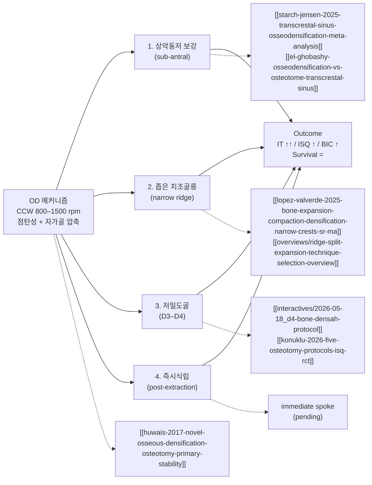

## 한국어 핵심요약

> [!summary] 한국어 핵심요약
> - 범위: OD의 4개 적용 시나리오(모체 3절, 3-1~3-4)를 분리한 하위 종합. 하위 번호는 모체 기준을 유지한다. [확인]
> - 3-1 상악동저 보강: 경치조골 OD 거상은 osteotome·측방창보다 ISQ가 높고 생존은 같다(Starch-Jensen 2025, SR+MA 6 RCT, GRADE low). 슈나이더막 천공률은 7.31%이고 잔존 골 높이 ≤3 mm가 독립 위험인자다(Mazor 2024, 670부위). 경치조골 OD의 합병증은 2.78%로 osteotome 14.32%보다 낮았으나 OD가 더 높은 골에 적용되었다(Cobo-Vázquez 2025). CBCT는 RBH를 약 1.86 mm 과소평가한다(Ragher 2026). 수직 증대가 목표면 측방창을 우선한다. [확인]
> - 철회된 근거: 시계방향 HaeNaem OD 버의 Changrani 2024 전향 연구는 철회되었으므로 그 수치를 쓰지 않는다. HaeNaem CW-OD에 대한 유효한 전향 임상 근거는 현재 없다. [확인]
> - 3-2 좁은 치조능: 10편/241명 SR+MA(López-Valverde 2025)에서 골밀도(SMD −0.71, I²=0%)만 견고하고, 치조정 확장(−1.12, I²≥75%, 민감도 분석 전에는 비유의)과 ISQ(−8.88, I²=96%)는 출판편향 위험이 높아 취약하다. 세 기법을 합친 실험군 대 대조군이어서 OD 대 골 확장의 직접 비교가 아니다. [확인]
> - 좁은 능선의 서열: 저자들은 GBR, 블록골, crestal split이 가능하면 그 뒤에 OD를 둔다. 과잉 밀도화로 인한 실패 3건이 보고되었고(Rizk 2024), 직접 비교(Vorovenci 2024)에서 증대량은 GBR 4.04 > ridge split 3.66 > OD 2.15 mm이었으나 OD는 더 넓은 능선에 적용되었다. 숙련자가 단계적 골증대가 어려울 때 쓰는 수단이다. [확인]
> - OD 대 확장기 RCT(Nabih 2025, n=22, 상악 D3/D4): 6개월 폭경은 OD가 모든 수준에서 우위였고 확장기 이득은 3–6개월에 회귀했으며 6개월 ISQ도 OD가 높았다(79.60 vs 72.10). 다만 술전 폭경이 이미 OD군에서 넓어(6.63 vs 5.60 mm) 교란이 있다. [확인]
> - 3-3 저밀도골(D3–D4): 삽입 토크는 확실히 오르지만 ISQ는 인체에서 혼재한다. 2025년 두 인체 SR+MA(Mohammadi, Shilpi)는 ISQ 비유의였고, Shilpi에서는 식립 직후 골밀도만 유의했다. 인체 임상(Moghaddas 2025)에서 IT는 약 37% 올랐지만 ISQ는 같았다. [확인]
> - 저밀도골의 세부: short 임플란트에서 IT 이득은 직경 의존이다(Koutouzis 2025, 5.4 mm에서만 50.0 vs 28.0 Ncm). under-drilling 대조군도 능가했고(Barberá-Millán 2021, 21.72 vs 8.87 Ncm), CNC 통제 환경에서 IT는 컸으나 ISQ는 같았으며 권장 셋팅은 1500 rpm·0.04 mm·z⁻¹·관수다(Tao 2025). 두 번째 OD 키트(WF)도 같은 패턴이었다(de Lima 2026). [확인]
> - 전방 심미 구역: split-mouth RCT(Ali 2026, 7명)에서 Densah bur의 ISQ가 Magnetic Mallet보다 높았고(70.1 vs 49.0, p<0.001), Mallet에서 협측 골판 골절로 인한 실패 1건이 있었다. 소규모 연구다. [확인]
> - 3-4 즉시식립: OD 단독 SR이 보유 논문에 없고 spoke는 pending이다. 얇은 협측 골판(<1 mm)에서는 측방 압밀이 골판을 손상시킬 수 있으므로 Type 1 소켓과 두꺼운 협측 골판에 한정한다는 판단은 [미검증]이다. [확인]
> - 종합 한 줄: OD는 시나리오마다 쓰임이 다르다. 토크 이득은 견고하나 좁은 능선과 극저밀도에서는 천장과 검정력 한계가 있고, 근거 수준이 낮아 환자에게 "토크는 개선, ISQ 이득은 근거 혼재"로 나누어 설명한다. [미검증]

## Three-line Summary

This sub-overview holds the four application scenarios of the parent osseodensification synthesis: sub-antral augmentation, narrow alveolar ridge, low-density bone, and immediate placement.
The scenarios differ in strength of evidence: the sub-antral transcrestal use has the best data with a clear perforation risk at low residual height, the narrow-ridge benefit is fragile apart from bone density, and low-density bone gains torque reliably but ISQ inconsistently.
Immediate placement has no held OD-only synthesis, and the retracted HaeNaem CW-OD study must not be cited.

## 세줄요약

이 하위 종합은 모체 골밀도화 종합의 4개 적용 시나리오를 담는다: 상악동저 보강, 좁은 치조능, 저밀도골, 즉시식립.
시나리오별 근거 강도가 다르다. 상악동저 경치조골 적용은 근거가 가장 좋지만 낮은 잔존 골에서 천공 위험이 뚜렷하고, 좁은 능선은 골밀도를 제외하면 이득이 취약하며, 저밀도골은 토크는 확실히 오르나 ISQ는 일관되지 않다.
즉시식립은 보유한 OD 단독 합성이 없고, 철회된 HaeNaem CW-OD 연구는 인용하지 않는다.

## Scope

Section 3 of the parent (sub-sections 3-1 to 3-4), moved verbatim from [[overviews/osseodensification-clinical-applications]]. The parent keeps a short stub that lists the four scenarios. The "§N" references inside the text follow the parent's numbering: §1 (mechanism, ceiling, heat) and §2 (outcome matrix) are in [[overviews/osseodensification-mechanism-outcomes-limits-overview]]. Existing siblings: [[overviews/sinus-lift-technique-selection]] and [[overviews/ridge-split-expansion-technique-selection-overview]].

## 3. 4개 적용 시나리오 — hub-and-spoke

### 3-1. 상악동저 보강 (sub-antral bone augmentation)

**언제**: 잔존골 높이 (Residual Bone Height, RBH) 4–8 mm, 경치조골 거상 (Transcrestal Sinus Floor Elevation, TSFE) 적응증.

**원리**: Densahbur로 sinus floor까지 CCW로 진행 → 골을 floor 쪽으로 압축하며 hydraulic + 자가골 이식 효과로 막 거상.

**최강 근거**:
- [[sinus-lift/transcrestal/starch-jensen-2025-transcrestal-sinus-osseodensification-meta-analysis|Starch-Jensen et al. 2025 SR+MA (6 RCTs, low GRADE)]] [확인, 그러나 GRADE low] — TSMEOD가 osteotome·측방창 대비 식립시·지대주 연결시 ISQ 유의하게 높음. 생존율 동등.
- [[sinus-lift/transcrestal/el-ghobashy-osseodensification-vs-osteotome-transcrestal-sinus]] [확인, RCT] — RCT, OD가 osteotome 대비 ISQ ↑.
- [[sinus-lift/transcrestal/mazor-2024-maxillary-sinus-membrane-perforation-osseodensification|Mazor et al. 2024 multicenter cross-sectional (6센터·670 sites)]] [확인] — OD 기반 TSFE **슈나이더막 천공률 7.31%** (기존 7–58% 하단). **RBH ≤3 mm가 천공 독립 위험인자**; 부위·socket 상태(healed/fresh)는 무관.
- [[sinus-lift/transcrestal/samir-2024-osseodensification-piezoelectric-internal-sinus-elevation|Samir 2024 RCT (OD vs 피에조)]] [확인, RCT] — OD가 골량·골밀도·수술시간·만족도 우위, 피에조는 당일 1차 안정성 우위 — 둘 다 유효, 강점이 다름.

**대안 OD 버 시스템 — HaeNaem CW-OD (시계방향 회전)** ⚠️ **(아래 Changrani 2024는 이후 RETRACTED/철회됨 — 임상근거로 인용 금지)**:
[[sinus-lift/transcrestal/changrani-2024-haenaem-zero-bone-loss-indirect-sinus-lift|Changrani et al. 2024 (Cureus, 전향적 단일군, n=12) — RETRACTED]]은 경치조골 간접 상악동 거상에 시계방향 (Clockwise, CW) 회전 OD 버인 HaeNaem Zero Bone Loss Kit을 적용한 (현존) 유일한 전향적 임상 데이터였다. RCBH 6–8 mm, 무이식, 동시식립 조건에서 4개월 CBCT 4방향(근심·원심·협측·구개측) 모두 유의한 골고 증가(p<0.01)로 보고됐으나, **이 논문은 이후 철회(retracted)되었으므로 위 수치를 근거로 사용해서는 안 된다.** 제조사 주장("Densah 대비 risk-to-benefit 우위")은 내부 비교 데이터 없는 assertion이며, 단일군(대조군 없음)이라 Densah와의 head-to-head 비교도 아니었다. 따라서 HaeNaem CW-OD에 대한 유효한 전향적 임상근거는 **현재 부재**하다. [철회됨 — 근거 무효]

**주의**:
- ESBG (Endo-Sinus Bone Gain)는 측방창 대비 OD에서 적음. 수직 골증대가 1차 목표면 측방창 우선 [확인, Starch-Jensen 2025].
- **RBH ≤3 mm에서는 OD-TSFE 천공 위험 ↑** (Mazor 2024) → 이 영역은 측방창 고려.
- **CBCT가 RBH를 ~1.86 mm 과소평가** ([[sinus-lift/transcrestal/ragher-2026-infrasinus-residual-ridge-height-cbct-indirect-sinus|Ragher 2026]], n=50) → borderline RBH 케이스에서 CBCT 단독 의존 경고, 이중 모달리티 권장.
- **경치조 OST vs OD 직접 비교 (최초 SR+MA — Cobo-Vázquez 2025)**: [[sinus-lift/transcrestal/cobo-vazquez-2025-crestal-sinus-lift-osteotome-vs-osseodensification|Cobo-Vázquez et al. 2025 (IJOMS, 13편/519부위)]] — 골증대량·생존율 동등이나 합병증률 OD 2.78% vs OST 14.32%(~5배 낮음); 단 OD가 더 높은 RBH에서 적용됨(5.94 vs 5.00 mm). **경치조 거상 기법 선택 시 OD가 안전성 면에서 우위이나 근거 기반은 아직 얇음(OD 연구 3편)** [확인].

**진입점**: [[overviews/sinus-lift-technique-selection|sinus-lift-technique-selection overview]].

### 3-2. 좁은 치조골릉 (narrow alveolar ridge)

**언제**: ridge 폭 4–6 mm로 conventional drilling은 천공 위험, 골절단 (ridge split)이나 GBR은 부담스러운 경우.

**원리**: CCW Densahbur가 cortical wall을 횡방향으로 압축·확장 (lateral condensation) → 골 부피 손실 없이 osteotomy 직경 확보.

**최강 근거 (2026-07-17 — spoke 개통, 종전 "pending")**: [[bone-regeneration/lopez-valverde-2025-bone-expansion-compaction-densification-narrow-crests-sr-ma|López-Valverde et al. 2025 (Front Bioeng Biotechnol, SR+MA, 10편/241명, PROSPERO CRD42025646738)]] [확인, 단 근거 취약] — 수평위축 ≤2.5 mm 좁은 치조정에서 **골확장 (Bone Expansion, BE)·골압축 (Bone Compaction, BC)·골밀도화 (OD) 세 기법을 하나의 실험군으로 묶어** 대조 술식과 비교한 SR+MA. 이 overview가 오래 비워 둔 자리를 메우는 첫 전용 합성이다.

**결과 — outcome별로 신뢰도가 갈리는 것이 핵심이다**:

| Outcome | SMD (95% CI) | p | I² | 신뢰도 |
|---|---|---|---|---|
| 골밀도 (Bone Density, BD) | **−0.71** (−1.15 – −0.27) | 0.002 | **0%** | **견고** — 고정효과·깔때기 대칭·출판편향 없음 |
| 치조정 확장 (Crestal Expansion, CE) | −1.12 (−2.21 – −0.03) | 0.04 | **≥75%** | **취약** — 민감도 분석 **전에는 NS**(0.41, p=0.58); 3편 제거 후에야 유의 |
| ISQ | −8.88 (−13.85 – −3.91) | 0.0005 | **96%** | **취약** — 이질성 극단 + 깔때기 비대칭 |

음의 SMD = 실험군 우위. **읽는 법 두 가지를 못박는다**: ① 이 SMD들은 **세 기법을 합친 실험군 vs 대조군**이지 **OD vs BE의 head-to-head가 아니다** — 이 SR은 "OD가 BE보다 우월하다"를 보고하지 않았으므로 그렇게 인용하면 안 된다. ② 헤드라인 "셋 다 개선"은 **"BD는 단단하게, CE·ISQ는 시사적으로"**로 읽어야 한다 (CE·ISQ 모두 출판편향 고위험). 절대 폭 증가는 포함 연구 통틀어 대략 **1.1–2.4 mm**.

**같은 논문 안의 head-to-head 신호 (narrative — pooled 아님)**: Rizk 2024 RCT — OD 버 > 임플란트 확장기 (폭 증가; 즉시 p=0.018/0.022 · 6개월 p=0.025/0.040); Tofan 2024 — OD 버 vs 나사형 확장기 최종 폭 차이 없음(5.48±0.57 vs 5.53±0.71)이나 OD가 더 빠름; Ahmed 2022 — OD가 crestal split 대비 삽입토크↑·수술시간↓이나 **6개월 수평 골증가는 유의차 없음**(1.99±0.68 vs 2.63±0.74 mm); **Nabih 2025 RCT (이중맹검, n=22, 상악 D3/D4) — OD(Densah) vs HaeNaem 확장기: 6개월 폭경 2·4·8mm 수준 전부 OD 유의↑(P<0.01), 확장기군 폭경 이득은 3–6개월에 술전 수준으로 회귀; 6개월 ISQ도 OD 79.60 vs 72.10(P=0.0268)** — 단 술전 2mm 폭경 이미 OD군 유의↑(P=0.0193). §3-3 상세.

**⚠️ 저자들의 결론은 OD 홍보가 아니다** — 이 spoke를 "개통"으로만 읽으면 논문을 거꾸로 읽는 것이다:
- **임상 ↔ 전임상 상충**: 임상 pooling은 densification에 유리하나, **전임상 모델(양·돼지·쥐)은 BIC·골통합 이득을 보이지 않는다.**
- **과잉 밀도화 실패**: Rizk 2024가 좁은 치조정 **과잉 밀도화로 인한 임플란트 실패 3건**(혈류 감소·발열)을 보고 — §1의 Coyac 천장과 **독립적으로 같은 방향**을 가리키며, 좁은 능선은 압축할 해면골과 여유 혈류가 애초에 적다는 점에서 천장이 더 낮을 수 있다 [미검증: 좁은 능선의 천장이 더 낮다는 것은 추론].
- **저자들의 서열**: 이 기법들을 **GBR·블록골이식·crestal split이 가능하다면 그 뒤에** 놓는다.

→ 따라서 이 spoke의 임상 명제는 *"OD가 좁은 능선의 1차 선택"*이 **아니라** *"단계적 골증대가 여의치 않을 때, 숙련자에 한해, BD 이득은 믿고 CE·ISQ 이득은 반쯤 깎아 듣고"*이다.

**술식 간 서열 (cross-overview)**: [[overviews/ridge-split-expansion-technique-selection-overview]]의 Vorovenci 2024 직접 비교 — 골증대량 GBR **4.04 mm** > ridge split **3.66 mm** > OD 확장 **2.15 mm** (ANOVA P=0.002), 단 생존율은 셋 다 ~98–99%로 동등. 결정적 해석: **OD는 셋 중 가장 넓은 능선(시작 4.37 mm)에 적용된 반면 RS는 가장 좁은 능선(3.43 mm)에 적용**됐다 — OD의 낮은 증대량은 "약해서"가 아니라 **애초에 덜 좁은 능선에 쓰이기 때문**일 수 있다. 좁은 능선의 술식 선택 자체는 이 overview가 아니라 그 overview에서 결정하라.

**주의**: D1/D2 cortical-dominant ridge에서는 골절·미세균열 위험 — torque feedback과 CBCT 사전평가 필수 [확인].

### 3-3. 저밀도골 (low-density bone, D3–D4)

**언제**: 상악 구치부, 후방 무치악, IT 30 Ncm 확보 어려운 경우.

**원리**: trabecular bone 압축으로 walls에 미세 cortical layer 형성 → IT·ISQ 즉시 상승.

**최강 근거 (지지)**:
- [[implants/isq/althobaiti-2023-osseodensification-conventional-drilling-isq-sr|Althobaiti et al. 2023 SR (ISQ-focused)]] [확인] — D3/D4에서 OD ISQ ↑ 효과 가장 큼.
- [[implants/isq/konuklu-2026-five-osteotomy-protocols-isq-rct|Konuklu et al. 2026 RCT (5 protocols)]] [확인, RCT] — 5개 osteotomy protocol 직접 비교.
- [[implants/osseodensification/bergamo-2021-osseodensification-effect-implants-primary-secondary|Bergamo et al. 2021 multicenter CCT (56명·150 임플란트)]] [확인] — OD가 IT·ISQ 모두 유의 우위, ISQ 3주 dip 후 6주 회복하나 OD는 전 기간 ISQ≥68 유지. **단 short 임플란트는 예외(차이 없음)** — 이 예외는 직경 조절변수로 정밀화된다(아래 Koutouzis 2025).
- [[implants/osseodensification/koutouzis-2025-osteotomy-preparation-short-implants-stability|Koutouzis et al. 2025 (돼지경골, 6mm short 임플란트 90개, 3직경×3술식)]] [animal] — **OD의 IT 이득이 직경 의존적**: 광폭(5.4mm)에서만 OD가 SD 대비 유의↑(50.0 vs 28.0 Ncm, p=0.005), 세폭(4.2mm)·표준폭(4.8mm)은 NS. OD 내에서도 W-OD(50.0) > N-OD(31.5, p=0.04)로 직경 효과가 가산적. 단 osteotome도 광폭에서 OD와 동등하게 IT를 올려(46.9 Ncm, p=0.026) **OD가 압축술식 중 유일하게 우월한 것은 아님**. 조직계측(골수강·결합조직 접촉)은 NS. → **임상: short 임플란트에 OD를 쓸 때는 직경 ≥5.4mm를 함께 선택해야 IT 이득 실현** (Bergamo의 short 예외를 "직경이 좁아서"로 설명).
- [[implants/osseodensification/moghaddas-2025-osseodensification-standard-drilling-isq-itv|Moghaddas & Banazadeh 2025 전향 임상 (21명·39 임플란트, 상악 구치부)]] [prospective] — 인체 임상에서 OD가 IT를 ~37%↑(50.3 vs 36.1 Ncm, p<0.001)했으나 **ISQ는 식립·3개월 모두 NS, 양 군 ISQ 68↑ 유지** — IT↑/ISQ NS 해리를 cadaver/animal이 아닌 실제 환자에서 재현. 단 ridge ≥9mm·≥6mm cohort라 SD도 이미 충분한 안정성 달성.
- [[implants/osseodensification/marzorati-2026-osseodensification-standard-osteotomy-torque-isq-sr-ma|Marzorati et al. 2026 SR+MA (PRISMA 2020, 검색 2025년 9월, 인체 only, 555명/685개)]] [확인, 인체 SR+MA] — **CCW Densah bur만 포함(오스테오톰·MM 제외)한 최초 인체 SR+MA.** IT 45.75 vs 38.00 N·cm(P<0.001); **ISQ MD 3.24(95% CI 0.72–5.95, P=0.024) 통계적 유의** — 인체 SR+MA 최초. 이전 SR+MA(mohammadi·shilpi)의 ISQ NS가 기법 혼입으로 설명될 가능성 제기; ISQ 효과 크기가 오스테오톰 혼입 이전 SR보다 작아 **진짜 OD-only 효과는 더 작다**는 신호. 단 생존율·MBL 미보고.
- [[implants/osseodensification/mercier-2022-osseodensification-primary-stability-cadavers|Mercier et al. 2022 (사람 하악 사체 21개·58 osteotomy)]] [in-vitro] — OD가 SD 대비 IT 유의↑(34.9 vs 23.6 Ncm, +48%, p=0.036)·CBCT 골밀도↑(p=0.026), IT–ISQ 상관 OD에서만(ρ=0.527). Rittipakorn 2025 CW-OD의 IT(34.0 Ncm)와 거의 일치 — 골원·OD 변형 무관하게 OD IT 일관됨.
- [[implants/isq/arpudaswamy-2025-osseodensification-conventional-implant-stability-rabbit|Arpudaswamy 2025 (토끼 D4 split-body RCT)]] [animal] — 식립 시점 ISQ는 차이 없으나 **3개월 ISQ·IT 유의 ↑ → 이득은 2차 안정성**.
- [[implants/osseodensification/neiva-2018-effects-osseodensification-astra-tx-ev|Neiva 2018 (sheep e-poster)]] [animal] — IT/RFA OD 압도적 우위, EV 시스템에서 BIC/BAFO도 ↑.
- [[implants/osseodensification/barbera-millan-2021-primary-stability-low-density-osseodensification|Barberá-Millán et al. 2021 (in vitro, 돼지경골 Type IV, n=55/group)]] [확인, in-vitro] — **대조군이 plain drilling이 아닌 conventional under-drilling(UD)**이라는 점에서 가장 엄격한 D4 비교: OD가 UD 대비 IT 21.72 vs 8.87 Ncm (≈2.4배, p=0.000)·ISQ 69.75 vs 65.16 (p=0.001) 모두 유의 우위. torque–ISQ는 sigmoid 관계로 ISQ가 ~75.6에서 plateau (그 이상의 torque는 추가 안정성 없음). 즉 **이미 under-sizing한 soft-bone 프로토콜조차 OD가 능가** — D4에서 OD의 1차 안정성 이득을 보강.
- [[implants/osseodensification/tao-2025-optimizing-osseodensification-drilling-implant|Tao et al. 2025 (in vitro CNC, Type IV foam 0.160 g/cm³)]] [확인, in-vitro] — **드릴링 파라미터 최적화** 관점을 추가: OD vs CD(BLT tapered)에서 IT 11.73 vs 7.77 N·m·RT 9.28 vs 6.65 N·m (모두 p<0.001)로 torque 우위·골벽 결함 적음·발열 낮음이나 **ISQ는 동등(47.1 vs 46.7, p=0.86)** — torque↑/ISQ NS divergence를 CNC 통제 환경에서 깔끔하게 재현. 권장 OD 셋팅 **1500 rpm·0.04 mm·z⁻¹·관수 동반**(Type IV).
- [[interactives/2026-05-18_d4-bone-densah-protocol|d4-bone-densah-protocol]] — **D4 전용 chairside 인터랙티브**.

**반례 (논쟁) — living-document 갱신 핵심**:
- [[implants/osseodensification/mohammadi-2025-osseodensification-conventional-low-density-bone-sr-ma|Mohammadi et al. 2025 SR+MA (7편)]] [확인, 반례] — 저밀도골 OD vs CD에서 **1차 ISQ MD=4.13 (p=0.13)·2차 MD=1.78 (p=0.11) 모두 NS**, MBL·PI도 NS. 12개월 PD·구개측 CBL만 OD 유리. 결론: "장기 우월성 입증 부족".
- [[implants/osseodensification/shilpi-2025-osseodensification-conventional-low-bone-sr-ma|Shilpi et al. 2025 SR+MA (인체 RCT/NRCT 6편)]] [확인, 반례·보강] — Mohammadi와 **독립된 팀·같은 해·인체전용 제한**으로 같은 결론 재확인: ISQ 즉시 SMD=2.13 (95% CI −0.08–4.35, p=0.06)·추적 SMD=1.81 (p=0.11) 둘 다 NS. **단 식립 직후 peri-implant 골밀도는 SMD=2.14 (p=0.004) 유의↑** (압축효과 확인)이나 3–7개월엔 NS (remodeling으로 정상화). ISQ 즉시 p=0.06이 간발의 차로 NS·CI 하한이 0을 살짝 넘음 → "표본부족으로 검정력 미달한 양의 trend" 해석을 보강. **2025년 두 번째 인체 SR+MA로 "ISQ는 trend, 이득은 초기 골밀도에 국한" 패턴 강화**.
- [[implants/isq/al-ahmari-2022-osseodensification-conventional-low-density-jaw|Al-Ahmari 2022 split-mouth (20명·40 임플란트)]] [확인, 반례] — **골밀도만 OD↑, 1차·2차 안정성·PI·BOP·PD·MBL은 NS**.
- [[implants/osseodensification/kalra-2025-implant-stability-crestal-bone-osseodensification-sr-ma|Kalra et al. 2025 SR+MA (5편/109명/198개, 저밀도골 특이)]] [확인, CBL null] — ISQ 기저치·추적관찰 OD 유의 우위(P<.05); **CBL 변화량은 어느 시점도 유의차 없음(P>.05)** — **CBL을 pooling한 최초 OD SR+MA이며, OD의 1차 안정성 이득이 변연골 보호로 전이되지 않음을 확인.** n=198으로 진짜 null vs 검정력 부족 미결.
- [[implants/osseodensification/de-agostinho-neto-2026-in-vitro-evaluation-different-implant-systems|de Agostinho Neto et al. 2026 (Sci Rep, 신선 저밀도 소 늑골 in vitro, 3군)]] [확인, 반례·null] — 기존 드릴링(SIN) vs OD(VERSAH) vs 골확장기(MAXIMUS) 비교에서 **아무것도 유의하지 않았다**: 시스템 간 미세구조 차이 없음, 식립 토크도 NS (SIN 35±21.5 · VERSAH 43.2±27.1 · MAXIMUS 59.6±28.5 Ncm). 두 가지가 특기할 만하다. ① **경부·체부·근단부를 나눠 micro-CT로 본 첫 보유 논문이며, 부위 간 차이가 없었다** — 이는 [[implants/osteotomy-thermal/kim-2019-double-spiral-condensing-screw-implant|HaeNaem 특허]]의 공학적 전제("기존 OD 버는 측벽은 강하게·골삭제 바닥은 약하게 밀도화한다, d2 ≪ d1")를 **처음으로 계측에 부친 결과이며 그 전제를 지지하지 않는다.** 단 아래 검정력 문제로 *반증*이라고까지 말할 수 없다 — 특허 전제는 여전히 **미검증인 채로 남는다** [미검증]. ② 저자들은 극도로 다공성인 골에서 밀도화가 **"유용성의 한계점 (threshold of utility)"**에 도달 — 압축할 해면골 자체가 부족 — 해 드릴 선택보다 해면골 생물학이 1차 안정성을 지배한다고 읽는다. **단 이 null은 조심해서 읽어야 한다**: 군당 n=5–8에 표준편차 21–28 Ncm가 평균 격차 24.6 Ncm를 덮는다 — **검정력 부족이 유력하며 "차이가 없다"가 아니라 "차이를 못 찾았다"**이다 [확인, 페이지가 스스로 명시]. 게다가 대조군(SIN)조차 3.5 mm 임플란트에 최종 3.0 mm 골삭제로 **이미 언더사이즈**였다.

**임상 종합**: Fontes Pereira 2023은 D3–D4를 "greatest OD benefit" 시나리오로 명시했으나, **2025년 두 인체 SR+MA(mohammadi 7편·shilpi 6편)가 나란히 ISQ 이득을 재현하지 못함** (shilpi는 식립 직후 골밀도만 유의↑·3–7개월엔 소실). 현재 합의: IT(1차 기계적 고정)는 일관되게 ↑, 그러나 **RFA로 측정되는 ISQ 이득은 인체에서 불확실**하고 이득이 있다면 2차 안정성(동물 RCT)에 가까움. 이 IT↑/ISQ NS 해리는 이제 cadaver(mercier·rittipakorn)·bench(tao)·동물(arpudaswamy)에 더해 **인체 임상시험(moghaddas 2025)에서도 직접 관찰**돼 측정 노이즈가 아닌 구조적 현상으로 굳어졌다. 추가로 short 임플란트에서는 IT 이득조차 **직경 의존적**(koutouzis 2025: 광폭 5.4mm에서만)이라 OD 적용 시 직경 선택이 변수다. 환자 설명 시 "삽입 토크는 확실히 개선, 안정성 수치(ISQ) 이득은 근거 혼재"로 분리 권장.

**전방 심미 구역 OD 기법 — DB vs MM (신규 ali-2026):** [[implants/osseodensification/ali-2026-osseodensification-techniques-implant-stability-maxilla|Ali et al. 2026 split-mouth RCT (7명/14부위, 상악 전방 심미 구역)]] [확인, RCT] — Densah bur(DB) vs Magnetic Mallet(MM) 골밀도화를 전방 상악 심미 구역에서 비교한 **최초 split-mouth RCT.** DB ISQ 70.1 vs MM 49.0(p<0.001); 6개월 DB 74.7 vs MM 59.8; DB 순구개측 골판 두께 유의↑; **MM 1건 골판 골절 → 임플란트 실패, 1건 구개측 균열.** 골밀도·치조정 폭은 6개월 시점 동등. DB가 전방 상악의 얇은 치조제에서 ISQ ≥70 임계값을 달성하며 안전한 선택임을 시사; 얇은 치조제에서 MM의 충격력은 위험 신호. 단 n=7로 소규모 — 더 큰 RCT가 필요하다.

**OD vs 확장기 최초 RCT — 6개월 이차 안정성 OD 우위, 그러나 술전 폭경 혼입인자 (신규 nabih-2025):** [[implants/osseodensification/nabih-2025-evaluation-of-the-stability-of|Nabih et al. 2025 (이중맹검 RCT, n=22, 상악 D3/D4, 협설폭 ≥4 mm)]] [확인, RCT] — OD(Versah Densah, CCW 800–1200 rpm) vs HaeNaem 확장기 키트 비교. 1차 안정성(식립 직후)·3개월 ISQ 군간 동등(P=0.2247/0.9770); **6개월 ISQ는 OD 79.60 vs 확장기 72.10(P=0.0268)로 OD 유의 우위** — 1차가 아닌 2차 안정성에서 이득이 나타나는 패턴이 OD vs 확장기 비교에서도 재현. 치조정 폭경: 6개월 2·4·8 mm 수준 전부 OD 유의↑(P<0.01); 확장기군은 초기 폭경 이득이 3–6개월에 걸쳐 술전 수준으로 회귀 — OD가 확장 효과를 유지하는 반면 확장기는 유지 못함. 안전성: 확장기군 협측 피질골 골절 2건(제외) + 3개월 실패 2건; OD군 부하 후 실패 1건; 전체 생존율 87%. 단 **술전 2mm 수준 폭경이 이미 OD군에서 넓음**(6.63 vs 5.60 mm, P=0.0193) — 폭경·안정성 우위가 기저 차이를 반영했을 가능성을 저자들도 인정. 이 논문은 OD vs conventional drilling이 아닌 **OD vs 확장기** 비교이므로 §2 Outcome Matrix의 conventional 비교 행들과 직접 통합하지 않는다. 저자 결론: 확장기는 중등도 골질(D2–D3)·충분한 기저 폭에 적합할 수 있음. HaeNaem 확장기 키트는 철회된 changrani-2024와 달리 **유효한(non-retracted) 비교군**으로 등장해 HaeNaem 제품의 첫 유효한 임상 비교데이터를 이 wiki에 제공.

이 torque-vs-ISQ 분리는 2026년 bench 근거가 더 또렷하게 만든다. **Tao 2025**가 CNC로 hand-pressure noise를 제거한 통제 환경에서 OD가 torque는 크게 올리되 ISQ는 동등(p=0.86)임을 재현했고, **de Lima 2026**이 소 늑골 Type IV 쌍대 연구에서 두 번째 OD 키트(WF)를 포함한 3군 비교로 이를 추가 재현(ISQ p=0.157 NS; IT/RT 모두 유의) — divergence가 측정 노이즈가 아니라 두 지표가 측정하는 물리량이 다르다는 구조적 현상임을 더욱 강화한다. 특히 de Lima 2026은 Versah 이외 OD 키트(WF)가 동일한 IT↑/ISQ NS 패턴을 보이되 토크 수치는 Versah를 초과(IT 95.25 vs 77.62 Ncm)함을 보여, OD의 torque-ISQ 해리가 Versah 특이적이 아닌 OD 기전 공통 현상임을 시사한다. 동시에 Tao 2025는 기존 overview에 없던 **드릴링 파라미터 축**(속도·feed·관수)을 추가: Type IV에서 1500 rpm·0.04 mm·z⁻¹·관수 동반이 권장 OD 셋팅이며, 무관수는 양 술식 모두 thermal damage 위험(§1 Soldatos 발열 규칙과 정합). 한편 **Barberá-Millán 2021**은 ISQ 결과의 nuance를 더한다 — 인체 SR+MA가 NS인데도 이 bench에서는 OD ISQ가 유의 우위(p=0.001)였는데, 대조군이 plain drilling이 아닌 이미 under-sizing한 UD였음에도 OD가 능가했다는 점이 핵심이다. 종합하면: **저밀도골에서 OD의 1차 기계적 고정(IT/RT) 이득은 bench·cadaver·동물에서 매우 견고**하고 under-drilling 대조군조차 능가하지만, **ISQ 이득은 in-vitro에서는 관찰되다가 인체 SR+MA에서 사라지는** 모순이 남아 있어, "torque는 확실, ISQ는 혼재" 프레이밍을 유지한다.

**저밀도의 *바닥* — null이 붙인 단서 (2026-07-17 추가):** de Agostinho Neto 2026은 위 "IT 이득은 확실"이라는 명제에 **바닥 조건**을 붙인다. 소 늑골이라는 *극도로* 다공성인 기질에서는 OD의 토크 이득조차 유의에 이르지 못했다(43.2 vs 35 Ncm, NS). 두 해석이 경합한다 — ⓐ 저자들의 **"threshold of utility"**: 압축할 해면골이 남아 있지 않은 곳에서는 밀도화가 물리적으로 할 일이 없다. ⓑ **단순 검정력 부족**: n=5–8, SD 21–28 Ncm. **이 논문 하나로는 둘을 구별할 수 없으므로 이 페이지는 둘 다 열어 둔다** [미검증: 어느 쪽인지 미결]. 실무적 함의는 어느 쪽이든 같다 — OD를 D3–D4에서 쓰되, **골질이 D4보다도 아래로 내려가는 구간에서는 드릴 선택보다 임플란트 macrogeometry·부하 프로토콜·이식이 레버**라는 신호로 읽는 편이 안전하다. 이는 [[implants/osteotomy-thermal/gehrke-2021-healing-chambers-macrogeometry-low-density-drilling|Gehrke 2021]]의 "언더사이즈는 PCF-20에서만 효과 — 최저밀도 한계 + macrogeometry 보완"과 **같은 방향의 독립 관찰**이다.

### 3-4. 즉시식립 (post-extraction immediate placement)

**언제**: 발치와 (extraction socket) 즉시식립에서 socket-bone gap, 잔존 buccal plate 얇음, primary stability 확보 어려움.

**원리**: socket walls를 OD로 압축·확장 → engagement 증가, gap 감소, autograft 효과.

**최강 근거**: [미검증] Fontes Pereira 2023이 included studies로 언급하나 본 llm-wiki에 즉시식립 OD 단독 SR이 아직 없음. spoke pending.

**주의**: thin buccal plate (<1 mm)에서 OD의 lateral compaction이 plate 손상·발거 가능 — Type 1 socket·thick buccal plate에 한정 [미검증].

---

## Related Overviews

- [[overviews/osseodensification-clinical-applications]] — parent synthesis
- [[overviews/osseodensification-mechanism-outcomes-limits-overview]] — mechanism, outcome matrix, and evidence limits (sibling)
- [[overviews/sinus-lift-technique-selection]] — sinus-lift technique selection (existing sibling)
- [[overviews/ridge-split-expansion-technique-selection-overview]] — ridge split and expansion (existing sibling)
- [[overviews/transcrestal-maxillary-sinus-augmentation-overview]] — transcrestal sinus augmentation (existing sibling)
