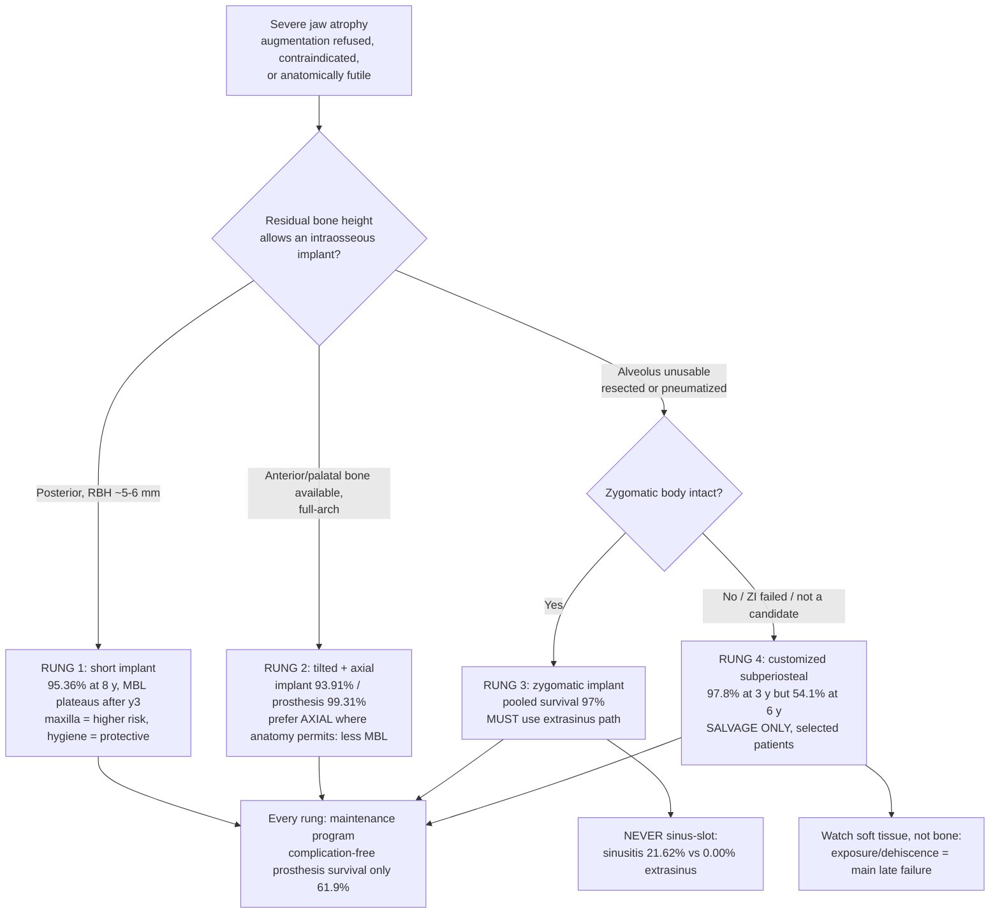

## 한국어 핵심요약

> [!summary] 한국어 핵심요약
> - 핵심 명제: 심한 악골 위축(severe atrophy)에서 **골증대(bone augmentation)를 피하는 4개의 사다리 칸** — 숏 임플란트(short implant) → 경사 임플란트(tilted implant) → 관골 임플란트(Zygomatic Implant, ZI) → 맞춤형 골막하 임플란트(Customized Subperiosteal Implant, CSI) — 를 하나의 결정 축으로 묶는다. 위로 갈수록 해부학적 한계를 더 크게 우회하지만, **실패의 성격이 골유착 실패에서 연조직 실패로 바뀐다**.
> - 사다리는 "골이 얼마나 남았나"가 아니라 **"남은 골을 어떤 방향으로 빌릴 수 있나"** 로 오르내린다: 숏은 수직골을 포기하고, 경사는 전방·구개측 골을 각도로 빌리고, ZI는 악골을 건너뛰어 관골체(zygomatic body)에 정착하며, CSI는 골 내부를 포기하고 골 표면에 얹힌다.
> - 1칸 숏(Barausse 2024, 4 mm, 212명/496개, 평균 8.02년): 누적 생존 95.36%(95% CI 93.12–97.04), 1년 변연골소실(Marginal Bone Loss, MBL) 0.47 mm → 10년 0.59 mm로 3년 이후 유의한 증가 없음. **상악 식립이 실패위험 유의 증가(p=0.02)**, 위생 내원 빈도가 보호인자(p<0.001). 후방 수직위축의 default.
> - 숏 vs 거상 헤드투헤드(Chaware 2021, RCT 22편·1,595개): 생존 동등(RR 1.01, I²=0%) → **거상을 "더 안전해서" 고르는 근거는 없다.** 자세한 결정 게이트는 [[overviews/short-implant-vs-sinus-augmentation-decision]].
> - 2칸 경사(Del Fabbro 2022, 24편/2,637명, 3–18년): 임플란트 생존 93.91%·보철 생존 99.31%로 전악 재건은 예측가능하지만, **MBL은 축방향(axial)보다 경사 임플란트에서 유의하게 큼(P<.0001)** → 해부학이 허락하면 축방향 우선.
> - 3칸 관골(Scocca 2026 SR+MA, 17편/294명·679 ZI — 위키 최초의 ZI 결과 근거): 통합 생존 **97%**(95% CI 94–99, I²=42.4%). 1차 종양절제 시 동시 식립 실패 2% vs 2차 식립 9%(p=0.41, 비유의), **방사선치료 오즈비(OR) 3.42(95% CI 0.97–12.06, p=0.055)로 경계적 비유의** → 조사(照射) 상악도 재건 가능하나 표본이 작아 "위험 없음"이 아니라 "위험 미확정".
> - ZI의 진짜 합병증 축은 생존이 아니라 **부비동염**: sinus-slot 술식 21.62% vs extrasinus 0.00%(Rocha 2023) → **sinus-slot은 폐기하고 extrasinus로 간다.** ZI를 고를 때 읽어야 할 숫자는 97%가 아니라 이 21.62%다.
> - 4칸 골막하(Cosola 2026 SR+MA, 11편/268명·369개, 초록전용): ≤3년 생존 97.8% → 전체 92.4% → **단일 6년 연구에서 54.1%로 붕괴**. 후기 실패의 주원인은 골유착 실패가 아니라 **임플란트 노출·열개 등 연조직 합병증**. 저자 결론도 "선별된 환자의 salvage 옵션".
> - 여기서 나오는 사다리 전체의 교훈: **"생존율"은 위로 갈수록 성공을 과대평가한다.** CSI의 97.8%(단기)와 숏의 95.36%(8년)를 나란히 놓으면 CSI가 더 좋아 보이지만, 시간축과 실패양식을 보면 정반대다. 짧은 추적의 높은 생존율은 근거가 아니라 미청구 청구서다.
> - 유지관리 부담은 위 칸에서만 생기는 문제가 아니다 — 무치악 상악 전악 보철 자체가 이미 무합병증 보철 생존 61.9%·환자수준 무합병증 임플란트 생존 46.5%(Ng 2026). 즉 **사다리 어느 칸을 골라도 "심으면 끝"이 아니라 유지관리 프로그램이 치료의 절반**이다.
> - 근거 성숙도 경고(Yildirim 2026 계량서지): 숏 임플란트 문헌은 2019년 정점 후 감소 — 사다리의 1칸만 근거가 성숙했고, 위로 갈수록 근거는 얇아진다(ZI는 SR+MA 1편·종양 한정, CSI는 초록전용·6년 데이터 단 1편).

## Three-line Summary

Synthesis of 8 papers spanning the four graftless options for severe jaw atrophy — 4-mm short implants (Barausse 2024, 212 patients/496 implants, mean 8.02 y), short-vs-sinus-graft head-to-head (Chaware 2021, 22 RCTs/1,595 implants), tilted full-arch implants (Del Fabbro 2022, 24 studies/2,637 patients), zygomatic implants (Scocca 2026, 17 studies/679 ZIs), and customized 3D-printed subperiosteal implants (Cosola 2026, 11 studies/369 implants) — plus the sinusitis (Rocha 2023) and prosthetic-maintenance (Ng 2026) cost layers.

Survival is high and rises misleadingly up the ladder — short 95.36% at ~8 years, tilted 93.91% (prosthesis 99.31%) at 3–18 years, zygomatic 97% pooled, subperiosteal 97.8% at ≤3 years — but the subperiosteal figure collapses to 92.4% overall and 54.1% in the single 6-year study, with soft-tissue exposure and dehiscence, not failed osseointegration, as the dominant cause of late failure; the zygomatic option's real complication axis is sinusitis, driven entirely by technique (sinus-slot 21.62% vs extrasinus 0.00%, Rocha 2023).

Climb the ladder only when the rung below is anatomically unavailable, read survival as a time-conditioned rather than absolute number, and budget for maintenance rather than for placement: even before any exotic anchorage, edentulous-maxilla full-arch prostheses run complication-free prosthesis survival of 61.9% and patient-level complication-free implant survival of 46.5% (Ng 2026).

## 세줄요약

심한 악골 위축의 무이식 선택지 4가지를 8편으로 종합 — 4 mm 숏 임플란트(Barausse 2024, 212명/496개, 평균 8.02년), 숏 vs 상악동거상 직접비교(Chaware 2021, RCT 22편/1,595개), 경사 임플란트 전악(Del Fabbro 2022, 24편/2,637명), 관골 임플란트(Scocca 2026, 17편/679개), 맞춤형 3D프린팅 골막하 임플란트(Cosola 2026, 11편/369개) + 부비동염(Rocha 2023)·보철 유지부담(Ng 2026) 비용층.

생존율은 사다리를 오를수록 착시로 높아진다 — 숏 8년 95.36%, 경사 93.91%(보철 99.31%), 관골 통합 97%, 골막하 ≤3년 97.8% — 그러나 골막하는 전체 92.4%, 단일 6년 연구에서 54.1%로 붕괴하고 후기 실패의 주원인은 골유착 실패가 아니라 **연조직 노출·열개**이며, 관골의 실제 합병증 축은 생존이 아니라 술식이 좌우하는 부비동염이다(sinus-slot 21.62% vs extrasinus 0.00%).

임상 결론: 아래 칸이 해부학적으로 불가능할 때만 위로 오르고, 생존율은 절대값이 아니라 추적기간이 조건인 값으로 읽으며, 예산은 식립이 아니라 유지관리에 배정한다 — 특수 고정원 이전에 이미 무치악 상악 전악 보철의 무합병증 보철 생존은 61.9%, 환자수준 무합병증 임플란트 생존은 46.5%다(Ng 2026).

## Thesis

The wiki already answers the *first* question of the atrophic jaw well: when there is 5–6 mm of residual bone height in the posterior maxilla, a short implant matches a sinus graft on survival and beats it on morbidity ([[overviews/short-implant-vs-sinus-augmentation-decision]]), and when vertical bone must genuinely be rebuilt, there is a technique ladder for that too ([[overviews/vertical-ridge-augmentation-overview]]). What the wiki has not had is the branch taken when augmentation is *refused, contraindicated, or anatomically futile* — the resected maxilla, the pneumatized sinus over 2 mm of bone, the patient who will not accept a nine-month graft-and-wait. That branch has four rungs, and this page is about how to climb them.

The organizing idea is not "how much bone is left" but **which direction the remaining bone can be borrowed from**. A short implant gives up vertical height and accepts a poor crown-to-implant ratio. A tilted implant borrows anterior and palatal bone by changing the angle of attack. A zygomatic implant abandons the alveolus entirely and anchors in the zygomatic body. A customized subperiosteal implant gives up intraosseous anchorage altogether and rides on the bone surface. Each rung buys anatomic freedom by spending something — and what it spends is the thing the survival number does not measure.

Read down the survival column and the ladder looks safe, even inviting. Short implants: 95.36% cumulative at a mean 8.02 years, with marginal bone loss that stops progressing after year three (0.47 mm at 1 y → 0.59 mm at 10 y; Barausse 2024). Tilted full-arch: 93.91% implant and 99.31% prosthesis survival across 3–18 years (Del Fabbro 2022). Zygomatic implants in oncologic maxillae: **97%** pooled (95% CI 94–99), with failure 2% when placed at the primary resection versus 9% at a secondary procedure (p=0.41, not significant) and radiotherapy raising failure odds only borderline-non-significantly (OR 3.42, 95% CI 0.97–12.06, p=0.055) — the first outcome-level ZI evidence this wiki holds (Scocca 2026). Customized subperiosteal implants: 97.8% at ≤3 years (Cosola 2026). By that column, the most exotic option is the best one.

That reading is wrong, and the reason it is wrong is the most useful thing on this page. **Survival is a time-conditioned quantity, and the follow-up horizon shortens as you climb.** Cosola's 97.8% is a ≤3-year figure; the overall pooled survival is 92.4%, the heterogeneity is driven by the long-term studies, and the single 6-year study reports survival at **54.1%**. More telling than the number is its mechanism: the dominant adverse events were implant exposure and dehiscence — **soft-tissue failures** — and these, not failed osseointegration, caused the late losses. The authors' own conclusion is that survival alone overestimates clinical success and that these devices are a salvage option for carefully selected patients. A subperiosteal implant cannot fail by losing osseointegration, because it never had any; it fails by wearing through its cover. [근거중 — abstract-only source, single 6-year study]

The zygomatic rung teaches the same lesson in a different register. Its 97% survival is real, but it is not the number that should drive the decision, because the characteristic ZI complication is not implant loss — it is **sinusitis**, and sinusitis is almost entirely a function of the surgical path. Rocha 2023 pools 3.76% sinusitis after zygomatic implants versus 1.11% after sinus lift, but the technique-level breakdown collapses that comparison: **sinus-slot ZI 21.62% versus extrasinus ZI 0.00%**. The risk lives in the path through the sinus, not in the zygomatic implant as such. Choosing a ZI therefore commits you to an extrasinus approach, and quoting "97% survival" without quoting "21.62% with the wrong technique" is the kind of half-citation this page exists to prevent. [확인 for the technique split]

Two cost layers apply across all four rungs. First, **maintenance burden is the baseline, not a complication of exotic anchorage.** Ng 2026, pooling 20 prospective studies and RCTs (913 patients, median 5-year follow-up) on edentulous-maxilla full-arch prostheses with ordinary implants, finds catastrophic failure uncommon (prosthesis loss 4.6%; implant loss ~5.5%) but **complication-free prosthesis survival of only 61.9% and patient-level complication-free implant survival of 46.5%** — and the dominant technical complication differs by prosthesis type (fixed: acrylic veneer fracture ~41%; overdenture: denture-base/tooth repair and reline ~91%). Roughly half of these patients will have a complication even when the anatomy was easy. In severe atrophy it will not be easier. Second, **evidence maturity falls as you climb.** Yildirim 2026's bibliometric map of 626 short-implant articles (1994–2024) shows the field's output peaking in 2019 and declining since — the mark of a question that has been answered. Nothing above the first rung is answered: the zygomatic evidence here is a single SR+MA confined to oncology patients, and the subperiosteal evidence is an abstract-only SR+MA whose long-term arm is one study. [미검증]

The defensible synthesis: **treat the ladder as strictly ordered, and climb only when the rung below is anatomically unavailable — not when it is merely inconvenient.** Then invert your reading of the outcome table: at the bottom of the ladder, watch bone; at the top, watch soft tissue and the calendar.

## Evidence Map

| Paper | Design | n | Rung | Key Finding | Confidence |
|---|---|---|---|---|---|
| [[implants/barausse-2024-4mm-short-implants-posterior-atrophic-8year]] | retrospective | 212 pts / 496 implants, mean 8.02 y | 1 — short | Cumulative survival 95.36% (95% CI 93.12–97.04); MBL 0.47 mm at 1 y → 0.59 mm at 10 y, no significant progression after y3; maxillary site raises failure risk (p=0.02); hygiene-visit frequency protective (p<0.001) | retrospective |
| [[sinus-lift/lateral/chaware-2021-short-vs-long-implant-sinus-graft-sr-ma]] | SR+MA | 22 RCTs / 667 pts / 1,595 implants | 1 vs graft | Survival equivalent, short/graftless vs long/grafted (RR 1.01, I²=0%) — graft confers no survival advantage | sr+ma |
| [[implants/del-fabbro-2022-full-arch-tilted-axial-implants-sr-ma]] | SR+MA | 24 studies / 2,637 pts / 11,205 implants, 3–18 y | 2 — tilted | Implant survival 93.91%, prosthesis survival 99.31%; MBL significantly **lower around axial than tilted** implants (P<.0001); maxilla vs mandible NS (P=.17) | sr+ma |
| [[implants/scocca-2026-zygomatic-implants-head-neck-cancer-sr-ma]] | SR+MA | 17 studies / 294 pts / 679 ZIs | 3 — zygomatic | Pooled survival 97% (95% CI 94–99, I²=42.4%); failure 2% at primary vs 9% at secondary placement (p=0.41, NS); radiotherapy OR 3.42 (0.97–12.06, p=0.055, NS); PROMs satisfactory even after RT | sr+ma |
| [[sinus-lift/lateral/rocha-2023-sinusitis-rate-sinus-lift-zygomatic-ma]] | SR+MA | 27 studies (9 ZI / 18 SFE) | 3 — cost layer | Sinusitis 3.76% ZI vs 1.11% sinus lift overall; **sinus-slot ZI 21.62% (95% CI 9.62–36.52) vs intrasinus 4.36% vs extrasinus 0.00% (0.00–1.22)**; lateral SFE 1.35% vs transcrestal 0.00% — risk is the path, not the procedure | sr+ma |
| [[implants/cosola-2026-customized-3d-printed-titanium-subperiosteal-implants-sr-ma]] | SR+MA (abstract-only) | 11 studies / 268 pts / 369 implants | 4 — subperiosteal | Survival 97.8% at ≤3 y; **overall pooled 92.4%; single 6-year study 54.1%**; implant exposure/dehiscence the most common adverse event and main cause of late failure; authors call it a salvage option | sr+ma |
| [[complete-denture/ng-2026-prosthetic-outcomes-implant-assisted-maxillary-restorations-sr-ma]] | SR+MA | 20 studies / 913 pts / 4,414 implants, median 5 y | all — cost layer | Prosthesis loss 4.6%, implant loss ~5.5%, MBL <0.8 mm — but complication-free prosthesis survival 61.9%, implant-level complication-free survival 72.2%, and **patient-level complication-free implant survival 46.5% (95% CI 21.1–72.9)**; fixed ≈ removable on survival, dominant complication differs (veneer fracture ~41% vs denture repair/reline ~91%) | sr+ma |
| [[implants/yildirim-2026-short-implants-bibliometric-research-trends]] | bibliometric | 626 WoS articles, 1994–2024 | evidence maturity | 12.69% annual growth, output peaks 2019 then declines; top journals COIR and IJOMI; four themes (survival, atrophic posterior jaw, prosthetic/biomechanical, vs standard+augmentation). Maps research activity, not effectiveness | narrative-review |

## Clinical Decision Points

Decision logic in prose:

1. **Do not climb for convenience.** Each rung buys anatomic freedom at the price of a failure mode the rung below does not have. The indication to move up is that the rung below is *anatomically unavailable*, not that it is slower or less impressive. [미검증]

2. **Rung 1 — short implants are the default for posterior vertical atrophy, and the graft has no survival advantage over them** (Chaware 2021, patient-level RR 1.01, implant-level RR 1.09, both I²=0%; MBL difference MD 0.16 mm). Two modifiers from the long-term cohort: maxillary placement significantly raises failure risk (p=0.02), and hygiene-visit frequency significantly lowers it (p<0.001) — the second is the only *modifiable* factor in the model, which makes recall scheduling part of the surgical plan, not aftercare. MBL stops progressing after year three. Scope note: Chaware pools "short" implants generally, whereas Barausse's 8-year cohort is specifically **4-mm** implants; a site with 5–6 mm of residual height can usually host a somewhat longer short implant, so Barausse should be read as the pessimistic bound of this rung, not its typical case. [확인]

3. **Rung 2 — when tilting, prefer axial where anatomy permits.** Full-arch tilted+axial rehabilitation is predictable (implant 93.91%, prosthesis 99.31%), but marginal bone loss is significantly greater around tilted than axial implants (P<.0001, Del Fabbro 2022). Tilt is a tool for reaching bone, not a free design choice; every implant that can be axial should be. [확인]

4. **Rung 3 — the zygomatic decision is a decision about the surgical path, not about the implant.** Pooled ZI survival of 97% is not what should worry you; the 21.62% sinusitis rate of the sinus-slot technique versus 4.36% intrasinus and 0.00% extrasinus is (Rocha 2023) — a monotonic dose–response in how much sinus the implant traverses. Commit to an extrasinus approach or do not commit to the ZI. In oncologic maxillae, placement at the primary resection appears modestly better than a secondary procedure (2% vs 9% failure) and radiotherapy does not preclude rehabilitation (OR 3.42, p=0.055) — but both comparisons are non-significant on small samples, so read them as "not contraindicated," not as "no added risk." [확인 for technique; 근거중/미검증 for timing and RT]

5. **Rung 4 — subperiosteal implants are a salvage option, and their survival curve is the argument for saying so.** 97.8% at ≤3 years, 92.4% overall, 54.1% in the one 6-year study. The failure mode is soft-tissue exposure and dehiscence, so patient selection should weigh mucosal thickness, keratinized tissue, smoking, and hygiene access at least as heavily as bone volume — the usual bone-centric workup does not predict this device's failure. Consent must state the long-term uncertainty explicitly. [근거중 — abstract-only, single long-term study]

6. **Every rung: budget for maintenance, not placement.** Ng 2026 shows that even ordinary edentulous-maxilla full-arch prostheses reach only 61.9% complication-free prosthesis survival and 46.5% patient-level complication-free implant survival at a median 5 years. The fixed-versus-removable choice barely moves survival; it changes *which* complication you will be repairing (acrylic veneer fracture ~41% for fixed; denture-base/tooth repair and reline ~91% for overdentures). A structured maintenance program and honest counselling matter more than the prosthesis-type debate. [확인; certainty low–very low per the source]

7. **Weight the rungs by evidence maturity, not by novelty.** Rung 1 rests on 22 RCTs and an 8-year cohort; rung 3 on a single SR+MA restricted to oncology patients; rung 4 on an abstract-only SR+MA whose long-term arm is one study. Yildirim 2026 shows short-implant research output already peaking and declining — the signature of a settled question — while the upper rungs have no such body of work behind them. Novelty in this domain correlates with thin evidence, not with progress. [미검증]

## Gaps & Future Research

- **No head-to-head between rungs.** Every comparison here is indirect. There is no trial of zygomatic versus subperiosteal implants in the same atrophy class, and none of tilted-implant full-arch versus zygomatic for the severely resorbed maxilla.
- **Zygomatic evidence outside oncology.** Scocca 2026 covers head-and-neck cancer patients only. The much larger non-oncologic severe-atrophy ZI population has no equivalent outcome-level SR+MA in this wiki. Whether the 97% pooled survival transfers is untested.
- **Subperiosteal long-term data is one study.** The 54.1% six-year figure comes from a single report and drives the overall heterogeneity. Whether that is the true long-term curve or an outlier from an early-generation design is unresolved — and the difference matters enormously for consent.
- **Soft-tissue predictors of subperiosteal failure are uncharacterized.** Exposure and dehiscence dominate late failure, yet no study stratifies risk by keratinized mucosa width, mucosal thickness, or smoking. Cross-reference [[overviews/peri-implant-soft-tissue-dehiscence-prevention]] and [[overviews/keratinized-mucosa-peri-implant-health-overview]] for the mechanisms this literature has not yet applied.
- **Radiotherapy risk is under-powered, not absent.** ZI failure odds after RT (OR 3.42, 95% CI 0.97–12.06) exclude the null by the narrowest margin. A larger cohort could easily move this to significance; treating p=0.055 as "no effect" is a misreading.
- **Abstract-only sourcing.** Cosola 2026 was ingested from the publisher's structured abstract (full text paywalled), so its methodology, subgroup definitions, and heterogeneity handling could not be appraised here.

## Related overviews

- [[overviews/short-implant-vs-sinus-augmentation-decision]] — the rung-1 decision in full detail (RBH gates, C/I ratio, PROMs)
- [[overviews/implant-length-selection-why-not-always-short]] — the counterweight: when *not* to reach for a short implant
- [[overviews/vertical-ridge-augmentation-overview]] — the augmentation branch this page is the alternative to
- [[overviews/peri-implant-soft-tissue-dehiscence-prevention]] — the failure mode that dominates the top of this ladder
- [[overviews/implant-loading-protocol-prosthesis-type-overview]] — loading and prosthesis decisions downstream of anchorage choice
- [[overviews/sinus-lift-lateral-2026-synthesis]] — the sinus-graft literature, including the sinusitis cost layer

## Related Papers

- [[implants/barausse-2024-4mm-short-implants-posterior-atrophic-8year]] — rung 1; the long-term anchor (8-year cumulative survival, MBL plateau, hygiene as protective factor).
- [[sinus-lift/lateral/chaware-2021-short-vs-long-implant-sinus-graft-sr-ma]] — rung 1 vs graft; survival equivalence (RR 1.01, I²=0%).
- [[implants/del-fabbro-2022-full-arch-tilted-axial-implants-sr-ma]] — rung 2; tilted implants work but carry an MBL penalty vs axial.
- [[implants/scocca-2026-zygomatic-implants-head-neck-cancer-sr-ma]] — rung 3; the wiki's first outcome-level zygomatic-implant evidence.
- [[sinus-lift/lateral/rocha-2023-sinusitis-rate-sinus-lift-zygomatic-ma]] — rung 3's real cost axis; sinus-slot 21.62% vs extrasinus 0.00% sinusitis.
- [[implants/cosola-2026-customized-3d-printed-titanium-subperiosteal-implants-sr-ma]] — rung 4; short-term success, long-term soft-tissue collapse.
- [[complete-denture/ng-2026-prosthetic-outcomes-implant-assisted-maxillary-restorations-sr-ma]] — the maintenance-burden layer that applies to every rung.
- [[implants/yildirim-2026-short-implants-bibliometric-research-trends]] — evidence-maturity map; short-implant output peaked in 2019 while the upper rungs have no comparable body of work.
