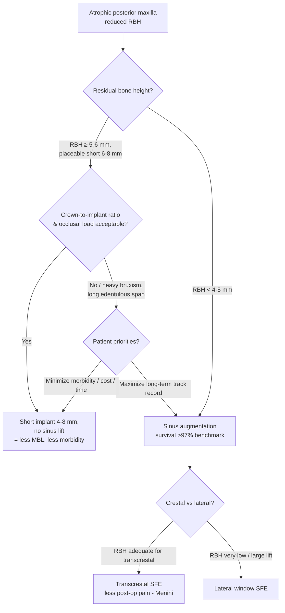

## 한국어 핵심요약

> [!summary] 한국어 핵심요약
> - 핵심 명제: 위축된 후방 상악에서 SR/MA 6편 + 환자보고결과(PROM) 메타분석 1편 종합 — 숏 임플란트(4–8 mm, 무거상)는 표준/장축+상악동거상과 **생존율 동등**, 변연골소실(MBL)은 일관되게 더 적고 이환은 낮음. 선택 기준은 생존율이 아니라 **잔존골고(RBH)·치관-임플란트 비(C/I)·환자경험**.
> - **생존율 동등**: 6개 독립 MA 모두 비유의(NS) — Toledano 2022 RR 1.02(p=0.09), Zhang 2024 OR 1.26(NS), Chaware 2021 RR 1.01(I²=0%), Alenezi 2025 OR 0.96.
> - **가장 재현성 높은 신호 = MBL 우위**: 숏이 일관되게 MBL 적음 — Mester 2023 WMD −0.29(p=0.005), Alenezi 2025 MD −0.26(p<0.001), Vetromilla 2021 MD −0.22(p<.01).
> - **생물학적 합병증도 숏 우위**: Mester RR 0.46(p=0.03), Alenezi OR 0.39(p=.02).
> - **umbrella 수렴**: Arbildo-Vega 2025(60 SR)와 Vetromilla 2021(7 SR/66연구) 모두 생존 동등 + 숏 MBL/합병증 우위; 단 Vetromilla은 AMSTAR-2 대부분 critically-low 품질 caveat.
> - **장기 anchor**: Thoma 2024 10년 다기관 RCT — 생존 96.0% vs 100%(p=.24), 양 군 median MBL 0.00 mm → 내구성 근거 강화(단 21% 탈락·단일 trial).
> - **장기 주의**: ≥5년 pool은 얇고 저확실성 — Mester 표준+SFE가 수치적으로 높음(RR 0.97, p=0.07), Alemán 2025는 7 RCT 중 5편 high RoB.
> - **결정 1번째 gate(RBH)**: ~5–6 mm 이상 → 6–8 mm 숏이 저이환 default; ~4–5 mm 미만 → 상악동거상(survival 벤치마크 >97%, Derbishi 2026)이 신뢰 경로.
> - **결정 2번째 gate(C/I·부하)**: 단, Torres-Alemany 2020은 C/I 비가 임플란트 상실(p=0.9)·MBL(p=0.36)에 유의 영향 없음 → 높은 C/I 단독은 숏 거부의 약한 이유, 진짜 gate는 교합부하/parafunction. 예외: 비고정(nonsplinted) 숏 단일치관(≤6 mm)은 장기 생존 열위(Xu 2020, RR 0.94, p=.01) → splinting/거상 고려.
> - **결정 3·4번째**: 동등 시 숏은 이환·비용·시간·술후통증 우위, 거상은 publish된 track record 우위 → 환자 우선순위로 tie-break. 거상 시 RBH 충분하면 경치조골(transcrestal)이 측방창보다 술후 통증 적음(Menini 2025, PROM 초록 기반·미검증).

## One-line Summary
Across six SR/MAs and one PROM meta-analysis, short implants (4–8 mm, no sinus lift) match standard/long implants + sinus augmentation on survival, show consistently less marginal bone loss, and carry lower morbidity — so the decision hinges on residual bone height, crown-to-implant ratio, and patient-experience factors rather than survival.

## 한줄요약
SR/MA 6편 + PROM 메타분석 1편 종합 — short implant(4–8 mm, 무거상)는 표준/장축 임플란트+상악동거상과 생존율 동등, 변연골소실은 일관되게 더 적고 침습·이환은 낮음. 따라서 선택 기준은 생존율이 아니라 잔존골고(RBH)·치관-임플란트 비(C/I)·환자경험이다.

## Thesis
The clinical question is no longer "does the short implant survive as well as the grafted long implant?" — six independent meta-analyses answer that with a consistent **yes** (survival equivalent, all non-significant). The dataset's strongest and most reproducible signal is that **short implants lose less marginal bone**, and they avoid the morbidity and PROM burden of sinus augmentation. The decision therefore shifts to four real discriminators: residual bone height, crown-to-implant ratio / occlusal load, the long-term (≥5 y) evidence gap, and patient preference for lower morbidity.

Two cautions keep this from collapsing into "always place short": (1) the pooled long-term (≥5 y) subset is thin and low-certainty — Mester 2023 found standard+SFE *numerically* higher survival (RR 0.97, p=0.07) and Alemán 2025 graded 5 of 7 RCTs at high risk of bias — though the single best long-term anchor, **Thoma 2024's 10-year multi-centre RCT, shows 96.0% vs 100% survival and median 0.00 mm MBL in both arms**, materially strengthening the durability case; (2) very low RBH or unfavorable C/I ratio can push beyond the short-implant comfort zone, where sinus augmentation (survival benchmark >97%, Derbishi 2026) remains the reliable fallback. The strongest single statements are now two umbrella-level syntheses converging on the same answer: **Arbildo-Vega 2025** (60 SRs) and **Vetromilla 2021** (7 SRs, 66 studies) both report equivalent survival with short implants favored on MBL and biological complications — Vetromilla adding the explicit AMSTAR-2 caveat that this signal rests on critically-low/low quality reviews. The most current RCT-only synthesis, **Alenezi 2025** (7 RCTs, 393 pt, search to June 2025), reproduces the pattern: equivalent survival, short implants better on MBL (MD −0.26 mm) and biological complications (OR 0.39). [claude해석]

## Evidence Map

| Paper | Design | n | Survival (short vs grafted/long) | MBL | Other | Confidence |
|---|---|---|---|---|---|---|
| Toledano 2022 | SR+MA | 14 RCT / 901 impl | RR 1.02, p=0.09 (NS) | short −0.11 mm ≤1y; −0.23 mm >1y (sig.) | sinus-lift complication rate up to 38% | sr+ma |
| Zhang 2024 | Network MA | 17 / 1076 pt / 1751 impl | OR 1.26 (0.53–3.00) NS | short significantly less MBL (≈−0.17 mm) | biological OR 0.47, mechanical OR 0.94 (both NS) | sr+ma |
| Chaware 2021 | SR+MA (RCT) | 22 RCT / 667 pt / 1595 impl | RR 1.01 pt / 1.09 impl (I²=0%) | MD 0.16, high I² (~75%) | biol. compl. ↑ long; prosth. compl. ↑ short (both NS) | sr+ma |
| Mester 2023 | SR+MA, ≥5y RCT | 5 RCT | RR 0.97 (0.94–1.00), p=0.07 | WMD −0.29 (favors short, p=0.005) | biol. compl. RR 0.46 fewer with short (p=0.03) | sr+ma |
| Alemán 2025 | SR+MA, ≥5y RCT | 7 RCT | RR 2.37 (0.83–6.78) NS | reported, imprecise | 5/7 high RoB → low certainty | sr+ma |
| Derbishi 2026 | SR+MA | sinus-aug pooled | survival >97% (augmentation benchmark) | — | crestal fewer failures (selection-confounded); low certainty | sr+ma |
| Menini 2025 | SR+MA (PROM) | 12 RCT +1 | — | — | graftless < grafted, transcrestal < lateral for post-op pain (abstract-only) | sr+ma |
| **Thoma 2024** | **RCT, 10-year** | 77 pt / 105 impl | **96.0% vs 100% (p=.24)** | median 0.00 mm both (p=.73) | peri-implantitis 4.2% vs 13.3% (NS); OHIP comparable | rct |
| Xu 2020 | SR+MA, ≥5y | posterior | mandible short≈long; maxilla short possibly lower | — | fewer biological complications with short | sr+ma |
| Emfietzoglou 2024 | SR (RCT) | ≤6 mm vs >6 mm | survival comparable (alternative to regeneration) | assessed | peri-implantitis/technical compl. assessed | sr |
| Arbildo-Vega 2025 | Umbrella (60 SR) | — | no diff. survival/failure/prosthetic (high-conf.) | less with short | fewer biological complications with short | sr+ma |
| **Vetromilla 2021** | Umbrella (7 SR / 66 studies) | — | RR 1.08, p=.79 (NS) | short lower, MD −0.22 (p<.01) | biologic favor short (RR 0.16); AMSTAR-2 mostly critically-low | sr |
| **Alenezi 2025** | SR+MA RCT (to Jun 2025) | 7 RCT / 393 pt / 474 impl | OR 0.96 (0.74–1.25) NS | short lower, MD −0.26 (p<.001) | biological compl. OR 0.39 fewer short (p=.02) | sr+ma |
| Xu 2020 (single-crown) | SR+MA (RCT) | 5 RCT | short-term NS; long-term short poorer (RR 0.94, p=.01) | NS (MD 0.00) | nonsplinted single crowns — caution | sr+ma |
| Torres-Alemany 2020 | SR+MA | 14 quant | — | no sig. effect of length/diameter/(C/I) on MBL | no sig. effect of C/I on implant loss (p=0.9) | sr+ma |

## Clinical Decision Points

Decision logic in prose:
1. **RBH is the first gate.** With ~5–6 mm or more, a 6–8 mm short implant is placeable and is the lower-morbidity default. Below ~4–5 mm, sinus augmentation becomes the more dependable route (Derbishi 2026 survival >97%). [합의수준]
2. **Crown-to-implant ratio / occlusal load is the second gate.** Favorable C/I and load → short implant. Heavy bruxism, unfavorable C/I, or long spans bias toward augmentation + longer implants, though survival data still do not penalize short implants. Notably, **Torres-Alemany 2020** found C/I ratio had no significant effect on implant loss (p=0.9) or MBL (p=0.36), so an elevated C/I ratio alone is a weak reason to reject a short implant — the gate is really occlusal load/parafunction, not the geometric ratio per se. One scenario does warrant caution: **Xu 2020** showed that nonsplinted short single crowns (≤6 mm) in the posterior region had poorer long-term survival (RR 0.94, p=.01), so splinting or augmentation should be weighed for isolated short single crowns. [claude해석]
3. **Patient priorities break ties.** When both are technically viable, short implants win on morbidity, cost, treatment time, and post-op pain; augmentation wins on the longer published track record. [합의수준]
4. **If augmenting, choose approach by RBH and morbidity.** Transcrestal is associated with less post-op discomfort than the lateral window (Menini 2025); reserve the lateral window for very low RBH or large lifts. [합의수준 / PROM abstract-only — 미검증]

## Gaps & Future Research
- **Long-term (≥5 y) evidence is improving but still narrow.** Pooled ≥5 y SR/MAs rest on few high-RoB RCTs (Mester 5, Alemán 7); Thoma 2024 now adds a 10-year multi-centre RCT (96.0% vs 100% survival, 0.00 mm median MBL) that strongly supports durability, but it carries 21% drop-out and a single-trial sample. More powered decade-horizon RCTs remain the key missing piece.
- **MBL clinical significance.** The short-implant MBL advantage (~0.1–0.3 mm) is statistically robust but of uncertain long-term clinical consequence.
- **PROM base is sparse and, here, abstract-only** (Menini 2025) — pooled magnitudes unverified.
- **C/I ratio thresholds** are not quantified across these syntheses; Torres-Alemany 2020 shows *no* significant C/I effect on loss/MBL but does not derive an actionable cutoff, so the load-based gate above is still inference, not a pooled threshold.
- **Isolated short single crowns** carry a distinct long-term survival caveat (Xu 2020, RR 0.94 at long-term) that the sinus-focused SR/MAs do not capture — splinting effects on short-implant durability remain under-pooled.

## Related Papers
- [[sinus-lift/lateral/toledano-2022-short-versus-standard-implants-sinus]] — short ≤6 mm vs standard+SFE; survival equal, MBL favors short.
- [[implants/zhang-2024-short-vs-long-implants-sinus]] — network MA across short / immediate-SFE / delayed-SFE.
- [[sinus-lift/lateral/chaware-2021-short-vs-long-implant-sinus-graft-sr-ma]] — 22-RCT pool, survival equivalent (I²=0%).
- [[sinus-lift/lateral/mester-2023-short-vs-standard-implants-sinus-floor-elevation-sr-ma]] — ≥5 y subset, short favored on MBL & biological complications.
- [[sinus-lift/lateral/aleman-2025-short-vs-long-implants-sinus-lift-5yr-sr-ma]] — ≥5 y, high-RoB, imprecise estimate (certainty caveat).
- [[sinus-lift/lateral/derbishi-2026-maxillary-sinus-augmentation-implant-survival-sr-ma]] — augmentation survival benchmark >97%.
- [[behavioral-dentistry/patient-reported-outcomes/menini-2025-proms-sinus-lift-procedures-sr-ma]] — PROM axis: graftless/transcrestal lower morbidity.
- [[sinus-lift/lateral/thoma-2024-short-6mm-vs-long-implants-sinus-elevation-10year-rct]] — 10-year RCT: the long-term anchor (96.0% vs 100%, 0.00 mm MBL).
- [[implants/arbildo-vega-2025-short-vs-standard-implants-edentulous-umbrella-review]] — umbrella review of 60 SRs: high-confidence equivalence + short-implant MBL advantage.
- [[implants/vetromilla-2021-short-standard-implants-sinus-umbrella]] — umbrella review (7 SRs, 66 studies): equivalence + short MBL/biologic advantage, with AMSTAR-2 quality ceiling.
- [[implants/alenezi-2025-short-long-implants-sinus-floor-elevation]] — most current RCT SR+MA (to Jun 2025): short lower MBL (−0.26 mm) & biological complications, equal survival.
- [[implants/xu-2020-short-standard-single-crown-posterior]] — nonsplinted short single crowns: poorer long-term survival caveat.
- [[implants/torres-alemany-2020-clinical-behavior-short-implants]] — C/I ratio, length, diameter have no significant effect on loss/MBL.
- [[implants/xu-2020-short-vs-longer-implants-posterior-5year-sr-ma]] — ≥5y, arch-dependent caveat (maxilla may favor long).
- [[implants/emfietzoglou-2024-short-implants-6mm-survival-posterior-edentulism-sr]] — strict ≤6 mm survival SR.
- [[overviews/sinus-lift-technique-selection]] — companion overview on augmentation technique choice.
