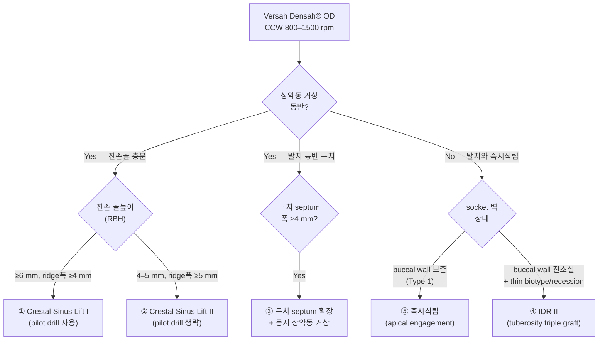

## 한국어 핵심요약

> [!summary] 한국어 핵심요약
> - Versah Densah® 제조사 프로토콜 카드 5종을 임상 상황 → 프로토콜 → 결정적 bur 차이 → peer-reviewed 근거 anchor로 라우팅하는 골밀도화 (Osseodensification, OD) 술기 선택 지도다.
> - 5종: ① 경치조골 상악동 거상 I, ② 거상 II, ③ 구치 septum 확장 + 상악동 거상, ④ 즉시치조복원 (Immediate Dentoalveolar Restoration, IDR II), ⑤ 즉시식립 (immediate implant).
> - 대전제 (가장 중요): 5종 모두 Versah LLC 발행 비-peer-reviewed marketing/narrative 문서로 정량 outcome·대조군이 없어 "술기 순서 참조"로만 쓰고, 임상 근거는 항상 교차링크된 peer-reviewed paper에서 가져온다. [근거강함, source 자체가 manufacturer document]
> - 1차 분기 3축: (a) 상악동 거상 동반 여부, (b) 발치 동반 여부, (c) 잔존 해부 (잔존골높이 RBH·septum 폭·socket 벽 상태) — 이 셋이 정해지면 5개 중 하나로 수렴.
> - Lift I vs II의 분기점은 pilot drill 하나 — RBH ≥6mm면 pilot로 access (①), 4–5mm면 얇은 잔존골 천공 위험 때문에 pilot 생략하고 Densah 버 자체로 진입 + allograft 추진 (②). [합의수준]
> - 즉시식립 (⑤) vs IDR II (④) 의 갈림길은 협측벽 (buccal wall): 벽 보존 → apical engagement (⑤), 벽 전소실 + 얇은 biotype → 상악결절 (tuberosity) triple graft + 구개측 (palatal) anchorage (④).
> - IDR II (④) 는 시멘트 보철 금기 (screw-retained만) 가 명시된 결정 차이이자 시험 포인트. [근거강함, 프로토콜 명시]
> - ③ 구치 septum 확장은 septum 폭 ≥4mm를 게이트로 즉시식립 + 상악동 거상을 한 술식에 합친 hybrid.
> - 근거 다리: Lift I/II는 Starch-Jensen 2025 SR+MA (TSFE-OD가 식립 시 ISQ 유의 ↑, 생존 동등) + Mazor 2024 (RBH 얇을수록 막 천공 ↑) 로, IDR/septum/즉시식립은 darosa 2019·bleyan 2021로 검증.
> - 공통 한계: proprietary Densah® 버 종속, 술자 의존도 높음 (특히 ③④), 적응증 컷오프 (RBH 6/4–5mm, septum 4mm) 가 제조사 정의이지 독립 RCT 검증값 아님 ([추정]).
> - 원장 메모: chairside 1차 분기는 "상악동 거상? → 발치 동반? → RBH/septum/socket 벽" 순으로 기억하고, 전체 evidence 그림은 자매 overview [[osseodensification-clinical-applications]] 에서 본다.

## One-line Summary
Decision map for Versah's five Densah® manufacturer protocol cards (Crestal Sinus Lift I/II, combined molar septum expansion + sinus lift, IDR II, immediate implant placement), routing a clinical situation (RBH, septum width, socket wall status) to the correct protocol, its distinguishing bur step, and the peer-reviewed evidence anchor that qualifies each — all five being non-peer-reviewed vendor documents.

## 한줄요약
Versah Densah® 제조사 프로토콜 카드 5종(경치조골 상악동 거상 I/II, 구치 septum 확장+상악동 거상, IDR II, 즉시식립)을 **임상 상황(잔존 골높이 Residual Bone Height·septum 폭·socket 벽 상태) → 해당 프로토콜 → 결정적 bur 차이 → peer-reviewed 근거 anchor**로 라우팅하는 술기 선택 지도. 5종 모두 제조사 문서(non-peer-reviewed)라는 한계를 전제로 한다. [합의수준]

---

> [!warning] 근거 수준 전제 — 5종 모두 제조사 문서
> 이 overview가 묶는 5개 source는 전부 Versah LLC가 발행한 임상 프로토콜 카드(2-page, REV06~09)다. peer-reviewed 연구가 아니라 marketing/narrative 문서이며 정량적 outcome·대조군이 없다. 본 지도는 "술기 순서 참조"로만 쓰고, 임상 판단의 근거는 항상 교차 링크된 peer-reviewed paper와 [[osseodensification-clinical-applications]] evidence overview에서 가져온다. [근거강함, source 자체가 manufacturer document임]

---

## Summary

골밀도화(Osseodensification, OD)는 두 축으로 나눠 봐야 한다. **왜 되는가(evidence)**는 [[osseodensification-clinical-applications]]가 Fontes Pereira 2023 SR을 spine으로 이미 정리했다. 이 overview는 나머지 축 — **어떻게 하는가(제조사 술기 프로토콜)** — 를 담당한다. Versah가 발행한 5개 프로토콜 카드는 각각 다른 임상 상황을 겨냥하는데, 카드 단위로 흩어져 있으면 "내 케이스에 어느 카드인가"가 안 보인다.

핵심 질문 4개:

1. 5개 프로토콜은 각각 어떤 임상 상황(적응증)을 겨냥하는가 — 1차 분기
2. 프로토콜끼리 결정적으로 갈리는 bur 스텝은 무엇인가 — Lift I vs II, IDR I vs II 등
3. 각 프로토콜의 근거를 어느 peer-reviewed paper로 검증하는가 — manufacturer → evidence bridge
4. 제조사 문서로서의 공통 한계와 임상 적용 시 주의점은 무엇인가

---

## 1. 5개 프로토콜 1차 분기 — 적응증 지도

1차 분기축은 세 가지다: **(a) 상악동 거상 동반 여부**, **(b) 발치 동반 여부**, **(c) 잔존 해부(RBH·septum·socket 벽)**. 이 셋이 정해지면 5개 중 하나로 수렴한다. [합의수준, 제조사 적응증 정의 기반]

---

## 2. 결정적 분기 bur 스텝 — 프로토콜끼리 갈리는 지점

각 프로토콜이 "무엇이 다른가"를 한 표로. 공통 분모(CCW Densifying 모드, 단계적 2.0→3.0→4.0→5.0 확장, autograft compaction)는 생략하고 **차이점만**.

| # | 프로토콜 | 적응증 핵심 | 결정적 분기 스텝 | source |
|---|----------|-------------|------------------|--------|
| ① | Crestal Sinus Lift I | RBH ≥6 mm, ridge ≥4 mm | **pilot drill로 sinus 1 mm 아래까지** 진입 후 Densah 2.0(CCW 1000 rpm, 관수) → sinus floor 3 mm 통과까지 | [[versah-densah-sinus-lift-i-protocol-rbh-6mm-minimum]] |
| ② | Crestal Sinus Lift II | RBH 4–5 mm, ridge ≥5 mm | **pilot drill 생략** — 처음부터 Densah 2.0 OD로 진입. 추가 거상 >3 mm 필요 시 마지막 버 **저속 150 rpm·무관수로 hydrated allograft 가압** | [[versah-densah-sinus-lift-ii-protocol-rbh-4-5mm]] |
| ③ | 구치 septum 확장 + 상악동 거상 | 구치 발치, septum 폭 ≥4 mm | **flapless 무외상 발치(septum 보존)** → CCW로 septum 측방 확장 + 슈나이더막 거상 **동시** → 즉시식립 → wide healing abutment로 socket sealing | [[versah-combined-molar-septum-expansion-sinus-lift-protocol]] |
| ④ | IDR II | buccal wall 전소실 + thin biotype/recession | **상악 결절(tuberosity)에서 bone+연조직 triple graft 채취** → palatal wall에만 1차 안정성 의존 → **screw-retained 임시(cement 금기)** → 4개월 후 최종 | [[versah-idr-ii-immediate-dentoalveolar-restoration-protocol]] |
| ⑤ | 즉시식립 | 발치와, buccal plate 보존 | **임플란트 직경 > 발치치 apex**, **마지막 Densah 버 ≥ socket apex 직경** — 1차 안정성을 socket apical에서 확보. 70/30 cancellous/cortical allograft를 한 단계 작은 버로 densify | [[versah-immediate-implant-placement-protocol]] |

세 쌍의 핵심 대비:

- **Lift I vs II** — 분기점은 pilot drill 하나다. RBH ≥6 mm면 pilot로 access, 4–5 mm면 얇은 잔존골 천공 위험 때문에 pilot 생략하고 Densah 버 자체로 진입 + allograft 추진 추가. [합의수준]
- **즉시식립(⑤) vs IDR II(④)** — 둘 다 발치와지만 buccal wall이 갈림길. 벽 보존 시 apical engagement(⑤), 벽 전소실+얇은 biotype 시 tuberosity triple graft + palatal anchorage(④). IDR II는 cement 보철 **금기**가 명시 차이. [근거강함, 프로토콜 명시]
- **③의 위치** — 구치 발치 + septum이라는 특수 해부에서 ④/⑤(즉시식립)와 ①/②(상악동 거상)를 한 술식에 합친 hybrid. septum ≥4 mm가 게이트. [합의수준]

---

## 3. Manufacturer → Evidence 다리 — 각 프로토콜을 검증하는 peer-reviewed anchor

제조사 카드의 술기를 임상 근거로 받쳐주는 paper 매핑. 프로토콜 카드 자체는 [미검증] 수준이고, 아래 anchor가 [근거강함]~[합의수준]을 제공한다.

| 프로토콜 | 검증 anchor (peer-reviewed) | anchor가 말해주는 것 |
|----------|------------------------------|----------------------|
| ① ② Sinus Lift I/II | [[starch-jensen-2025-transcrestal-sinus-osseodensification-meta-analysis]] (SR+MA, 6 RCT, GRADE low) | TSFE-OD가 osteotome·측방창 대비 식립시 ISQ 유의 ↑, 생존율 동등. 단 수직 골증대(ESBG)는 측방창보다 적음 |
| ① ② 천공 위험 | [[mazor-2024-maxillary-sinus-membrane-perforation-osseodensification]] | RBH 얇을수록(특히 ≤3 mm) 막 천공 위험 ↑ → Lift II 적응 한계의 근거 |
| ① ② 전반 | [[gaspar-2025-osseodensification-crestal-maxillary-sinus-elevation-narrative-review]] (narrative) | 경치조골 OD 거상 술기 개괄 |
| ③ septum 확장 | [[bleyan-2021-molar-septum-expansion-osseodensification-immediate-implant]] (case series) | 구치 septum-OD 즉시식립 임상 결과 + socket 분류 |
| ④ IDR | [[darosa-2019-immediate-dentoalveolar-restoration-osseodensification-periodontal]] | IDR의 peer-reviewed 임상 rationale |
| ⑤ 즉시식립·apical engagement | [[bleyan-2021-molar-septum-expansion-osseodensification-immediate-implant]] · [[darosa-2019-immediate-dentoalveolar-restoration-osseodensification-periodontal]] | 즉시식립 OD 임상 데이터 |
| 전 프로토콜 메커니즘 | [[huwais-2017-novel-osseous-densification-osteotomy-primary-stability]] (in vitro 원위) · [[fontes-pereira-2023-osseodensification-osteotomy-alternative-sr]] (SR spine) | CCW compaction·autograft·IT↑/BIC↑ 기전과 evidence matrix |

전체 근거 그림은 [[osseodensification-clinical-applications]] (evidence overview)에서 본다. 이 표는 "프로토콜 → 어느 paper로 검증"의 인덱스일 뿐이다.

---

## 4. 공통 한계 — 제조사 문서로서 (living-document 갱신 포인트)

[[feedback_wiki-living-document]] 원칙으로 명시:

- **non-peer-reviewed**: 5개 모두 Versah LLC marketing 문서. 정량 outcome·대조군·통계 없음. 술기 순서 참조용. [근거강함]
- **proprietary bur 종속**: Densah® 버 전용. 타 bur 시스템에 비일반화. [근거강함]
- **operator-dependent 편차 큼**: 특히 ④ IDR II(tuberosity triple graft 채취 + palatal-only anchorage)와 ③(동시 septum 확장+거상)은 술자 의존도가 높고 outcome 분산이 정량화되지 않음. [claude해석]
- **적응증 경계의 근거 빈약**: Lift I/II의 RBH 6 mm·4–5 mm 컷오프, septum 4 mm 컷오프가 제조사 정의이고 독립 RCT로 검증된 임계값이 아님. [추정]
- **즉시식립 socket 조건**: ⑤의 apical engagement는 apical bone이 충분할 때만 성립. thin buccal plate(<1 mm)에서 OD lateral compaction이 plate를 손상시킬 수 있음 — Type 1·thick plate 한정 [claude해석]. 천공·thin-bone 위험은 [[mazor-2024-maxillary-sinus-membrane-perforation-osseodensification]]로 보강.

---

## 5. 원장 메모 체크리스트

- chairside 1차 분기: **상악동 거상? → 발치 동반? → RBH/septum/socket 벽** 순으로 5개 중 하나 수렴 (§1 mermaid)
- Lift I↔II 헷갈리면 **pilot drill 유무**로 기억 (RBH ≥6 → I/pilot O, 4–5 → II/pilot X)
- ④ IDR II는 **cement 보철 금기**가 시험 포인트 — screw-retained만
- 환자 설명·동의서: 5종 모두 "제조사 프로토콜, 근거 수준 낮음" 전제. 술기 근거는 §3 anchor·[[osseodensification-clinical-applications]]에서 인용
- 자주 쓰는 시나리오(상악동저 보강·D3–D4)는 evidence overview의 active spoke와 연결 — [[osseodensification-clinical-applications]] §3 참조
- spoke 부족 영역: 좁은 ridge·즉시식립 OD 단독 RCT는 아직 wiki에 없음. ingest 우선순위 P1 (evidence overview와 공유)

---

## Related Papers
- [[implants/versah-protocols/versah-densah-sinus-lift-i-protocol-rbh-6mm-minimum]] — ① Sinus Lift I 카드
- [[implants/versah-protocols/versah-densah-sinus-lift-ii-protocol-rbh-4-5mm]] — ② Sinus Lift II 카드
- [[implants/versah-protocols/versah-combined-molar-septum-expansion-sinus-lift-protocol]] — ③ 구치 septum 확장+거상 카드
- [[implants/versah-protocols/versah-idr-ii-immediate-dentoalveolar-restoration-protocol]] — ④ IDR II 카드
- [[implants/versah-protocols/versah-immediate-implant-placement-protocol]] — ⑤ 즉시식립 카드
- [[overviews/osseodensification-clinical-applications]] — **자매 overview (evidence 축, why)**
- [[sinus-lift/transcrestal/starch-jensen-2025-transcrestal-sinus-osseodensification-meta-analysis]] — sub-antral SR+MA
- [[sinus-lift/transcrestal/mazor-2024-maxillary-sinus-membrane-perforation-osseodensification]] — 천공 위험
- [[sinus-lift/transcrestal/gaspar-2025-osseodensification-crestal-maxillary-sinus-elevation-narrative-review]] — 경치조골 OD narrative
- [[immediate-implant/bleyan-2021-molar-septum-expansion-osseodensification-immediate-implant]] — septum-OD case series
- [[immediate-implant/darosa-2019-immediate-dentoalveolar-restoration-osseodensification-periodontal]] — IDR rationale
- [[implants/huwais-2017-novel-osseous-densification-osteotomy-primary-stability]] — 메커니즘 원위논문
- [[implants/fontes-pereira-2023-osseodensification-osteotomy-alternative-sr]] — SR spine
- [[overviews/sinus-lift-technique-selection]] — sinus 술식 선택
- [[overviews/immediate-implant-decision-ladder]] — 즉시식립 결정
- [[overviews/d4-bone-densah-protocol]] — D4 chairside 인터랙티브
- [[overviews/isq-loading-threshold]] — ISQ 부하 결정
